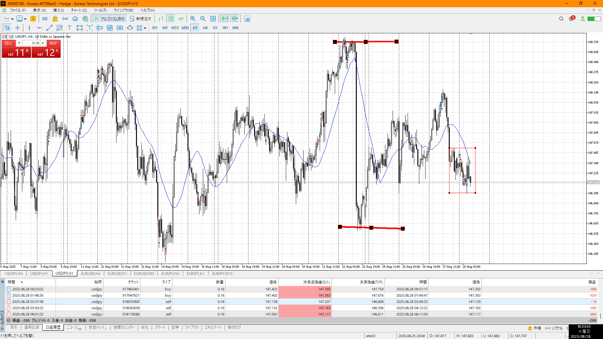
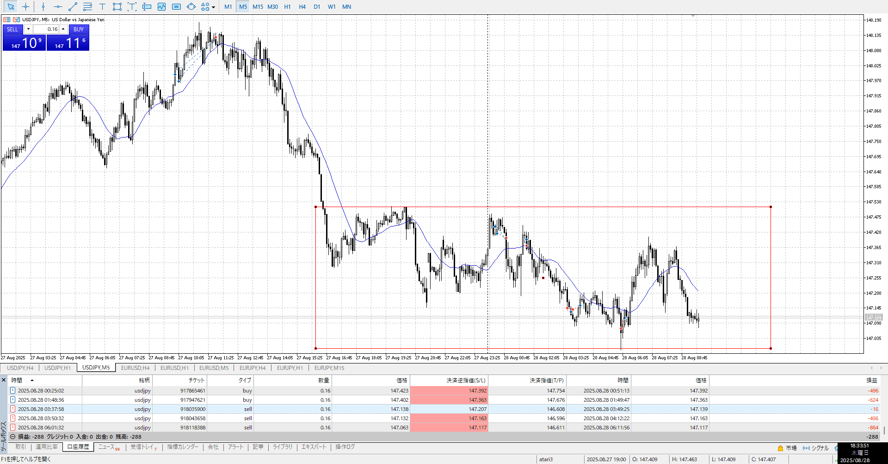

- [x] 指標
- [x] 4h,1h目線確認
- [x] 方向決定
- [ ] せめぎ合い、場確認
    - [ ] 両方の視点をもつ
- [ ] 目立つ場所
    - [ ] 切り上げ下げ、大きな動き
- [ ] (1h)レンジ待ち
- [ ] 明確エントリー/確定、下足確定

1h上、4hレンジ
上がろうとしたところで底を叩いてる

買うなら直前の下降を気にしないとこ、半値上まで
売るなら1hの否定をするので、下抜き

下降の上下がある
この中で目線を決めてるので、ここ抜けるまで売り
**4hから目線は決めようね**

昼は昼休憩で人がいないので危険

買うなら切り下げ、レンジ上抜きらへんの損切抜き
売るならレンジ下戻り売り