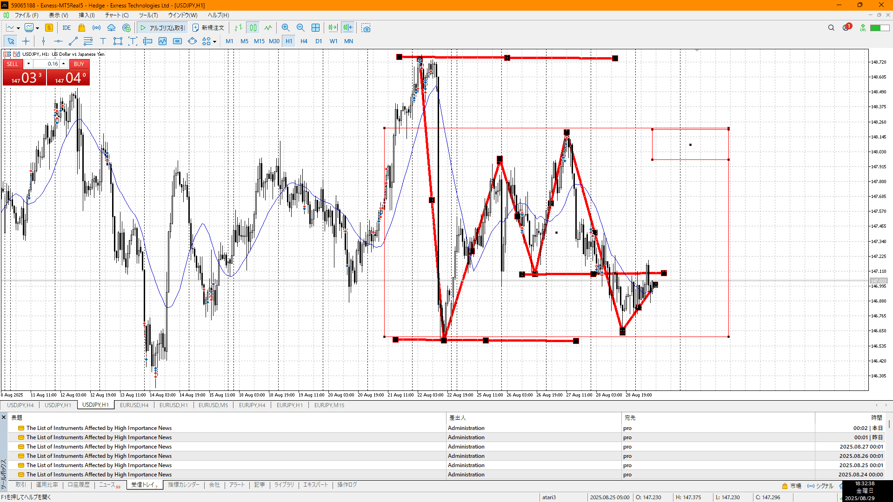

- [x] 指標
- [ ] 4h,1h目線確認
- [ ] 方向決定
- [ ] せめぎ合い、場確認
    - [ ] 両方の視点をもつ
- [ ] 目立つ場所
    - [ ] 切り上げ下げ、大きな動き
- [ ] (1h)レンジ待ち
- [ ] 明確エントリー/確定、下足確定

4hu,1hd

![[../../images/2025-08-29 2025-08-29 18.14.10.excalidraw]]
目線とトレンドレンジは別の話

目線は下、レンジはこの大きさ
目立つとこはダブルボトムのネックくらい、短期で売るならここ
レンジとして普通に売るならレンジ内上でレンジ作って下に落ちていくとこ

1h見るならこれくらい見る

買うなら売りの損切で
このあと切り上げを抜いて戻ってきて大きい陽線出すが、その辺くらい
この後さらにそこから登っていくが、売りが居ないので……