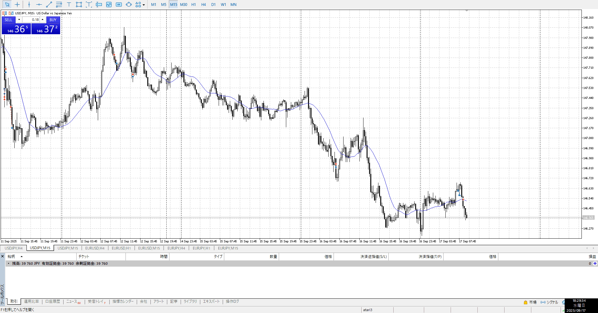

- [ ] 指標
- [ ] 4h,1h目線確認
- [ ] 方向決定
- [ ] せめぎ合い、場確認
    - [ ] 両方の視点をもつ
- [ ] 目立つ場所
    - [ ] 切り上げ下げ、大きな動き
- [ ] (1h)レンジ待ち
- [ ] 明確エントリー/確定、下足確定

一応木曜に失保
4hu,1hd

下寄りのレンジ
売るなら売りたいところ
買うならレンジの一番下
売るなら前回小レンジ下

下向き
買いの裏切り、1h確定で下入れる

下が近いが、そもそもレンジ下で売りにくいというのは
買うという話じゃない

1hに従う
買いを掛けるのは4hレンジに触れるくらいの下

1h近くに降下
この後にその二倍くらいの長さをかけて半分の横向き

つまりこう
売る流れ

また、前回の直近で戻り位置になりそうなところがある
**これを抜かないと買いにならない**
直近の降下を超えるのに必要な抜くべき壁を考える

この上に1hの売りがあり、戻り位置抜きから1h売りまでを買うならありだった

この形なので、売るところで売りたい
今回買いの裏切りで売れるというのはそういうこと

よくなかったこと
- レンジ下近くの売りを怯えすぎ
- **前回1hレンジ抜け後に作った売り場・買い場を無視してる**
    - レンジ線を置きっぱにしたせい
    - 一日したら、場に触れたりしてる線は消す
        - ローソクを見る
