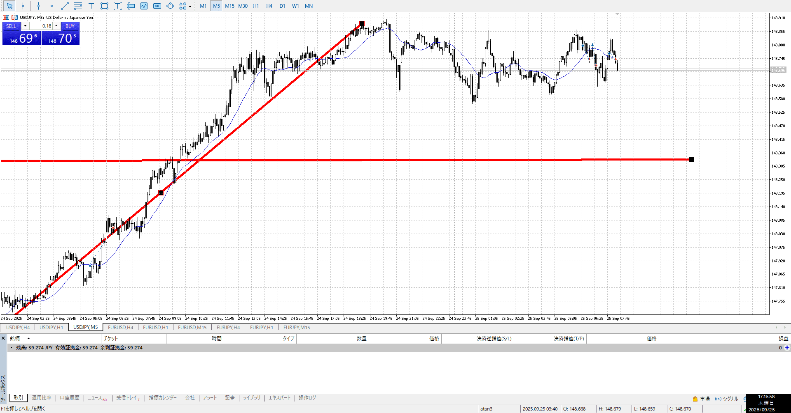
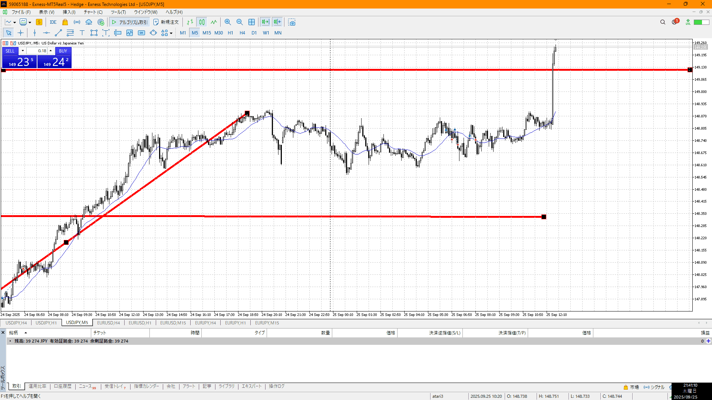

- [x] 指標
- [x] 4h,1h目線確認
- [ ] 方向決定
- [ ] せめぎ合い、場確認
    - [ ] 両方の視点をもつ
- [ ] 目立つ場所
    - [ ] 切り上げ下げ、大きな動き
- [ ] (1h)レンジ待ち
- [ ] 明確エントリー/確定、下足確定

4hu1hu
買いたい
4hレンジ上が売り場
前回までのレンジの上が買い場

買い場が分かってるんだから、そこで買うかそれを否定したところで買う
上でなんかやるな

昨日が良く動いたので、今日は動きにくい
それを念頭に

昨日が良く動いたので、今日はまんまレンジ疑惑
上目線はあると言いたいが、ここまで折られるとたぶんまだ決着がついてない奴
なので放置

買い場でも売り場でもないところでうろうろしてる
これは放置

勢いは客観的にレンジをスッと抜けたこと
これはレンジも抜けてないので一般

買いを期待していたはずなので、買うことはたぶんできた
実際押し目買いをこの後したのに、待ちを望みすぎて駄目にした

15ｍ一本待ちで早いのは普段の話
今回は1h抜いてて勢いあって押し目なので充分抜けで入れる
あとちゃんと損切まで持って

今回の流れについて
そもそも前日からの流れや1h的にとても買い、それは変わらない
でも上が固くて抜けなかった

上を抜いた後は利確勢が落ち着いた後、買い場で買いたい
まず最初に1h買い場があった、ここで買う
それだけ
