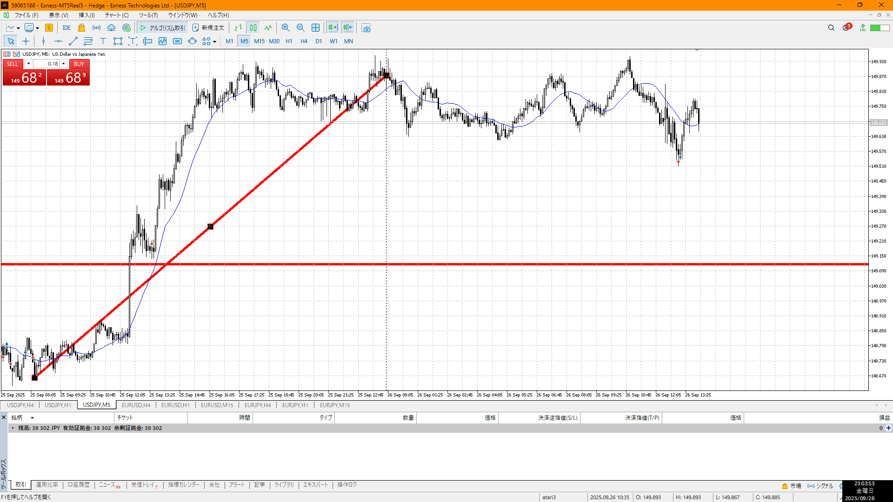

- [ ] 指標
- [ ] 4h,1h目線確認
- [ ] 方向決定
- [ ] せめぎ合い、場確認
    - [ ] 両方の視点をもつ
- [ ] 目立つ場所
    - [ ] 切り上げ下げ、大きな動き
- [ ] (1h)レンジ待ち
- [ ] 明確エントリー/確定、下足確定

4hu,1hu
買う

ひとまず買い場が前回レンジ上しかない、売り場はレンジ上
なのでそれまで何も出来んが
一応それまででレンジ作って（場を作って）抜ければそれで入れる
昨日の勢いで落ちてきて、というのが流れだがそれより前でレンジ上抜けなら十分買える

もしくは買い場で売りミスすぐ

買い場で売りミスの下髭が出た時点で買うことができる
今物凄い買い流れなお陰
