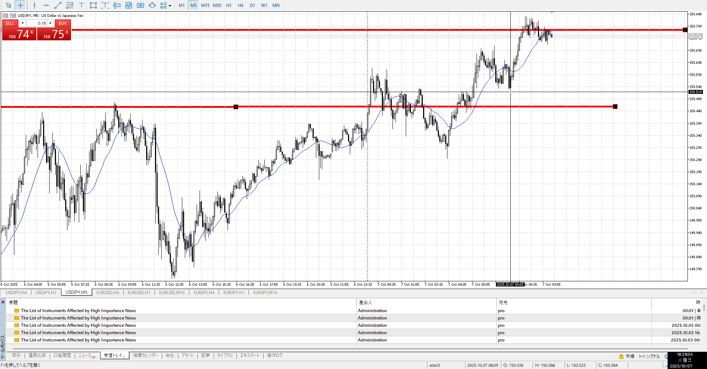

- [ ] [my](obsidian://open?vault=Sonolart&file=Project/FX/my)
- [ ] 指標
- [ ] 前日確認
- [ ] 4h,1h目線確認
- [ ] 方向決定
- [ ] せめぎ合い、場確認
    - [ ] 両方の視点をもつ
- [レンジは要注意](./2025-10-03.md)
- [戻りを意識](./2025-10-02.md)
- [終わった後の環境再度認識](./2025-09-30.md)

4hレベルだが、平均線が全然追いついてないので一日保留
レンジにしてもだらだら上がってるので手を付けにくい
4hの頭もすぐそこだし

前日高値を抜いた分の戻りなので買うことはできる

また、朝よりかは人が居そうな昼頃まで落ちてきたときの支えがかかる

4hu,1hu
4hを綺麗に抜いていったら戻しを買いたい
これだけの勢いで4h抜くのはない、というかここぬくと1dまでuになり全部一致して一気に伸びる
それなら少し戻って買い起点を小さい足で作る

でもdayの損切勢と引っかかって伸びる気もする
スピード取るなら開幕にレンジが結局ほしいがない
伸びについていく他なさそう

4h1h平均離れてるので静観
15mで平均付くたび伸びてるが、4h1hの動向は常にチェック

