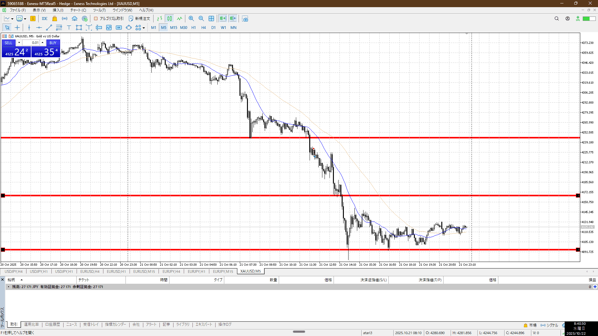
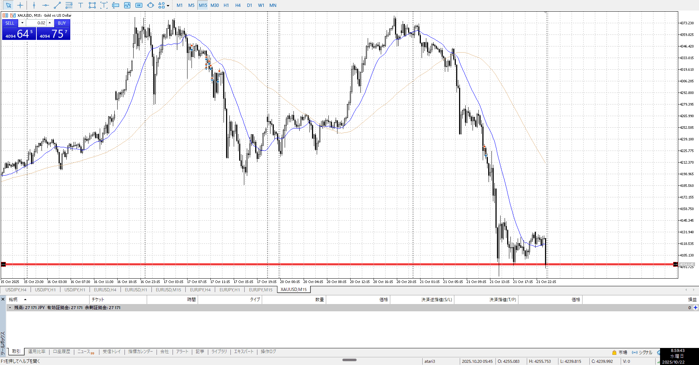
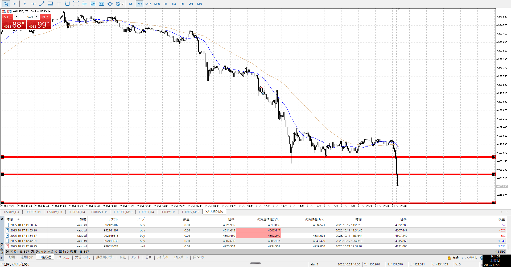
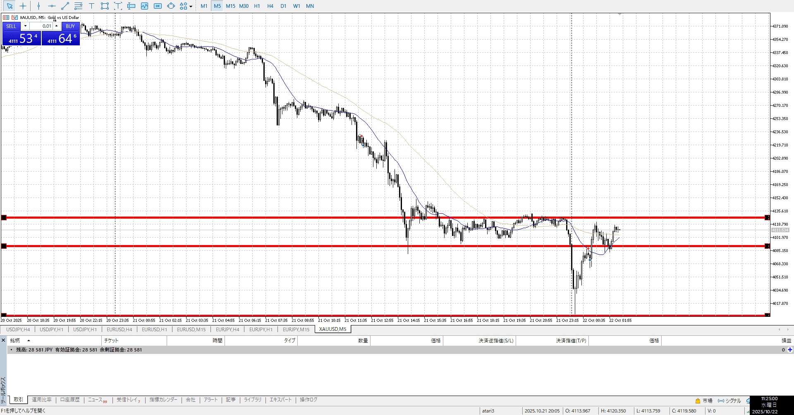
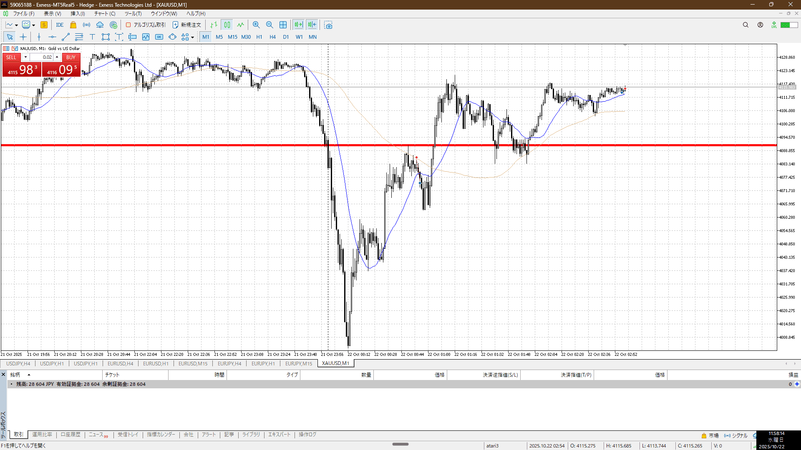
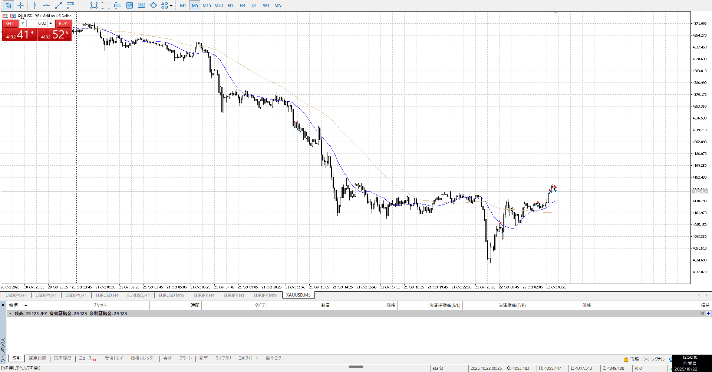
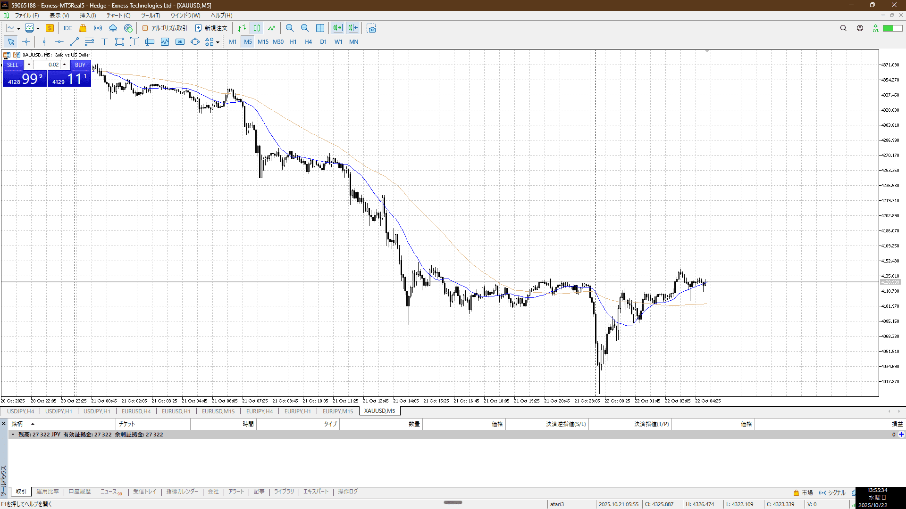
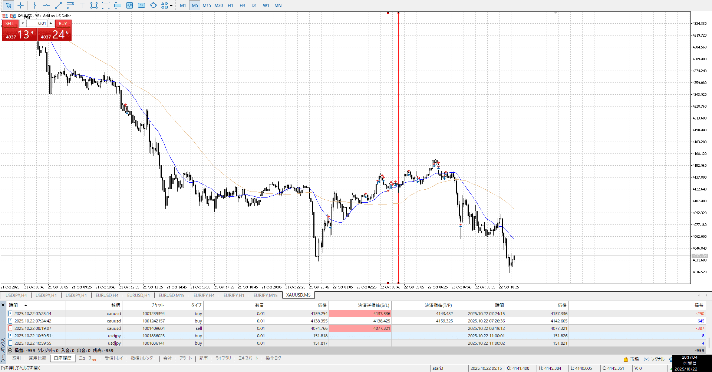
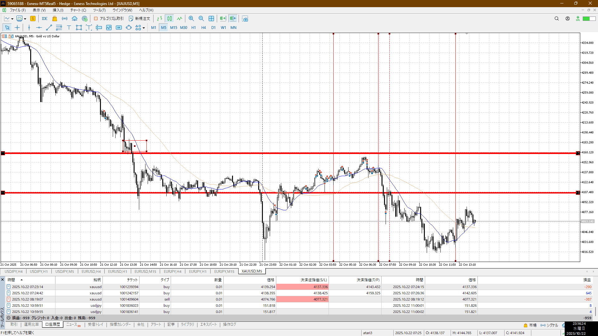

- [x] [my](obsidian://open?vault=Sonolart&file=Project/FX/my)(見ないと増える)
- [ ] 指標
- [ ] 前日確認
- [ ] 4h,1h目線確認
- [ ] 両視点整理
- [ ] 場確認
- [ ] 方向決定
- [ ] `<A-D>`

止められてるのでここを抜くらへんを考える
4h下髭と15m平均上復帰なので買えてもおかしくない

でも1hも下だし下を考えるべきだな

1d平均をした抜き、4h平均も下を考え始めている
15m5mは満足したという感じの下髭で止まったｇ、下への力が止まってない

1m5mが上向きになり始め
だが上に戻り切れず、目線が変わってない
まだ売りをしたい

確かにめちゃくちゃ上なんだが、目線は未だ下　背景が薄弱
となるとせめてこの上の壁を抜いて力を付けてから買いたいところ
前にもあった売り溜まり抜け急上昇のやつ

買い場としても上過ぎるし

- 背景
    - 5m上昇（急降下90％もどし）
- 事実
    - 5m15m切り上げ
    - 5m15m平均上
- 目標値
    - 5mレンジ上
- 損切値
    - 1mレンジ下
        - ズレあり、よくない
- 実際値
    - 同値

この後
何かしら下に行くのを失敗したり、上に行くのを押したりしたとこで書いたい

押しっちゃ押しだけど

近くにまだ気になる部分があるので、これを抜いてからにしたいところ
1h平均も上だった前回とは違う

ちょっと抜けてからまた下髭出しながら抜くのに時間かけてる
そろそろ1h平均繰るので、うかつに買えない

上昇を殺して売るというのが分かりやすいところ

全体に5分で待つ
1分は使わない

こういう場合の戻りは近場のこっち

仮にレンジだけ見てれば、上がレジスタンスで下がサポートで問題ない

今回の一番の問題は、小さい足で見すぎ
一本の大きな動きで惑わされるが、全体の形を見てチャンスで細かくは変わらない
なんも関係ないとこでは入れない
というかUSDJPYと同じ、時間帯が影響するのも同じ

フラクタルはそれぞれを別々に分析してから統合する、必ず分析してから

そのうえで、大きい足と小さい足の分析を混同しない
混同せず連動させる

終わってみるとこの4か所くらいしかない
こんなもんなのでやりすぎない

二本目の少し後ろでは買えない
1hが近いし、底から1h平均が上向いてるわけでもないしで買えない