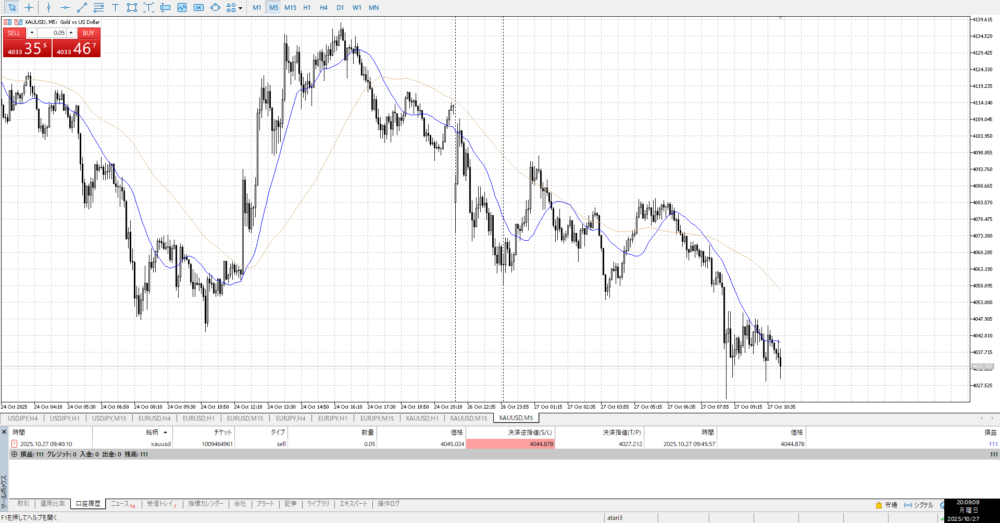
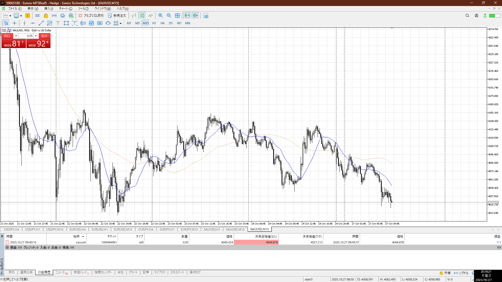

4h

＜ここに目線画像＞

1h

＜ここに目線画像＞

15m

＜ここに目線画像＞

5m

＜ここに目線画像＞

- [ ] [my](obsidian://open?vault=Teino&file=FX/my)(見ないと増える)
- [ ] 指標
- [ ] 前日確認
- [ ] 使用足全ての目線確認
- [ ] 方向決定
- [ ] 両視点整理

買い

売り

足流れ的にどっちが強い

否定の否定の否定

上が重くなってきた、上髭だらけ
もしくは下に落ちていくという流れから髭シグナルで落ちやすい奴

下髭出しながら落ちていってる
なんだこれは

