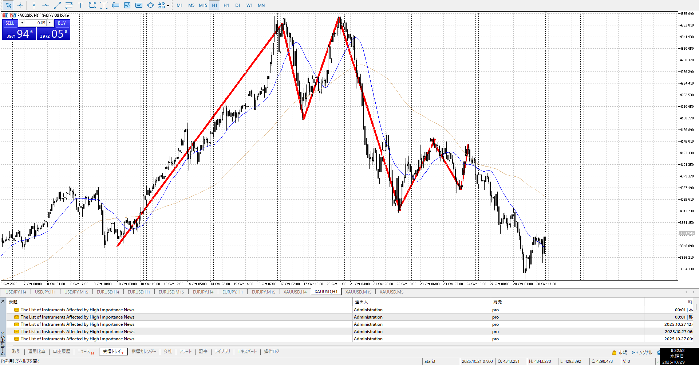
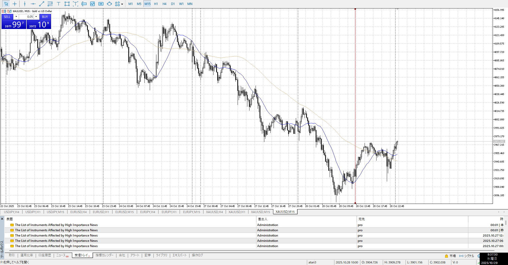
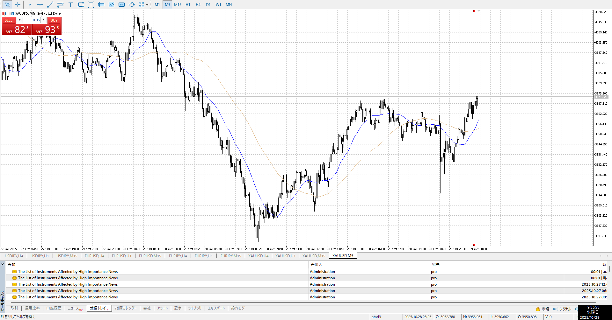
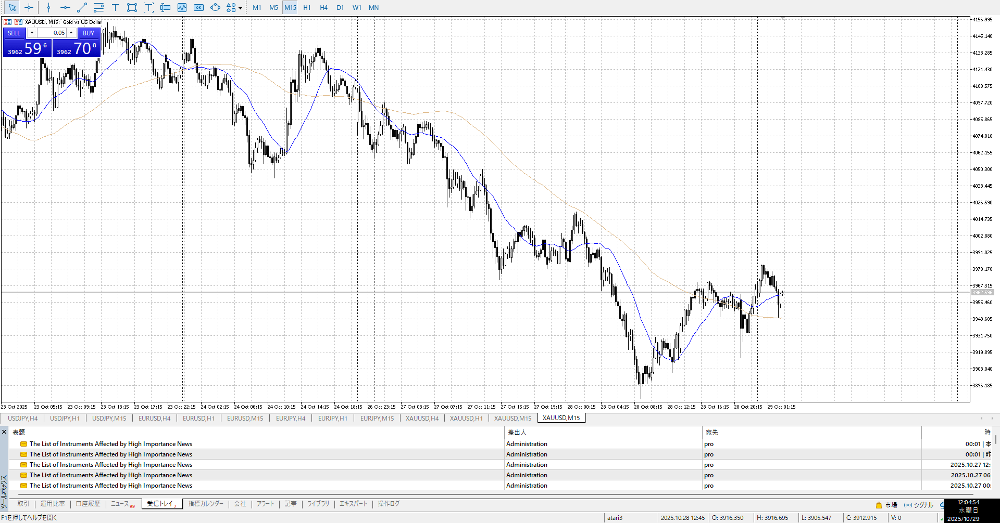
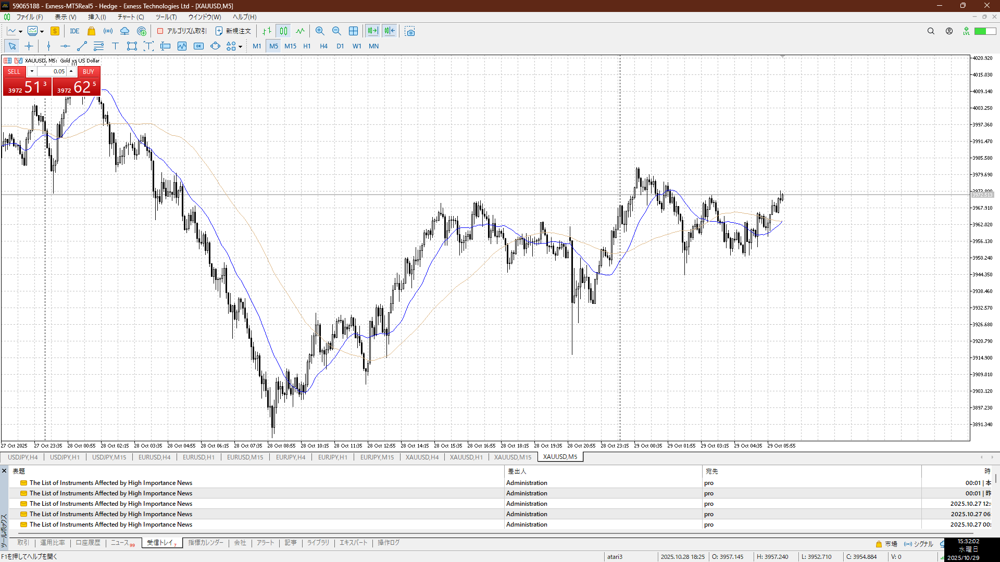
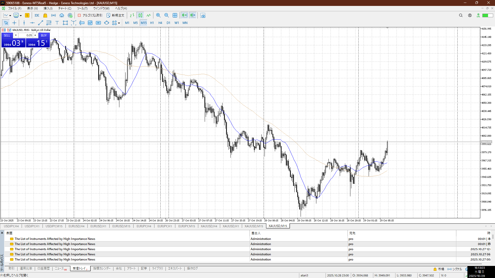
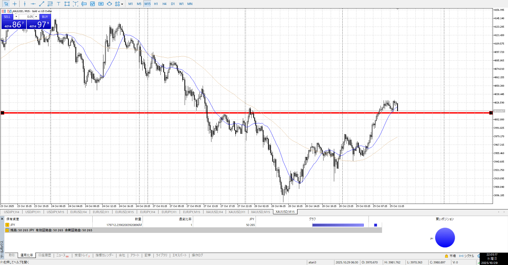
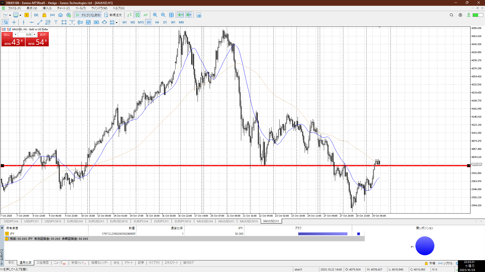

4h

＜ここに目線画像＞

1h

＜ここに目線画像＞

15m

＜ここに目線画像＞

5m

＜ここに目線画像＞

- [x] [my](obsidian://open?vault=Teino&file=FX/my)(見ないと増える)
- [x] 指標
- [ ] 前日確認
- [ ] 使用足全ての目線確認
- [ ] 方向決定
- [ ] 両視点整理

1h割から上昇売り場へ。
当然全部下げなので買うのは難しい。この売り場で売りたいところ。
本当に買うつもりなら下の下から小さめダブルに戻りが入る15mの縦線らへんしかないと思う。

買い
4h半値

売り
15ｍレンジ下

足流れ的にどっちが強い
売り
短期的には買いが続いてるので、これが終わったら

1hがダブルボトムっぽくなってきてる
がしかし15mの売り場とぶつかっている
流石に朝だとどっち行くか分からないので静観

定まってるっぽいがどっぴるま
やらない

上下迷ってる中で上を目指せそうな流れとシグナル
買えるには買えた

何を待っているのか明確じゃないまま待ってしまった
次

これが終わったら乃切り下げ、それが上昇で否定された
ここで買いを仕掛けられる

1h売り場にて

上髭出しての下降8本を一本で消し、それをさらに一本消しそう
下がりになりそうではあるが

