4h

＜ここに目線画像＞

1h
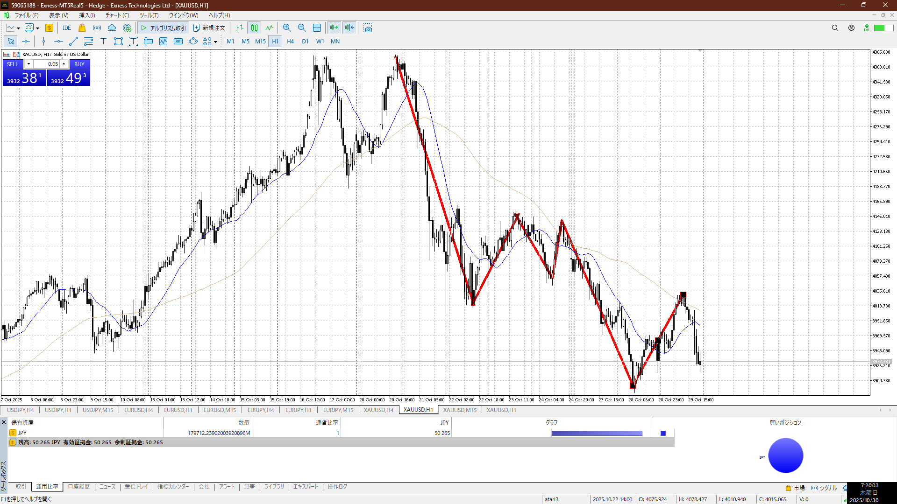
＜ここに目線画像＞

15m
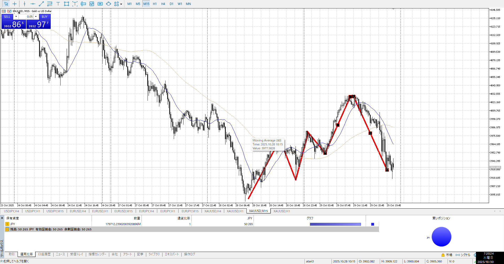
＜ここに目線画像＞

5m
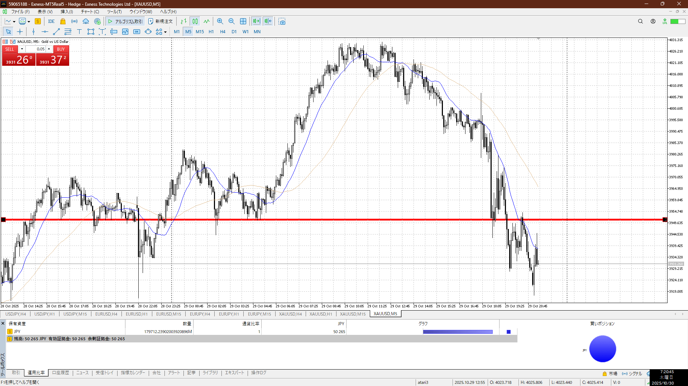
＜ここに目線画像＞

- [x] [my](obsidian://open?vault=Teino&file=FX/my)(見ないと増える)
- [x] 指標
- [ ] 前日確認
- [ ] 使用足全ての目線確認
- [ ] 方向決定
- [ ] 両視点整理

指標前から既に下折れ
1hd15mdなので売り

直近的にも売り
戻りを売りで噛んでいけばいい

買い

売り

足流れ的にどっちが強い

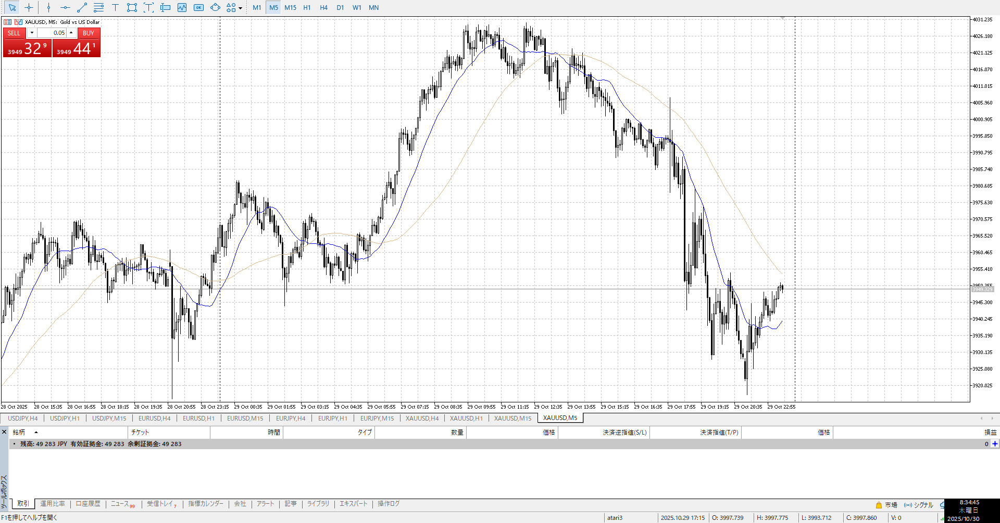

普通に落ち着け
たとえそれがシグナルだとしても、そもそも流れが出てないのでここで売るこたない
時間的にも
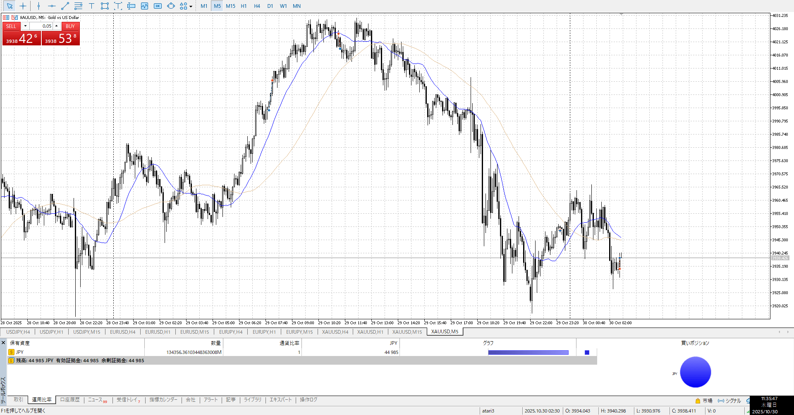

流れとしてはあったが、だったらひきつけろ
というか15mを見て落ち着け

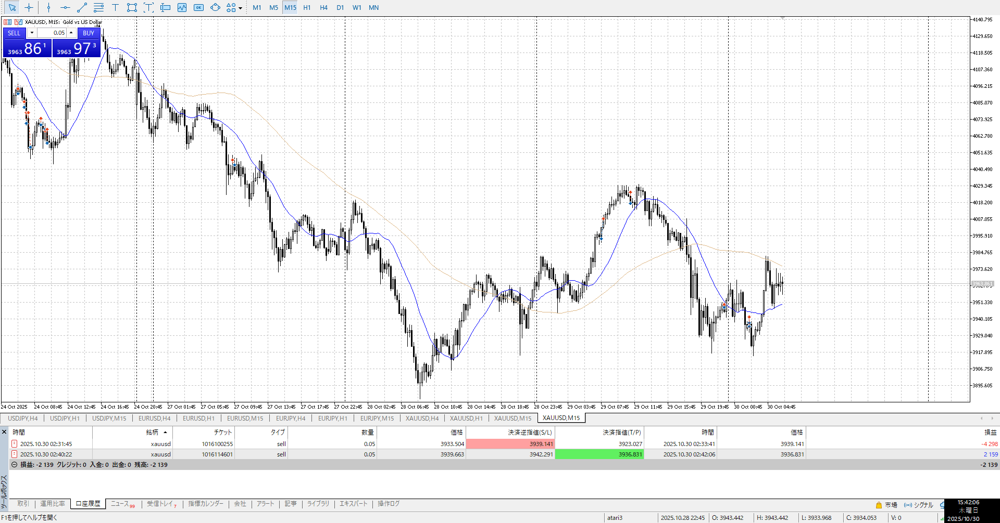
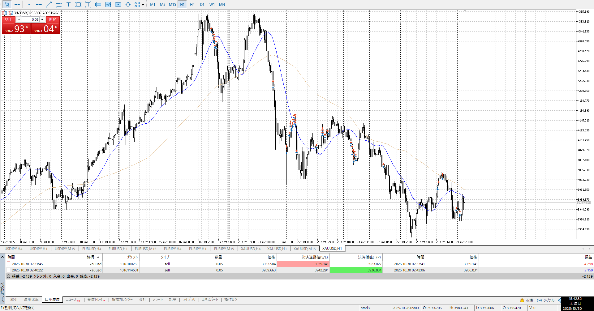
1hトレンドが上げて、1h半値が止めている。
15mがおかげでめちゃくちゃ迷ってる。
こっちは迷ったら何もしない事。

15m的には上がり切れてないので下がりたいところ。

---

朝はやり方を忘れているので、それを思い出すための簡単な演習問題が欲しい。
しかしこれには目線の規定から流れの把握、強弱、今どうするかどうなったらどうするかを決める必要がある。
手っとり早いのは1h15m出してノートっぽく画面に書きこんで、となるがなかなか難しい。繰り返し使いたいのでその書き込みは元画像に残したくない。問題と書き込みを分離し、かつ問題に使う画像などはまとめて1つの問題として管理しないといけない。

canvasは書き込みが出来ない。
excalidrawならexcalidrawを画像として読めるのでいけるかも。
そうするとあらかじめexcalidrawで揃えたものを作ったうえで、どの問題を解くかを決めてexcalidrawで作ったやつを引き出さないといけない。だるい。

srで作ればランダムに出してくれる。
ただしノートは使えない。書き込み無しのガチンコ。いいっちゃいいけど、やっぱり書き込み忘れそうだしよくないか。

---

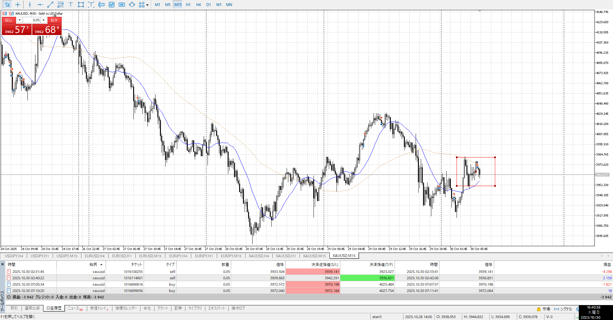

100戻し。
上が止まったら売りたい。
髭的にもトレンド的にもずっと上がり調子だけど。

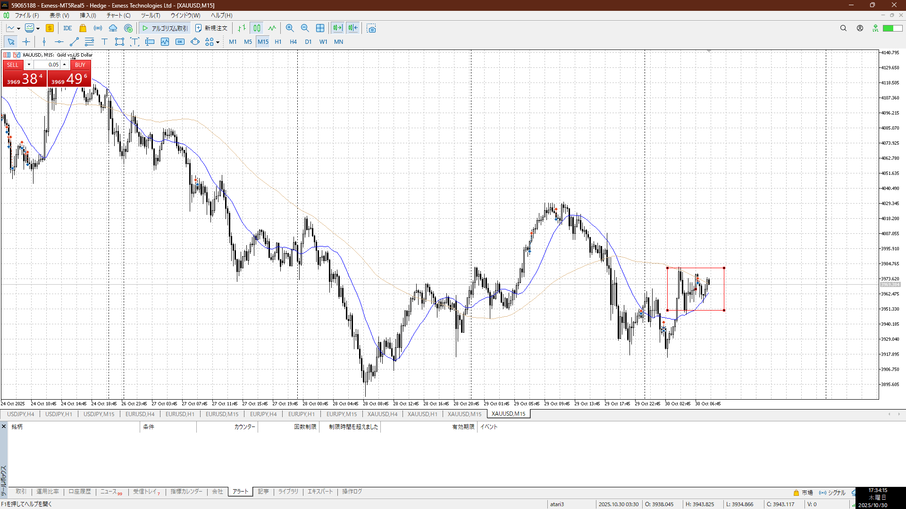

前日動いたから今日動かないの法則に見事に引っかかっている。
それに寝不足のダブルパンチ。今日は急速M戻りを下髭と小さい足でキャッチして、その後上下髭を上でキャッチする流れだった。

大きい足を見る。

折れは折れなんだけど15mで止まる箇所がいくつかあるので、その辺でMを警戒するなどあるべきところだった。
戻りがありそうなとこはM警戒。

最初の上昇がきついにしても、二回目は取るべきとこ。
売りたいとかは売り流れとシグナルが出て次の話。

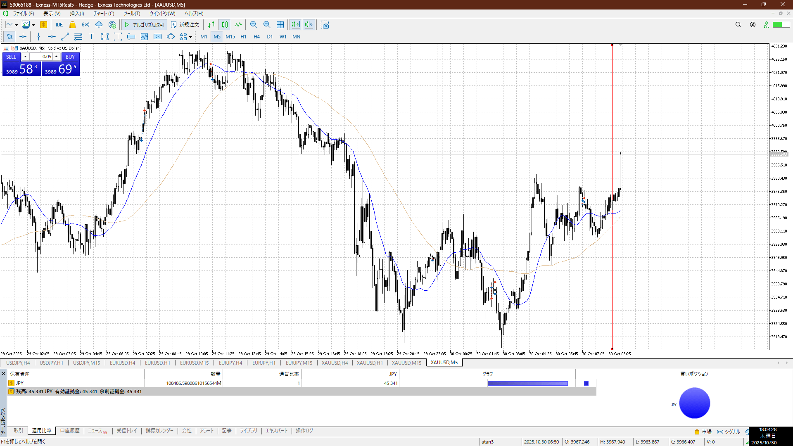

ここもそう
100戻しからちょい戻り

取引自体は売りで買いなので方向はあってる
ただ出だしを掴めてない

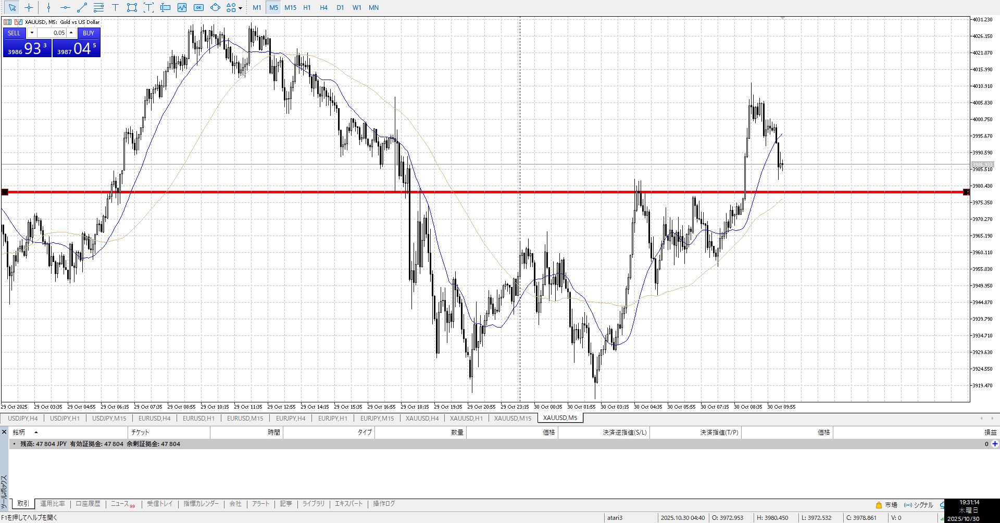

この戻り落ちも出だしを取れる
上髭に大きい陰線、上がらずを確認する

もちろん全体で売りがある前提だが

4h

＜ここに目線画像＞

1h
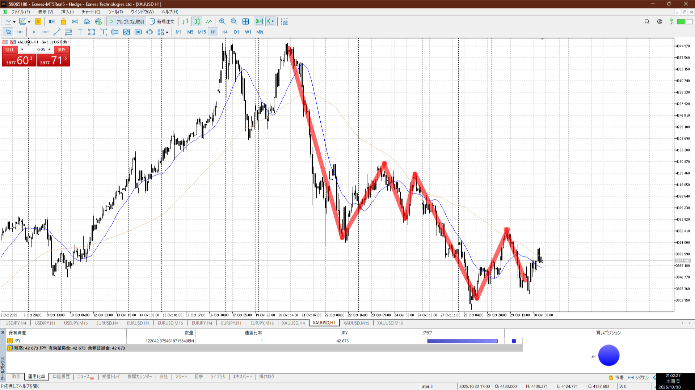
＜ここに目線画像＞

15m
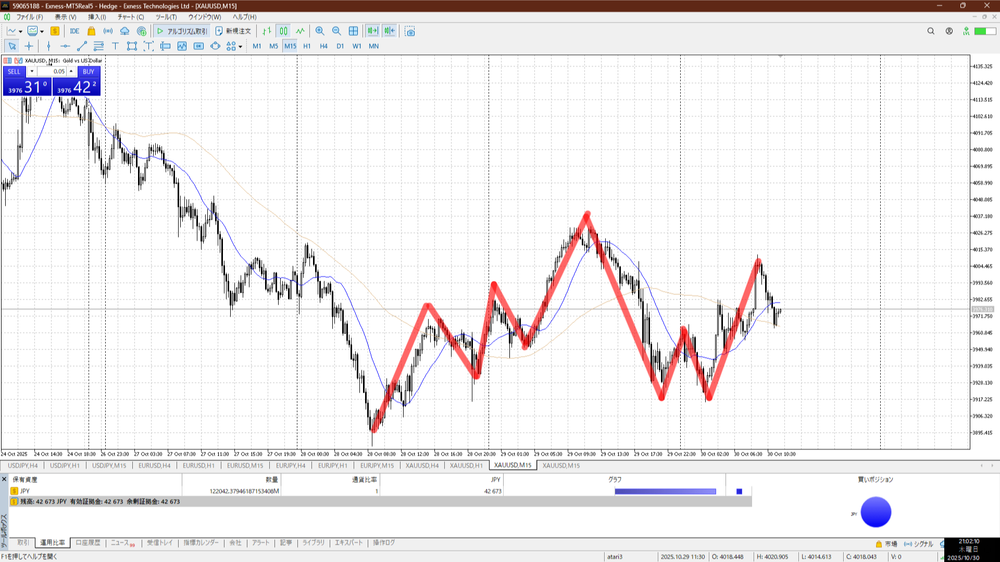
＜ここに目線画像＞

5m

＜ここに目線画像＞

平均描く

- [ ] 前日確認
- [ ] 使用足全ての目線確認
- [ ] 方向決定
- [ ] 両視点整理

1hd15mu
トレンドが上
売りは変わらず15m高値にいるので、ここまで来たら売りを考える

買い
15mネック

売り
15m高値

足流れ的に今どっちが強い
買い
1hとぶつかるので上の方は売りになる

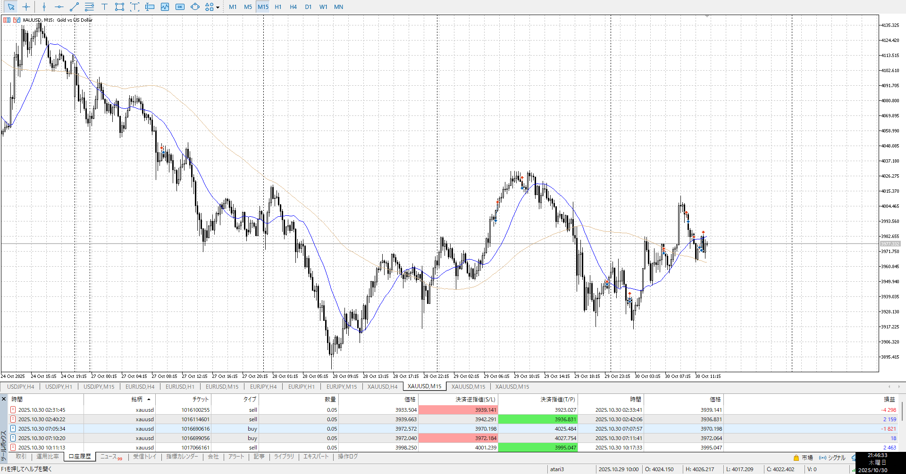

売りが刺してきてるが、高さを保っている
目線は変わらず買いなので買いたいが

流れを見て、シグナルを待つ
どちらも縦軸横軸を両方使える

![[../../images/2025-10-30 2025-10-30 21.55.15.excalidraw]]
ただしこういう取る長さに対して確定だと猶予が無くなる場合は触れ入り

そもそも流れとシグナルはレンジの話で、こここの時間足では少なすぎてレンジではない

だんだん小さくなる悪い癖

![[../../images/2025-10-30 2025-10-30 22.20.39.excalidraw]]