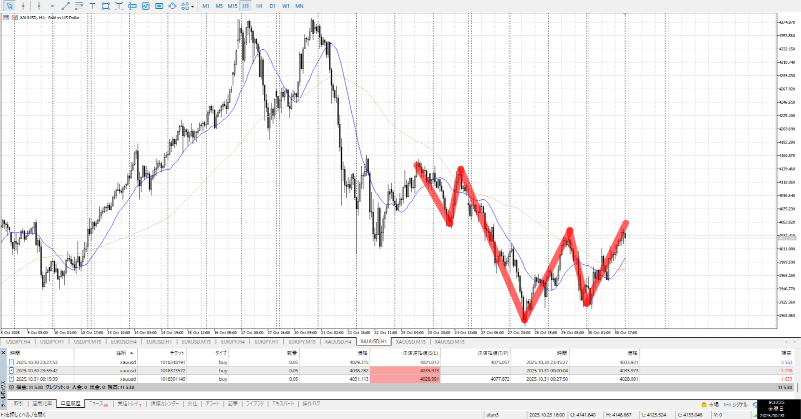
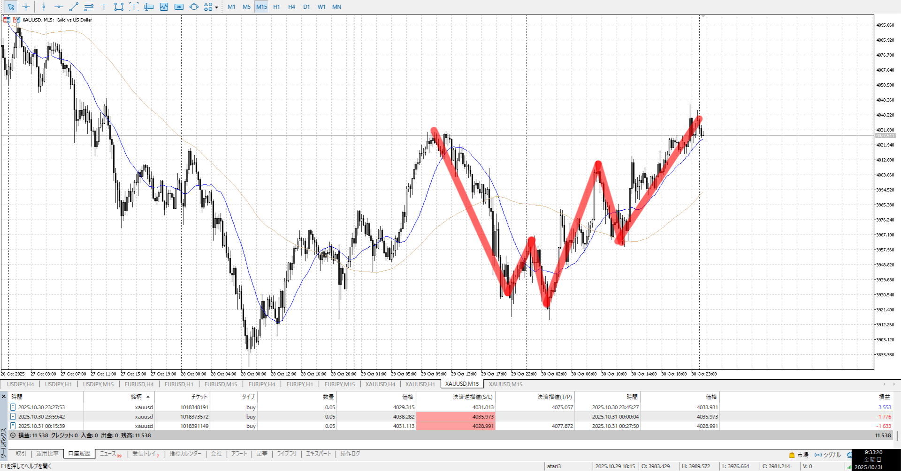
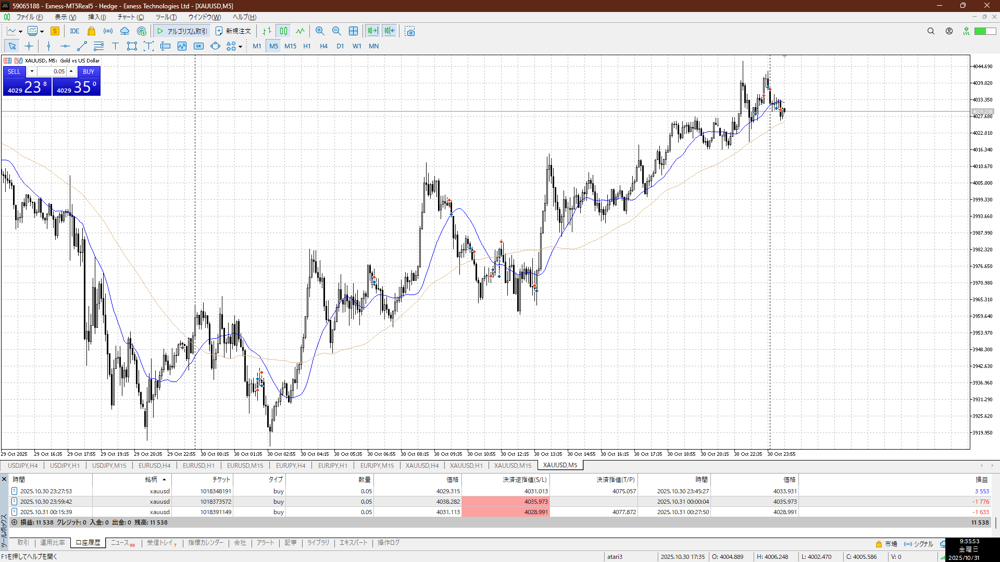
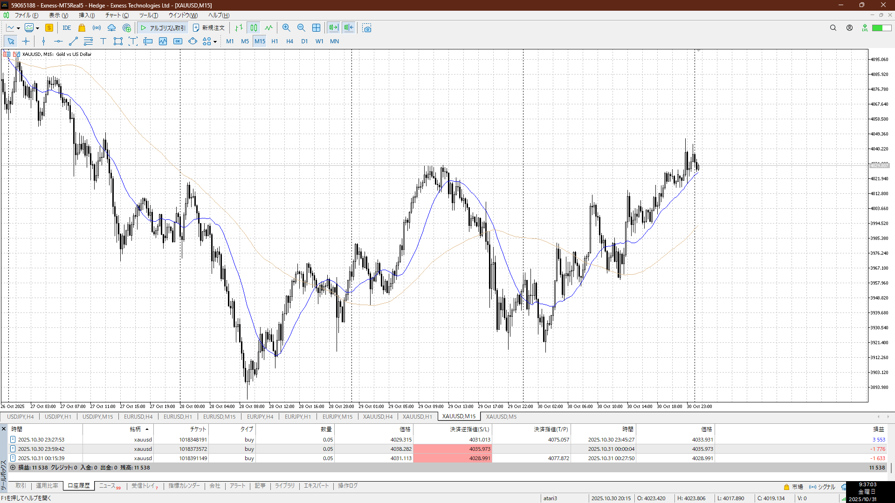
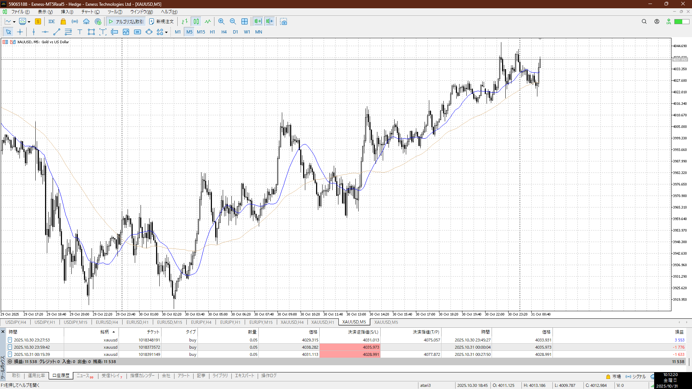
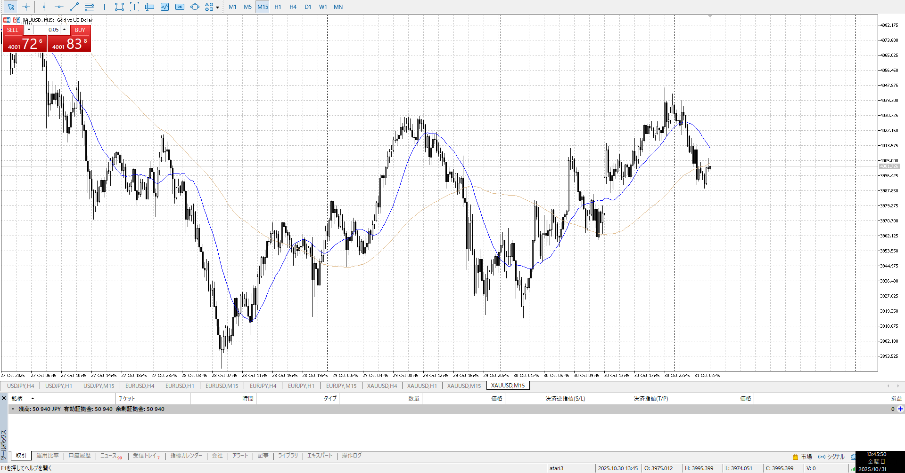
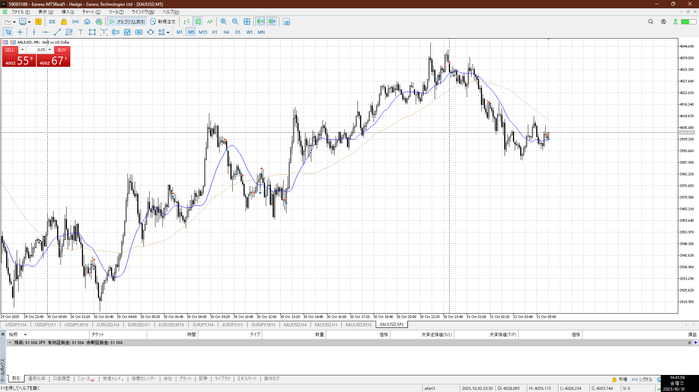
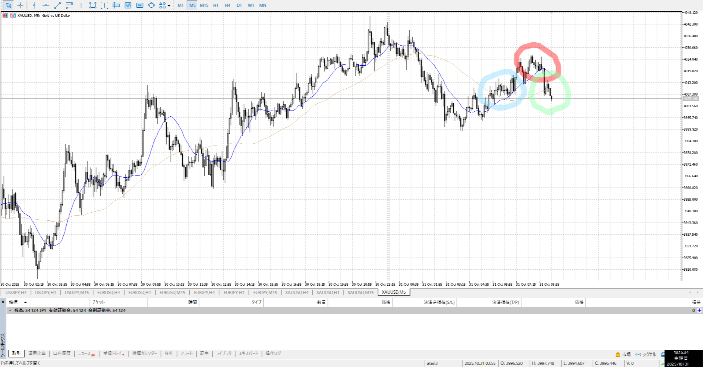
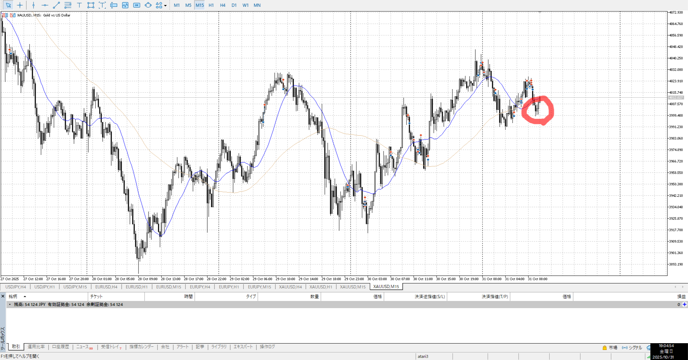
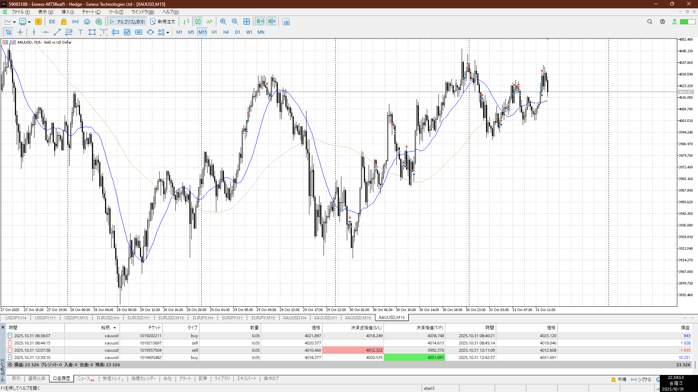

4h

＜ここに目線画像＞

1h

＜ここに目線画像＞

15m

＜ここに目線画像＞

5m

＜ここに目線画像＞

平均描く

- [x] [my](obsidian://open?vault=Teino&file=FX/my)(見ないと増える)
- [x] 指標
- [x] 前日確認
- [ ] 使用足全ての目線確認
- [ ] 方向決定
- [ ] 両視点整理

とても上
ネックによる下降などもかかる端境期なので、ちゃんと流れを見よう

買い
15mネック、抜けたら1hネック

売り
15m高値、抜けたら1h前々々回安値

足流れ的にどっちが強い
買いではある
今いるとこが売り場なので、変な流れに注意

2回目以降分は直前の上昇だけを見てやっていた

15mを見ると高値に届き切ってないので、下降の力がかかってしまう
下降中に買うという、昨日と同じことになってしまっている
[2025-10-31](./2025-10-31.md)

2回目以降は目を小さくして考えてしまいがち
むしろ二回目以降は大きくする気持ちで行け

理由を付けて買いたいなら、そりゃ下がったら上がるよなって。

昼。
15m上で折れ、半分で止まり。ここから上がる可能性は十分ある。

1hでも急な下がりであることには注意。

買うなら勢いが止まってから。

何故売ったのか

- 背景
    - 15m下降
- 事実
    - 15m,1hA
        - それにしては中途半端な位置
- 目標値
    - 15m安値
- 損切値
    - 5m高値
        - ズレ
- 実際値
    - 同値

たとえこれで落ちたとしても、入る場所が良くない
高さが低いので損切が多い

土地以下というと効果が下まで行かず弾かれてるので、買いの方がある
ただ15m1hAとぶつかるので、結局入らないが正解では

この後買い
抜けて嘉🄬あ15mネック

この後売り
15m高値

足流れ的にどっちが強い
前から引き継ぎ上

そうだ上狙いだった。
何してんだ。

青で入れないのに赤で入れるのは、高さと時間の問題

緑も入れる、平均を恐れすぎない

ひきつけて買える
元々買いだったし

![[../../images/2025-10-31 2025-10-31 19.10.08.excalidraw]]

ただ上昇に対して下落が早いので、買いにくい

---

今日一番の駄目
売り場で下がっていったが、その抵抗帯を死んだ扱いしてた

売り場を抜けきったわけではないので
（1hレベルなのでこの程度が抜いたうちに入らない）
抵抗帯はまだ生きてる、というわけで**売り優勢**

![[../../images/2025-10-31 2025-10-31 20.05.31.excalidraw]]

全体の見直しが出来てない

---

[小さく見てる時](../小さく見てる時.md)

今回は大きく流れで見て、15m高値で跳ね返ってるので売り。
がしかしそれが止められ、Mが出てネックを超えた。（15mのネックにはちょっと早かったが）
なので買い。15mで上髭が出たが多少かつ実体はネックを割っていた。**15m**で買い。
利確はそこから直近高値になる**15m高値**。

