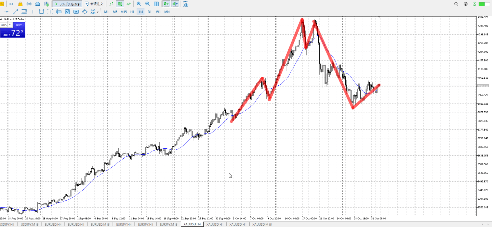
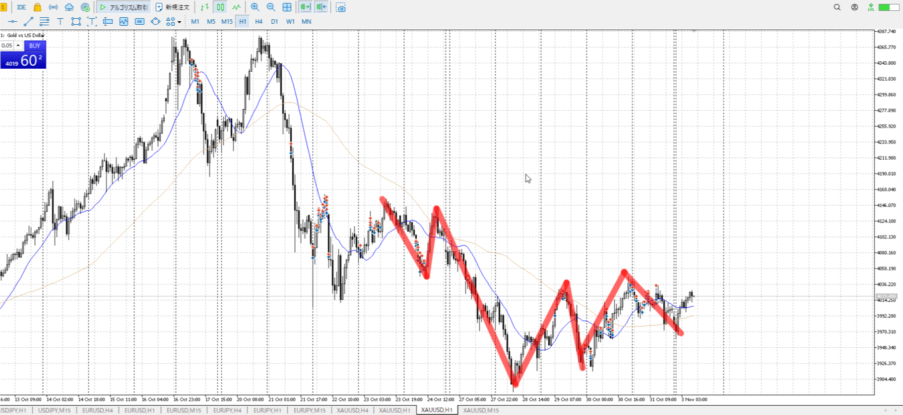
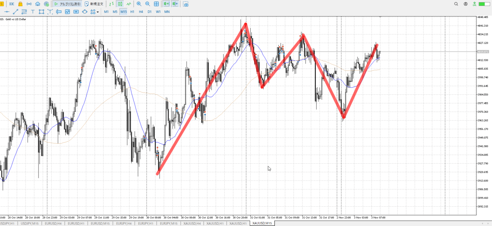
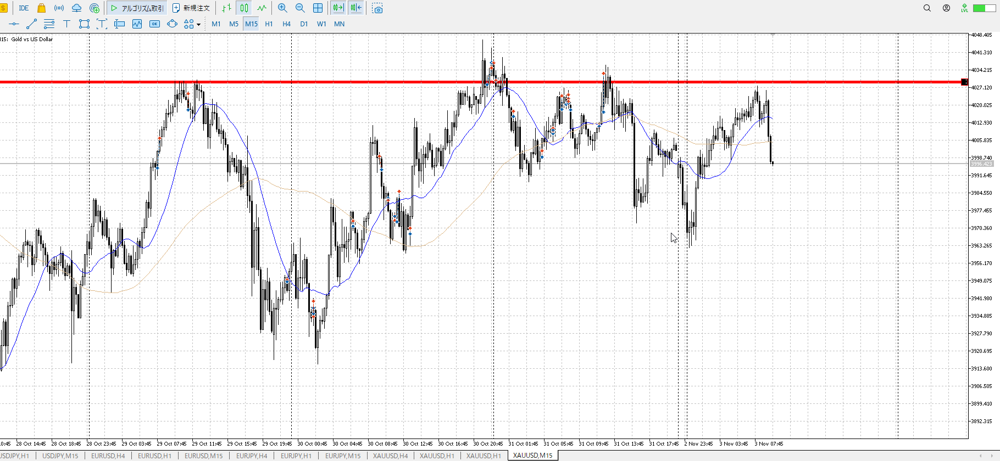
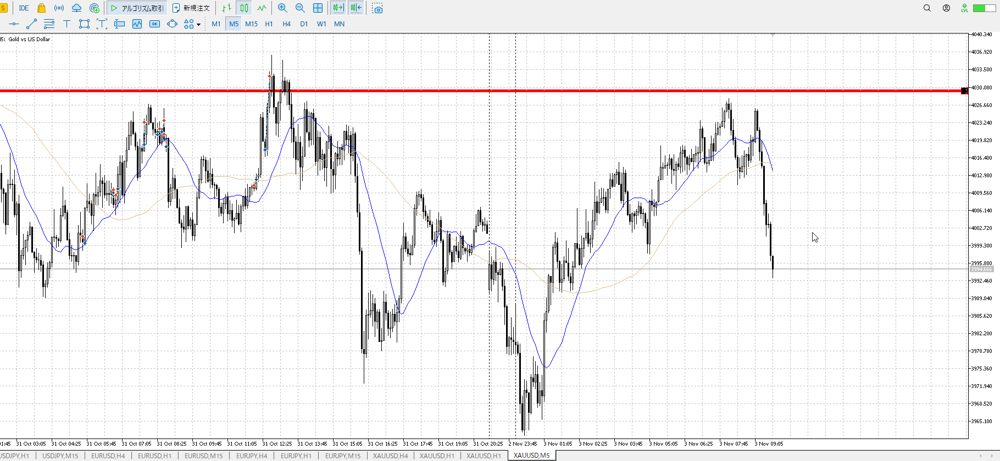
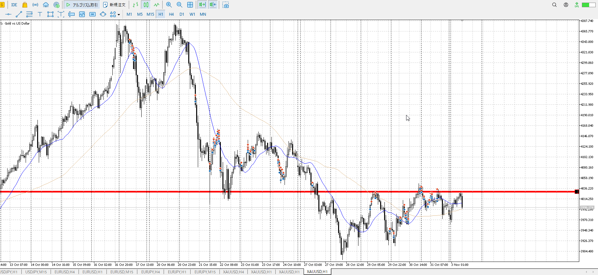

- [ ] 練習したか

4h

＜ここに目線画像＞

1h

＜ここに目線画像＞

15m

＜ここに目線画像＞

5m

＜ここに目線画像＞

平均描く

- [x] [my](obsidian://open?vault=Teino&file=FX/my)(見ないと増える)
- [x] 指標
- [ ] 前日確認
- [ ] 使用足全ての目線確認
- [ ] 方向決定
- [ ] 両視点整理

金曜10:30雇用統計

1hの半値で売りたい
前回15mで一気に落ちたかと思いきや、跳ね上がり半値へ再チャレンジ
切り上げは厳密にはまだ決まってないはず、今は15mを一度下に抜けてから再チャレンジという下への力が戻り始めてるアピールとも言える。

1hの半値で売りたいのだが。上昇が無くなる、レンジが出来るまで手は出せない。せめて平均は割りたい。
もちろん買いなんてできない。明確に1hで抜けでもしないと。

買い
1h直近安値

売り
1h半値

足流れ的にどっちが強い
売り

あー。
急激な上昇が勢いを失い始めての抜け。

一応5mなら……
いやそれでも厳しい。売りにくいことこの上ない。
5m最後の急上昇の否定へ戻るところ。これを取れたと言えばそうだが。

一応まだ戻り売りが取れるはずなので見る。
