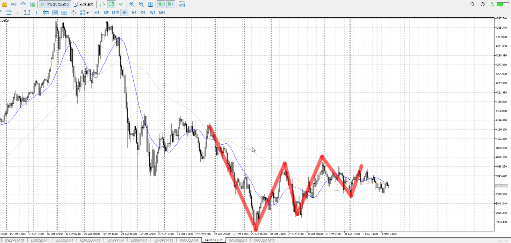
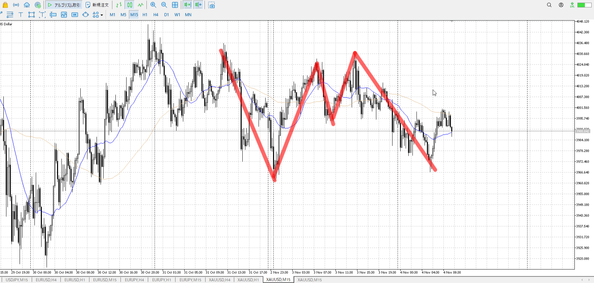
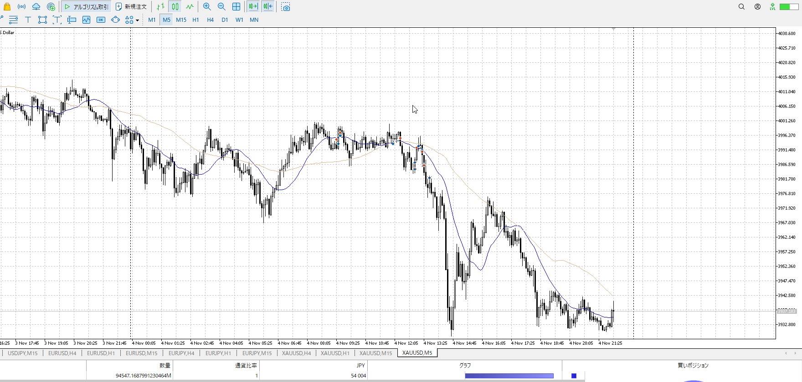

- [ ] 練習したか

4h

＜ここに目線画像＞

1h

＜ここに目線画像＞

15m

＜ここに目線画像＞

5m

＜ここに目線画像＞

平均描く

- [ ] [my](obsidian://open?vault=Teino&file=FX/my)(見ないと増える)
- [ ] 指標
- [ ] 前日確認
- [ ] 使用足全ての目線確認
- [ ] 方向決定
- [ ] 両視点整理

御磁ところで止められ続け、15mのネックをつかって売りたい場面ん。
途中15m直近安値を割った下降が1hレンジ下で止められて戻されたので、一応買いも試した。
損しないようにしたつもりだったがスリップで若干損。

買い
1ｈレンジ下

売り
1ｈレンジ上

足流れ的にどっちが強い
レンジ真ん中でぬかし抜かされしてるのでちょっと。

理想で上手くいかなかったからって逆と判断するのが早計過ぎる。
15m見ると即わかる。売り。

