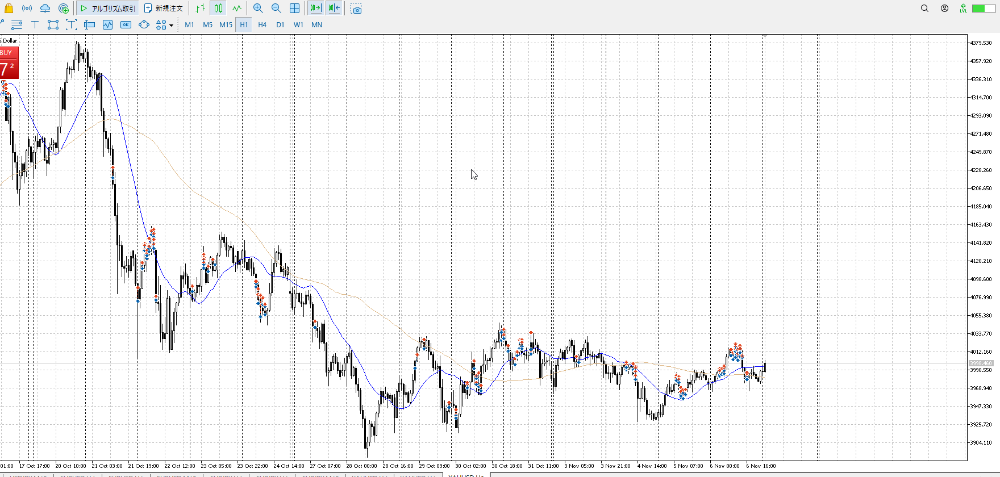
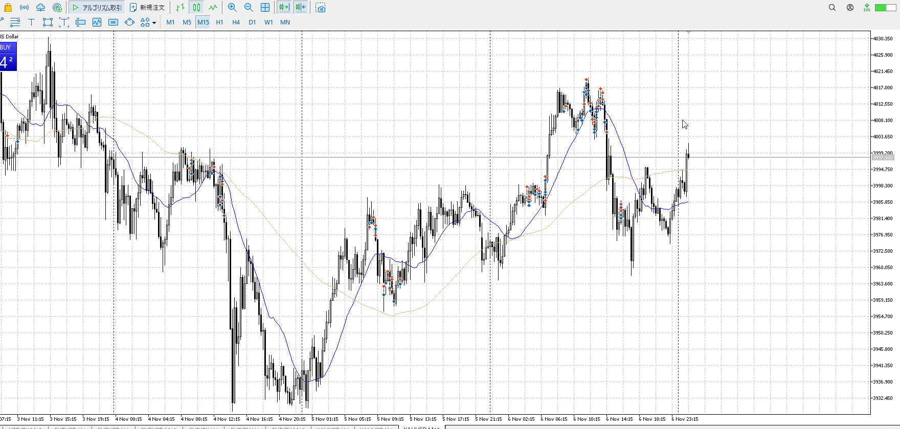
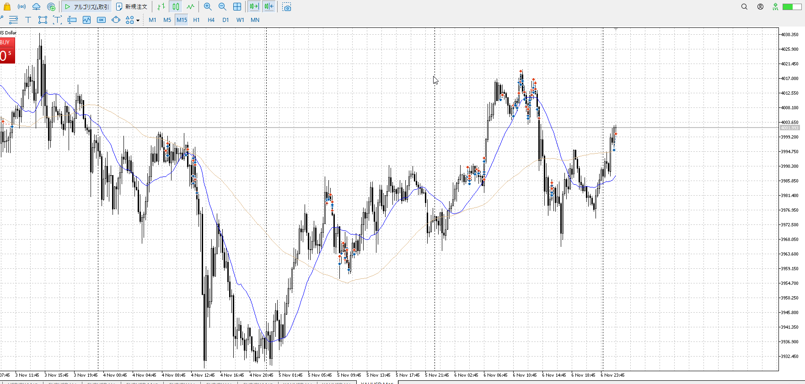
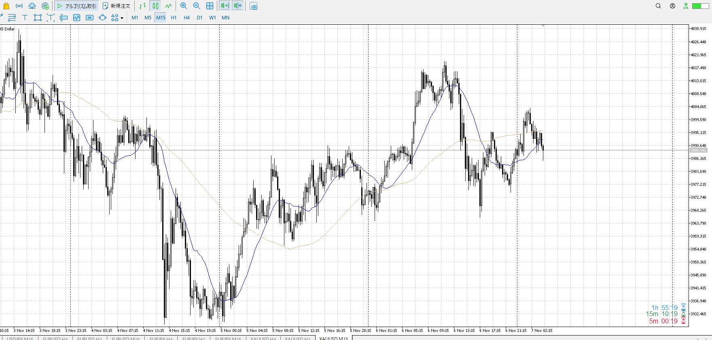
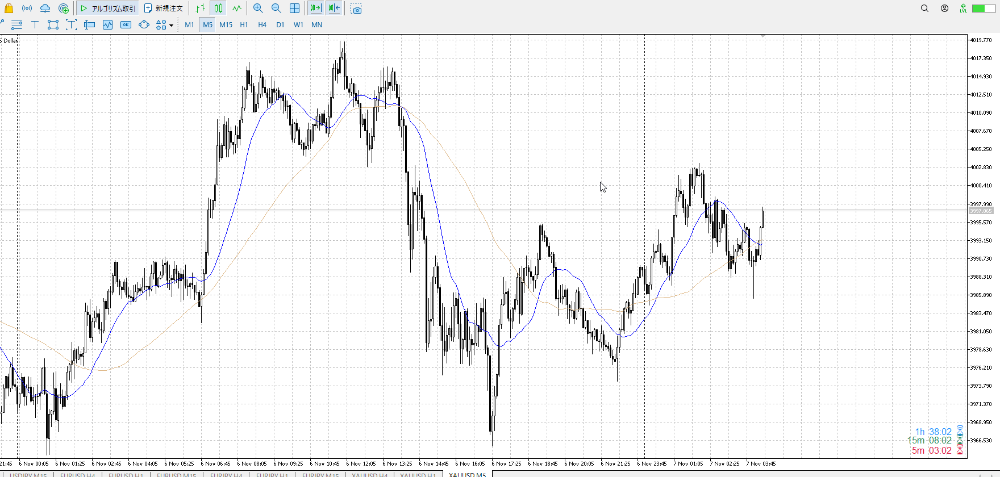
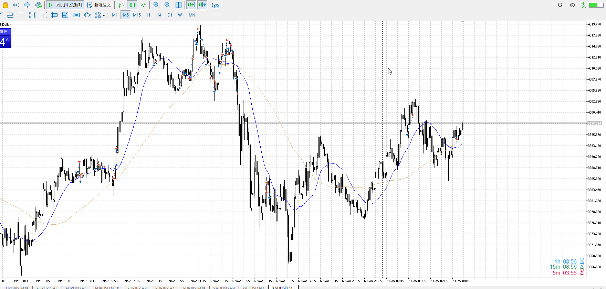
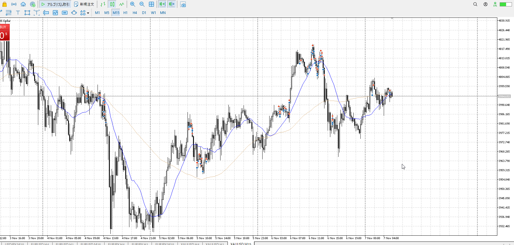
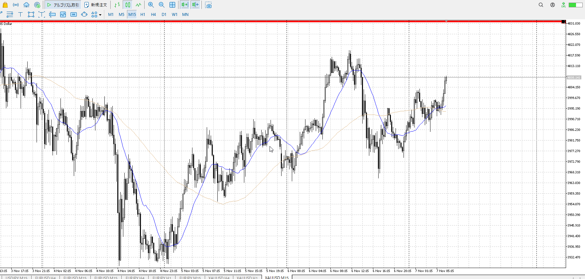

- [ ] 練習したか

4h

＜ここに目線画像＞

1h

＜ここに目線画像＞

15m

＜ここに目線画像＞

5m

＜ここに目線画像＞

平均描く

- [ ] [my](obsidian://open?vault=Teino&file=FX/my)(見ないと増える)
- [ ] 指標
- [ ] 前日確認
- [ ] 使用足全ての目線確認
- [ ] 方向決定
- [ ] 両視点整理

### exp
レンジがめちゃくちゃ迫られたWで戻っていく
かなり上の力が強いように見えるが、どうか

### sec

この下降を受けたうえですぐさまWを描いているので、上
それが崩れそうだが、確実に崩れるのは15m直近安値抜いてからのはず
まだ買い

平均下にいるので、これをまた上に行ったらどうなるかと言ったところ

まだ買いなので、こういう下髭出たら買えるんですね
押しを狙う

相場の方から小さくなってきている
どうすんべ
どうもこうもない、止めて置く

やめろっつってんだろ

だとしてももうちょい耐えろ

抑えられ目
上がってはいるがゆっくり、ここで急激に落ちてもおかしくない形
そしたらネックへの戻りか

同じくらいの高さまで来たら売りなのはそうだが
現時点では特に何もなく買いのまま

