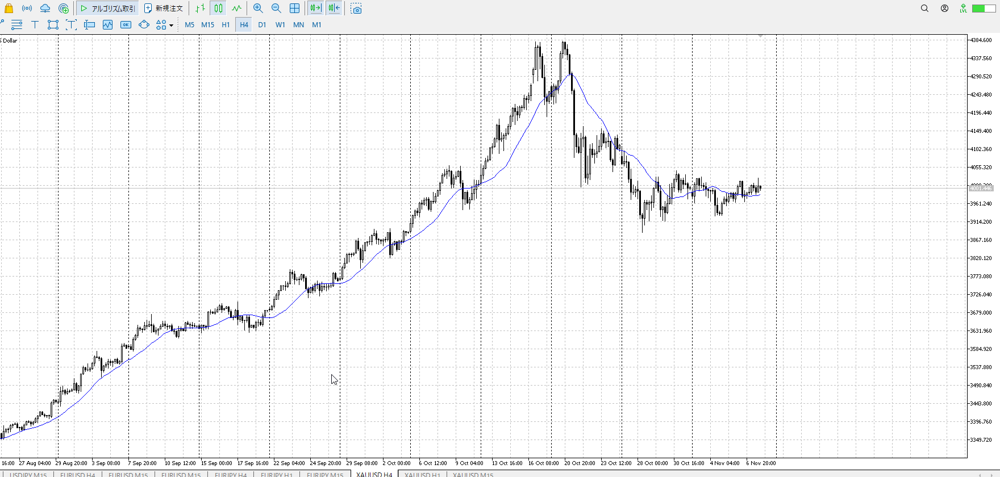
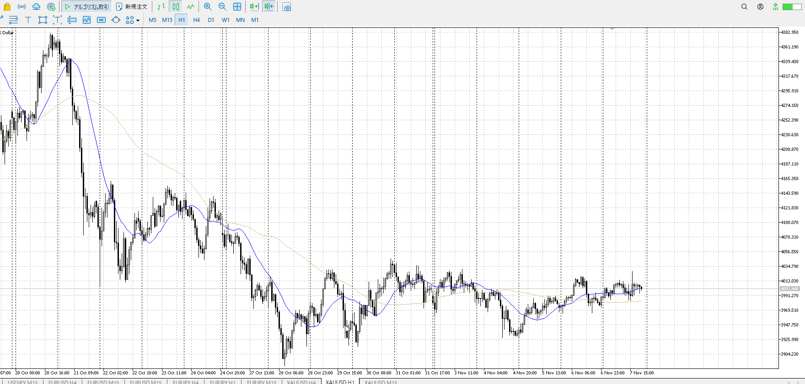
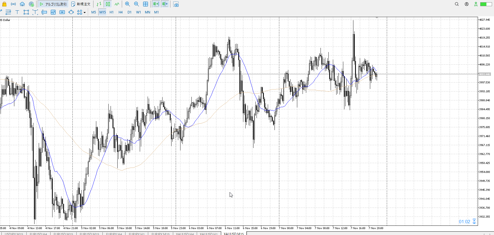

- [ ] 練習したか

4h

＜ここに目線画像＞

1h

＜ここに目線画像＞

15m

＜ここに目線画像＞

5m

＜ここに目線画像＞

平均描く

- [ ] [my](obsidian://open?vault=Teino&file=FX/my)(見ないと増える)
- [ ] 指標
- [ ] 前日確認
- [ ] 使用足全ての目線確認
- [ ] 方向決定
- [ ] 両視点整理

木曜10時半CPI

全体としてはレンジ上なので売りたい
のっそり上に向かってるので売りたい
で15mで突撃したが、跳ね返される
下支えされつつ落ちていく

直近が面倒だが、売りなのは変わらず売り
15mだけuになったので安値を割りたいところ

買い
15m安値

売り
1h高値

足流れ的にどっちが強い
売り
直近は買い
