> [!check]
> - [x] +1万 事前認識 **開始5分**
> - [ ] +1万 5枚

4h
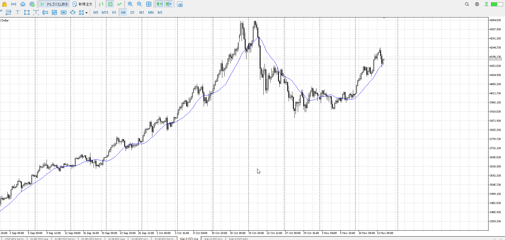
＜ここに目線画像＞

1h
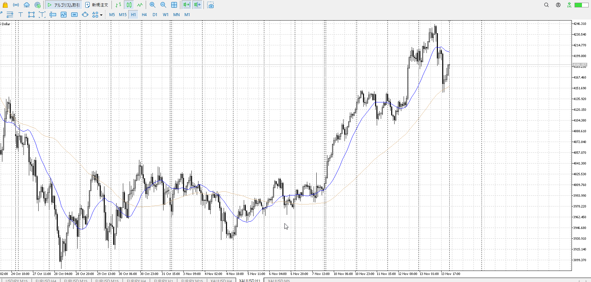
＜ここに目線画像＞

15m
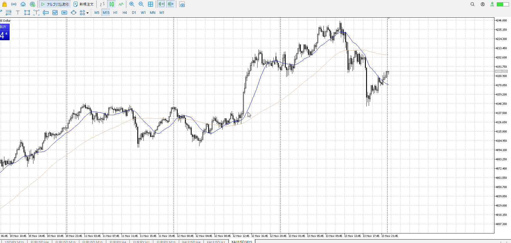
＜ここに目線画像＞

5m

＜ここに目線画像＞

- [x] [my](obsidian://open?vault=Teino&file=FX/my)(見ないと増える)
- [x] 指標
- [x] 前日確認
- [x] 使用足全ての目線確認
- [x] 方向決定
- [x] 両視点整理

ぶつかり
ひきつけ

15mが目線変わるほど折れた。根拠を4hネックの他確認できず。
しかし1hの押し目買いにより上昇。このまま二度目の下降を裏切るほど上昇すれば、4h売り一時撤退。売りは出来ないと予想できる。

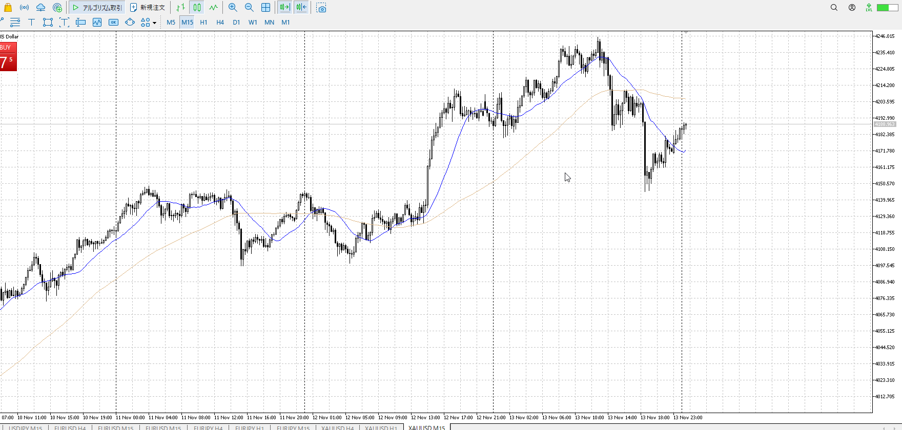

で、この位置は売るか買うかの本当に瀬戸際なので何かはあまりできないか。
急に売られるかもしれない。その場合15mの戻り売りということになる。
それに対抗しているのは1hの押し目買い。大きさに差はあれどどっちが勝つかは分からない。だから直前の間にひきつけろという。

![[../../images/2025-11-14 2025-11-14 10.03.42.excalidraw]]
買えよ！

買いそうなところからの2000points圏内把握と、1m禁止。直前の1mは不安煽りにしかならない。

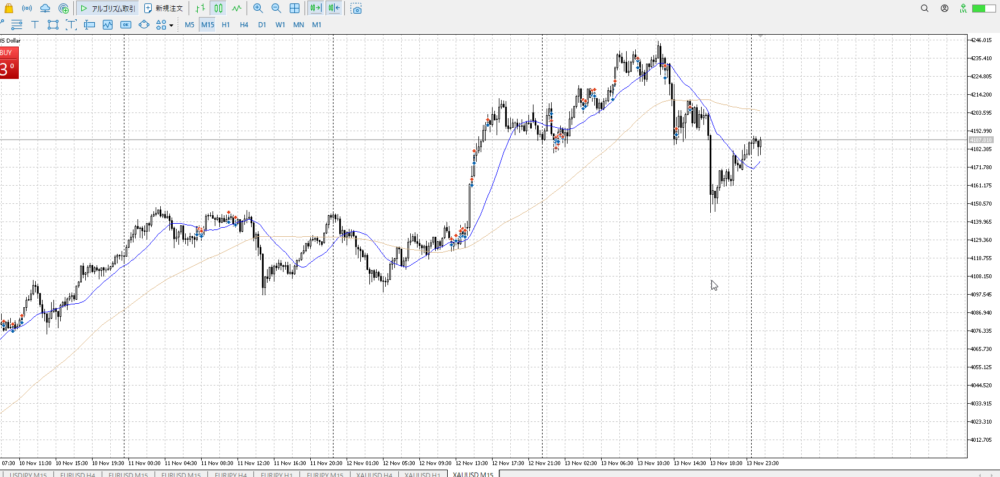

出来なかったので再度15mから。
同じく15m戻りと1h上昇のわけだが。

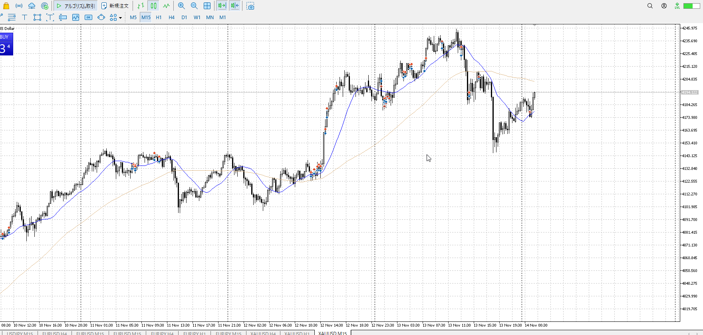

1h上昇か。
売りはできなくなるのでこのまま下がったら買いモード。1hAが上に見えている注意。

- [x] 場確認

買い
1h前回レンジ上

売り
15m前回レンジ上下

足流れ的にどっちが強い
まだ15m下降が生きてるので、売り
買うなら~~これを反転か~~買い場に来たところかダブルボトム作って抜けるか
買い場売り場内の話をする

生きてる死んでるは目線的な話で決める

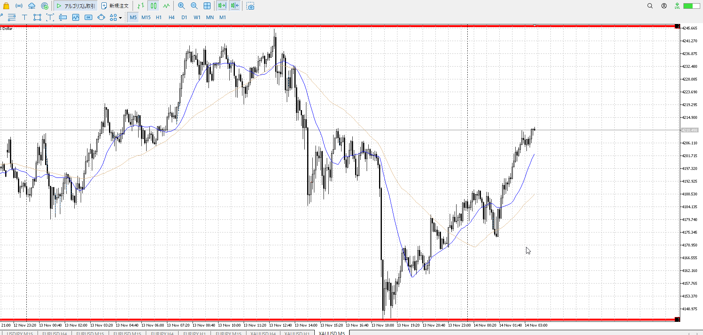

売り場なので、売られる
ここから買うなら売りを直接否定する必要がある
売られないでは不十分

つつみの大陽線、その戻り
本当にそこで買いたいならだが、リスク大

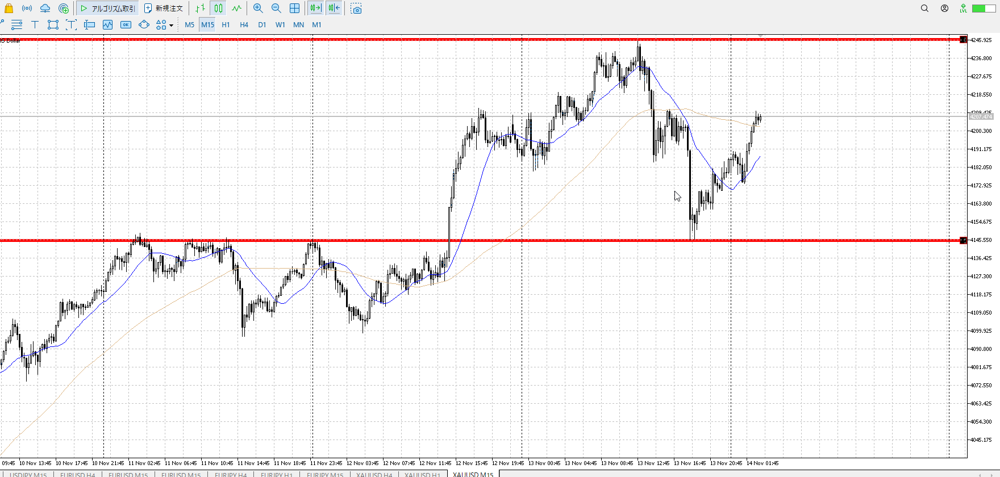

売り場抜けそう
そしたら以下になる

買い
15mレンジ上下

売り
1h高値

足流れ的にどっちが強い

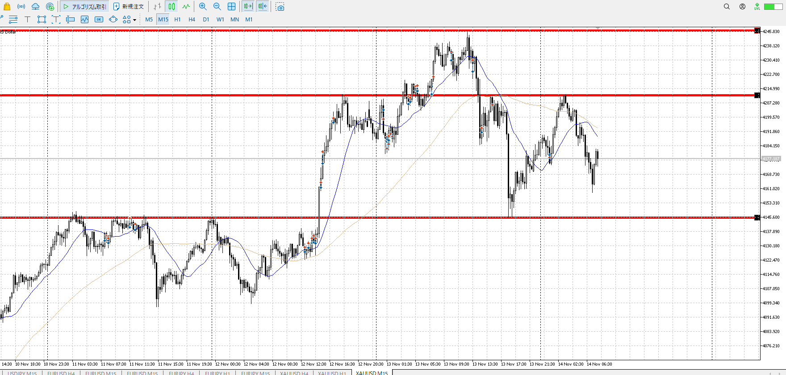

抜けはしなかったので継続
このまま買い場で買い、売り場で売りを目指したい

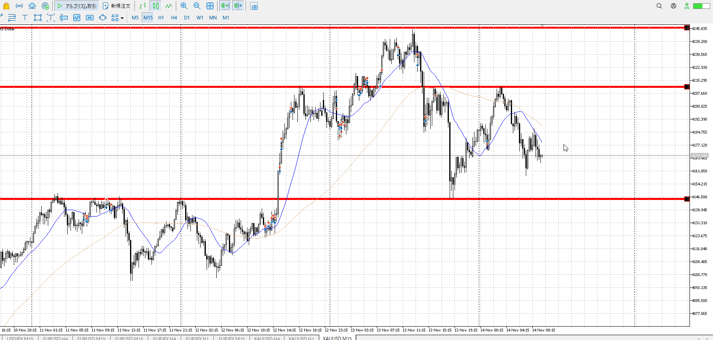
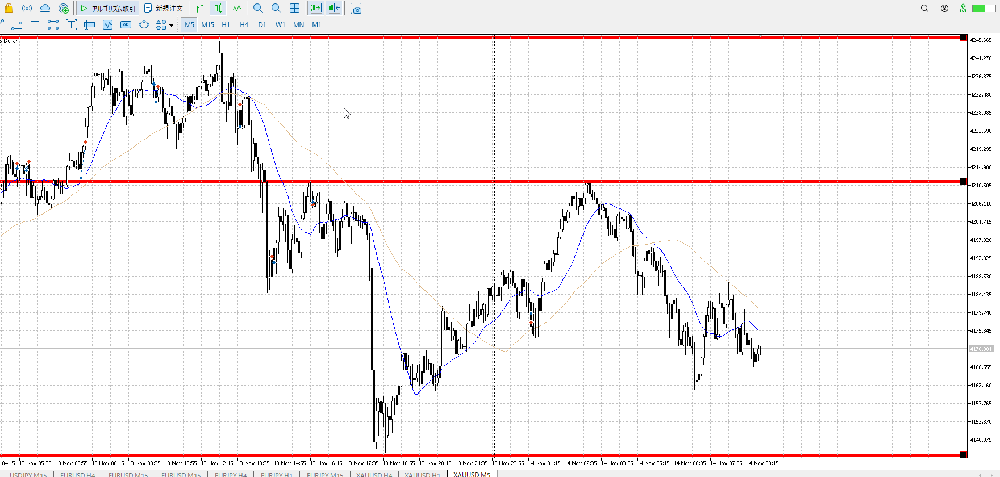

早めの下固め上がりかと思ったが、上髭出しながら落ちてるという。
ただでさえまともじゃないレンジみたいな形なので、不安ならやめる。

再度確認。

買い
1hレンジ上

売り
15mレンジ上

買いの力が15mレンジ上下で止められている。
つまり今売られているのは15mレンジ上下の力のみのはず。
高さは4hネックだがそれなら勢いがない。

だから早めに折れるのは流れとしてはありそう。
1hレンジ上から買った税の押し目買い。

しかし1回目押しかと思われるところは何もない。
15m売りの満足か。でも買い場じゃないので上がりにくい。
横幅としてもd15-r10。ここからはちょっと早い。

こんな危ないとこより、買い場で大きく下髭出した後を買ったほうがいい

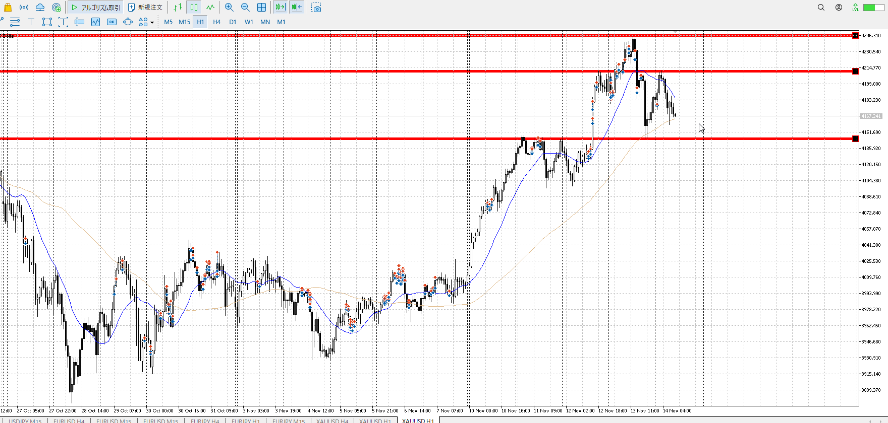

1h
4hAにぶつかってるが、このまま下髭触れで行ける？

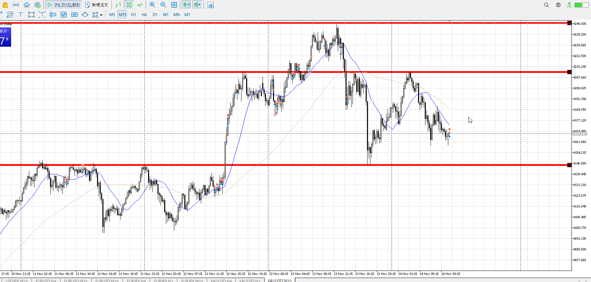
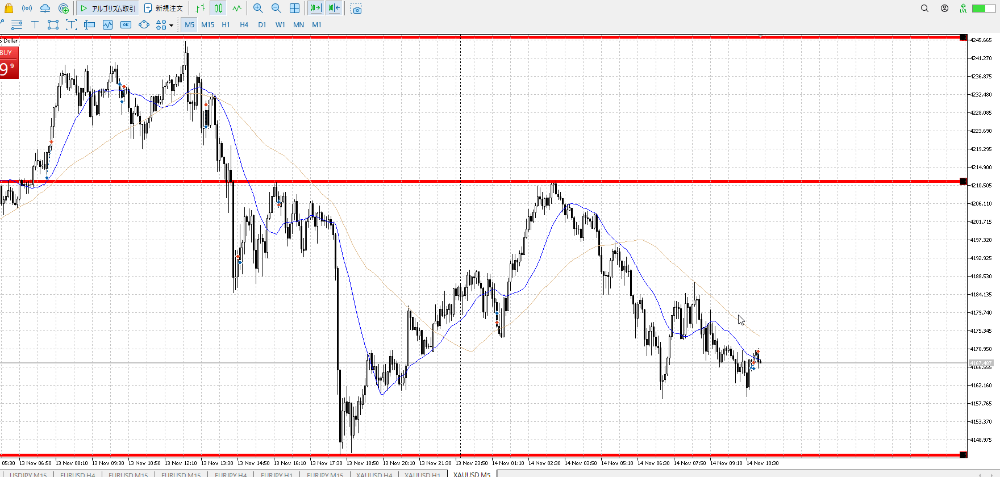

包あと小ロウソクにしてはいまいち伸びなかったので手放した。
これはしゃーなし。

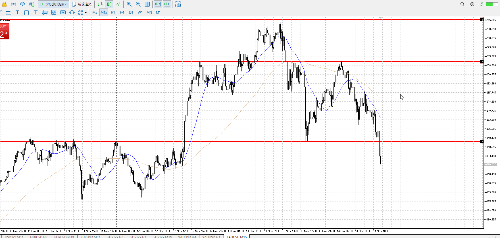

そういや15m売りだけど。
でも1hが買いだったから買うのは間違ってなかったはず。急に加速した。

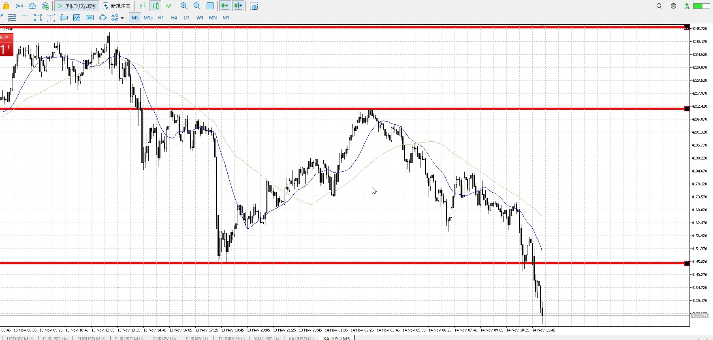

抜け売りは難しいので、5m速攻売りをしたいが。
やっぱむずい。

[[./2025-11-14-t]]