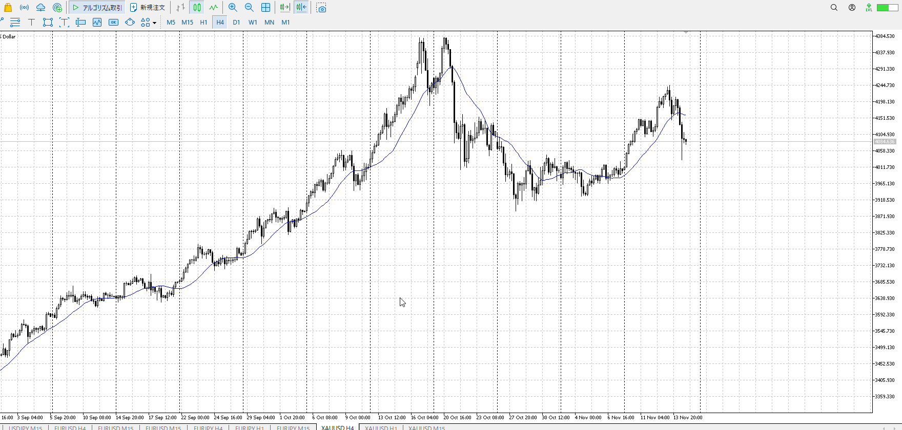
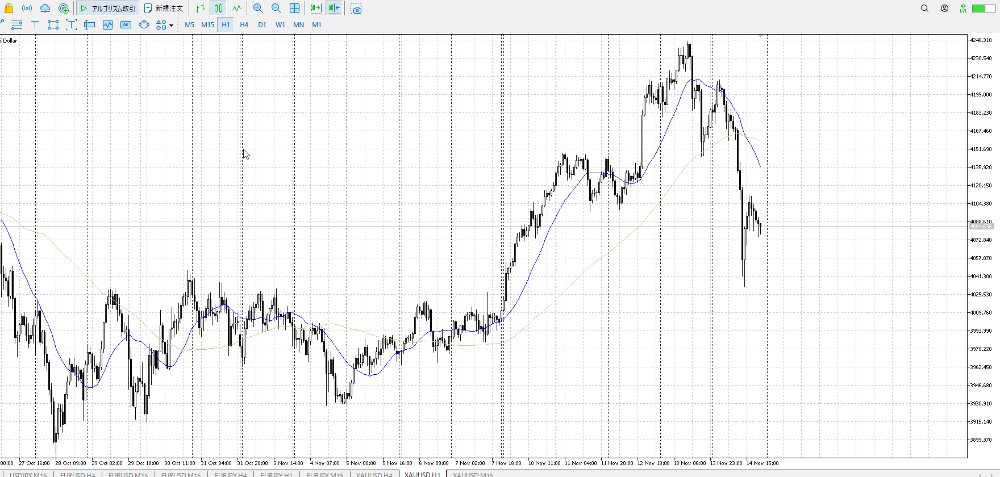
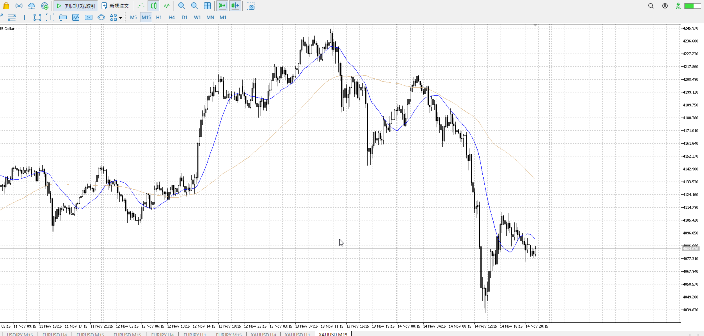

> [!check]
> - [ ] +1万 事前認識 **開始5分**
> - [ ] +1万 5枚

4h

＜ここに目線画像＞

1h

＜ここに目線画像＞

15m

＜ここに目線画像＞

5m

＜ここに目線画像＞

- [x] [my](obsidian://open?vault=Teino&file=FX/my)(見ないと増える)
- [x] 指標
- [ ] 前日確認
- [ ] 使用足全ての目線確認
- [ ] 方向決定
- [ ] 両視点整理
- [ ] 場確認

ぶつかり
ひきつけ

4hu1hd15md
目線が軒並み下折れ

目線としては当然売り
1h前回安値で売りを再度仕掛ける

下髭を出しながら落ちており、どこから上がってもおかしくない
その分急上昇を再度折る可能性もあるし、買いに安易についていかないこと

買い
4hレンジ上

売り
1h前回安値

足流れ的にどっちが強い
急降下は生存しているし、売りたい
下髭が怖いのでひきつけ売りを徹底、または買い跳ね返り後の抜け？

