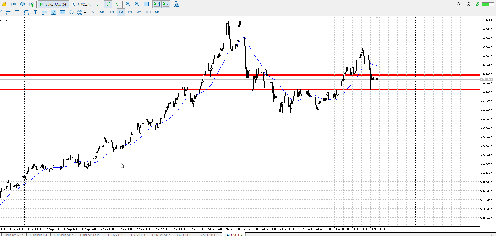
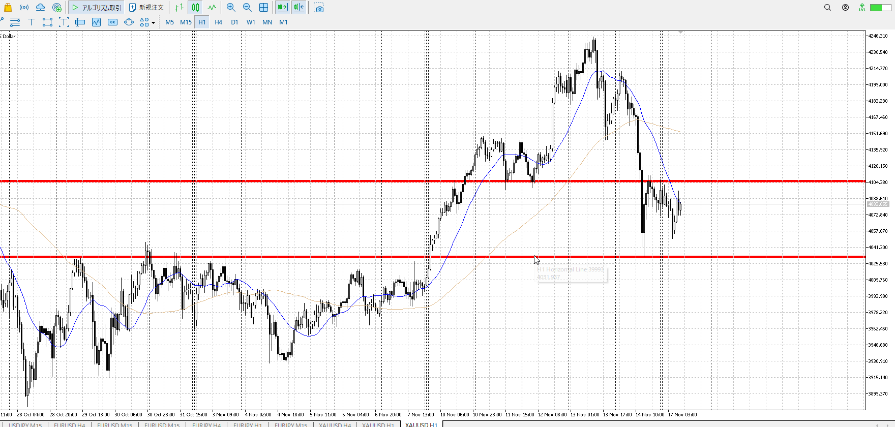
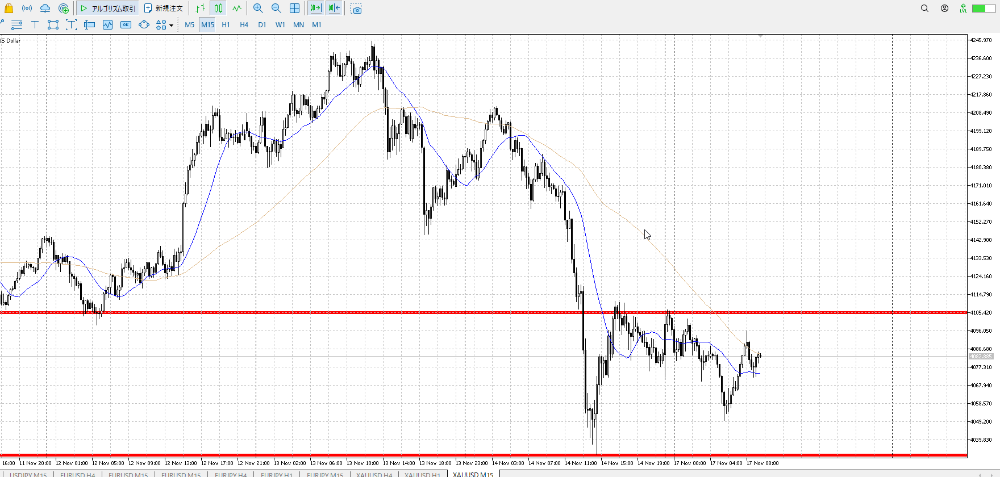
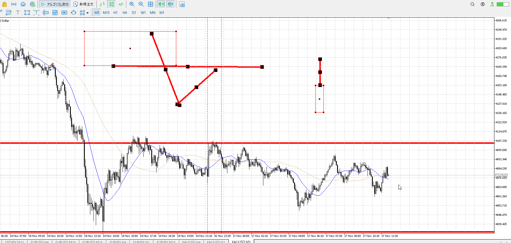
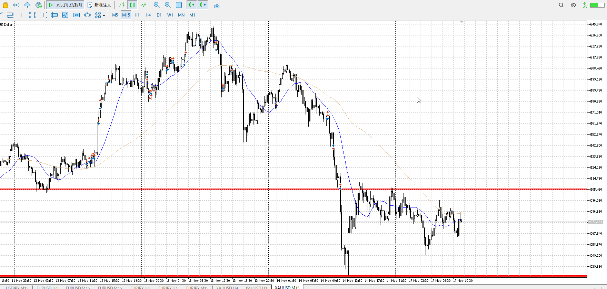
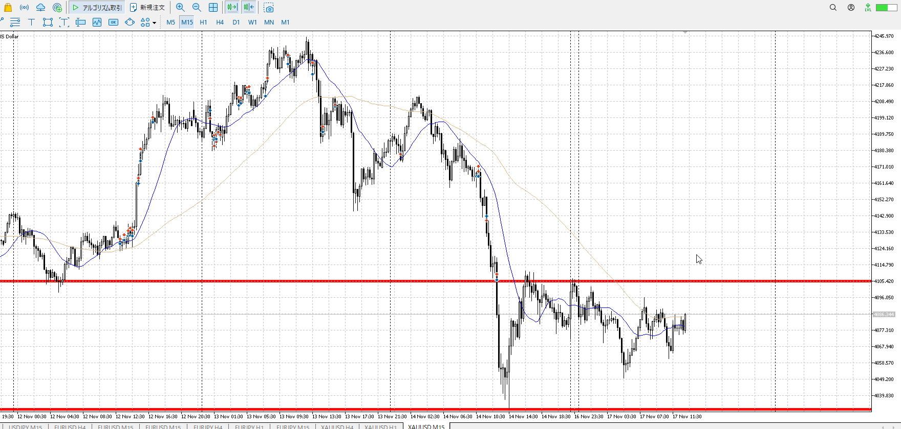
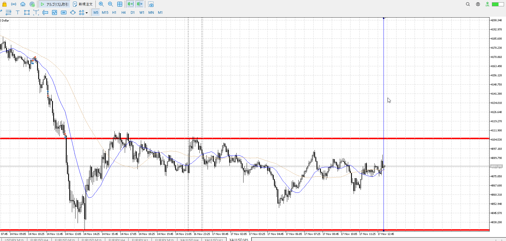
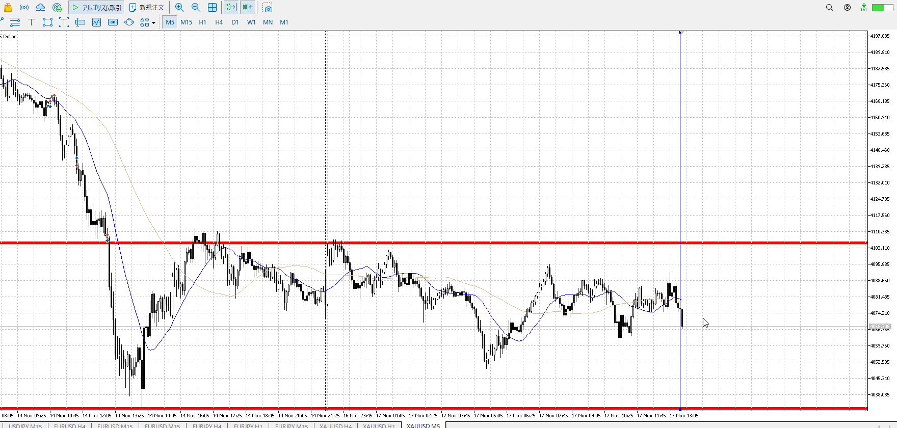
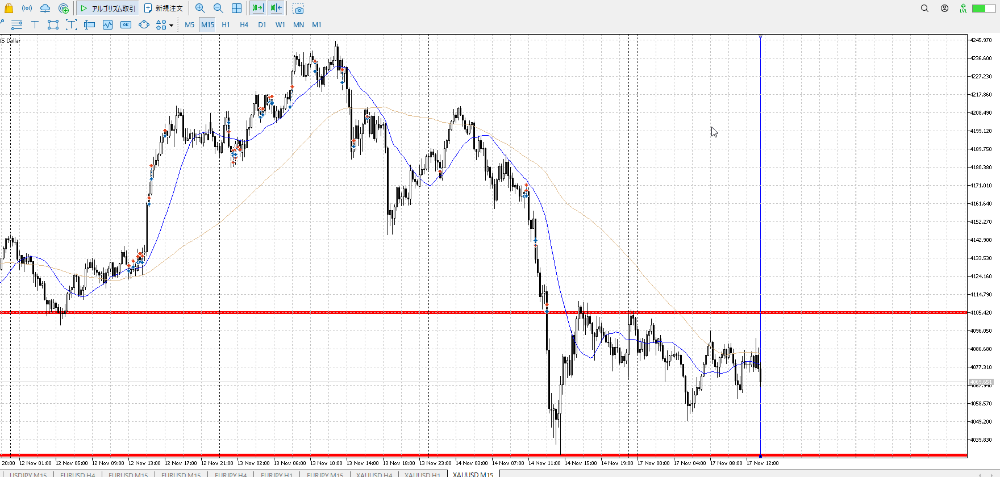

> [!check]
> - [ ] +1万 事前認識 **開始5分**
> - [ ] +1万 5枚

4h

＜ここに目線画像＞

1h

＜ここに目線画像＞

15m

＜ここに目線画像＞

5m

＜ここに目線画像＞

- [ ] [my](obsidian://open?vault=Teino&file=FX/my)(見ないと増える)
- [ ] 指標
- [ ] 前日確認
- [ ] 使用足全ての目線確認
- [ ] 方向決定
- [ ] 両視点整理
- [ ] 場確認

ぶつかり
ひきつけ

udd

1hレンジ下売り、4hレンジ上買い。
15mでレンジを作り下抜け。戻りが激しく一直線抜き。すると押しを買いたくなって。
といっても押し買いはやはり短期的な話。1h目線上、1hレンジ下売りで売られるのを待ちたいところ。

いまはMやレンジが無いので。短期の買いの死に待ち。
上についてMを作り始めて売りたい。

エントリーは横幅も取っていく。

横幅が取れても、この場所は何もないので取引はしにくい。

急降下から上昇に戻り売りが起きず真っ直ぐ上昇、下髭止まりで売り否定があり再度上昇、その後押し。
買うこと自体はできる。ただ5mレベルで反転を狙った買い。落ちたら即落ちるので注意。

それを掴むここの抜け売り。
15mとしても上髭出して止めて、で大分それっぽい。
元々売ろうとしてた分もある、もちろん元買いの根拠にしてた売り止まりの抜けを見てだけど

