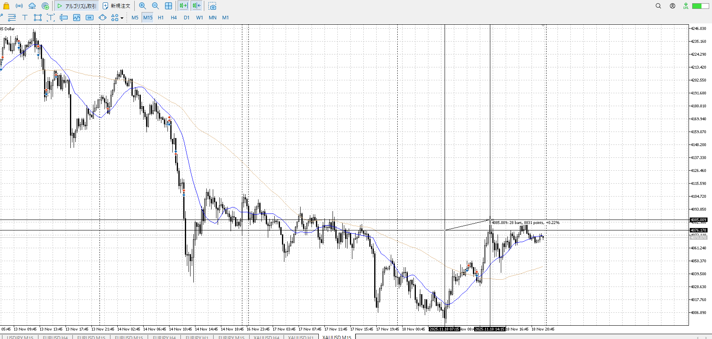
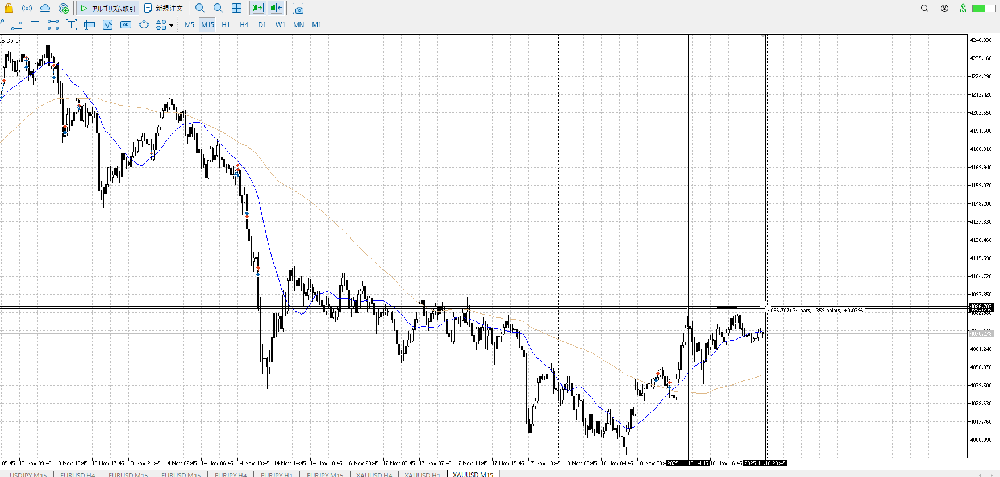
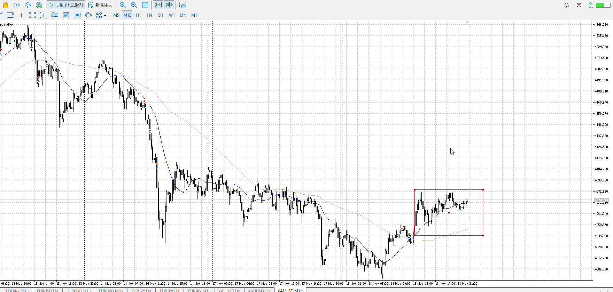
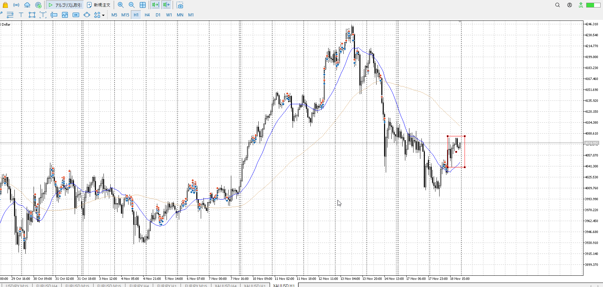
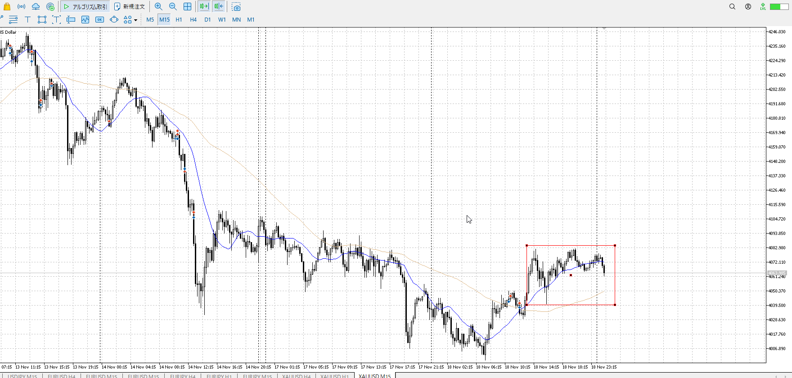
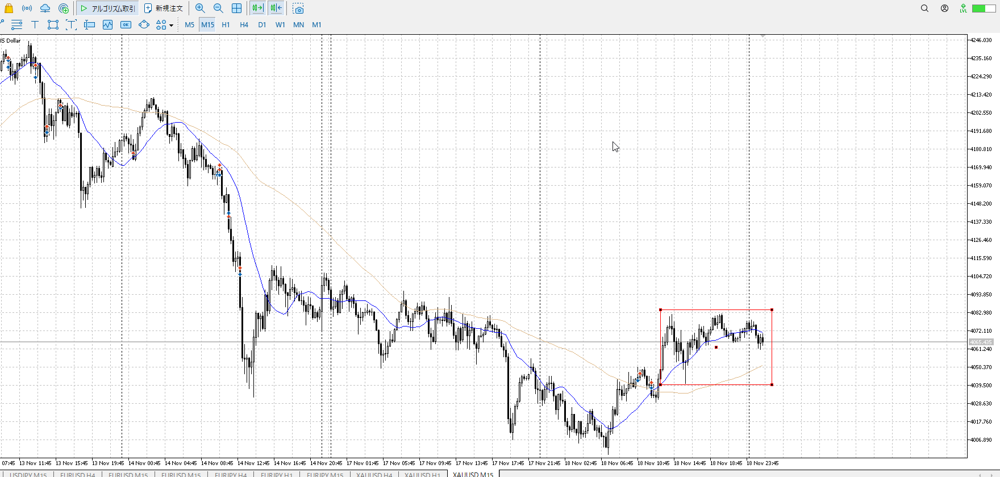
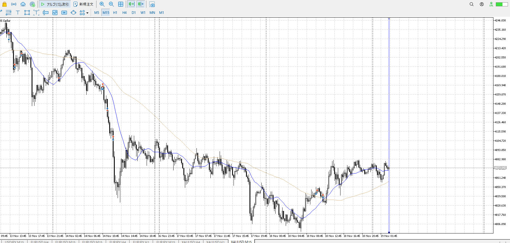
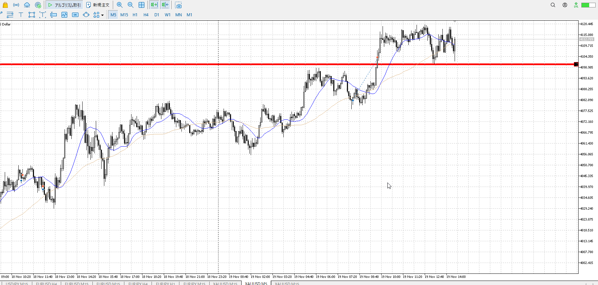
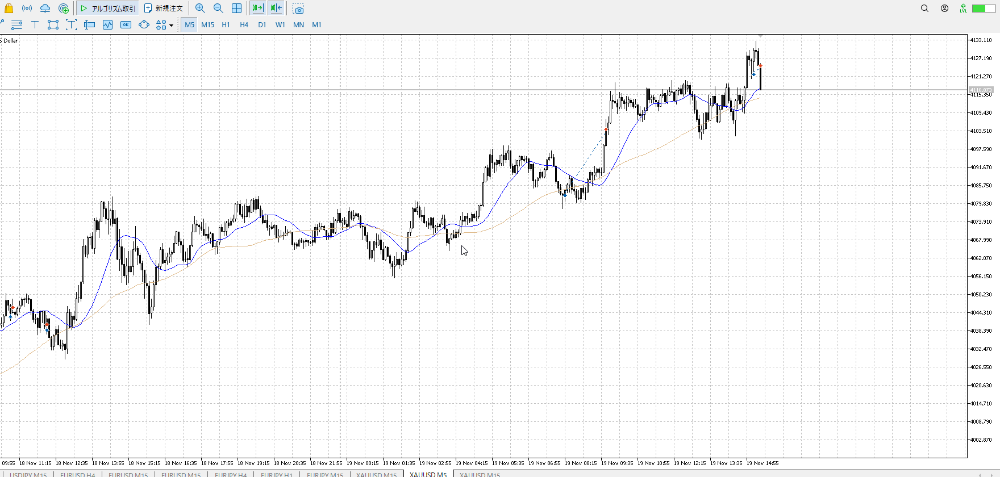

> [!check]
> - [ ] +1万 事前認識 **開始5分**
> - [ ] +1万 5枚

4h

＜ここに目線画像＞

1h

＜ここに目線画像＞

15m

＜ここに目線画像＞

5m

＜ここに目線画像＞

- [x] [my](obsidian://open?vault=Teino&file=FX/my)(見ないと増える)
- [x] 指標
- [ ] 前日確認
- [ ] 使用足全ての目線確認
- [ ] 方向決定
- [ ] 両視点整理
- [ ] 場確認

ぶつかり
ひきつけ
横幅

4hレンジ上買い場で買われる。1hレンジ上の売り場に早めに反応。前回の1hレンジは上が右肩下がりなのでいろんなところで反応するが、その中の一番低い奴が反応。
->15m目線更新が出来てない。dddのまま。

横幅を使い上がいないことを示し始めているので、売りたいところ。

だらだらだが上昇は50bar程度。
だらだらなら急激に売られるのもおかしくないが。

この中で1hで包みが出ている。

上昇は上昇だし、レンジになるか大きく崩れるまで分からないか。

明確な上昇のみだと、後ろのレンジ判定が長めになる。
というか、ここで折れてようやくレンジって判るから、

今初めてこうか。
あくまで15mレベルレンジ。

方向は売り。
レンジが上に貼りつき気味なので、これをした抜きから戻り、あるいは抜けが一番妥当。
反転の場合は上行くのを見せかけて下包み。

あくまで15mがレンジと言うだけ
1hとしてはここで落ちるのはおかしいので、それを踏まえて朝ごはん

売り場内なんだから、この時点で15m開いて見ればできたか。

上にしては上髭出してないのが気になる。

よく見たら15m目線上だ。ddu。
なのでしばらく売りは出来ない。買い。

買い
15mレンジ下

売り
1hレンジ上

15mどっちが強い
買い、目線的にも流れ的にも
こいつだけ上目線なのでこれを否定しないと売れない、買うなら明確な何かで短期買い

戻して云々と言われると買いそうだが、その戻しは上までいってない。
時間帯も辛い。
短期で買うことになるのですぐ上が利確になり辛い。
なのでやっぱり辛い。

日の入り、出でそこの奴がまだ持ってるなというのが分かる。

[[./2025-11-19-t]]

シナリオ上の買いの抜き、その押し
二回目のところでも入れる、そのほうが確実

その後の上昇押し
時間帯と一日トレンド上、惰性に従い上昇を取れる
なので迷わなければ二回目を取れる

![[../../images/2025-11-19 2025-11-20 00.05.28.excalidraw]]

![[../../images/2025-11-19 2025-11-20 00.06.10.excalidraw]]

速攻で入ってる。抜け相当。
上下髭でもピンバー。上髭が抜け上昇で起きたので早め撤退が正解。
