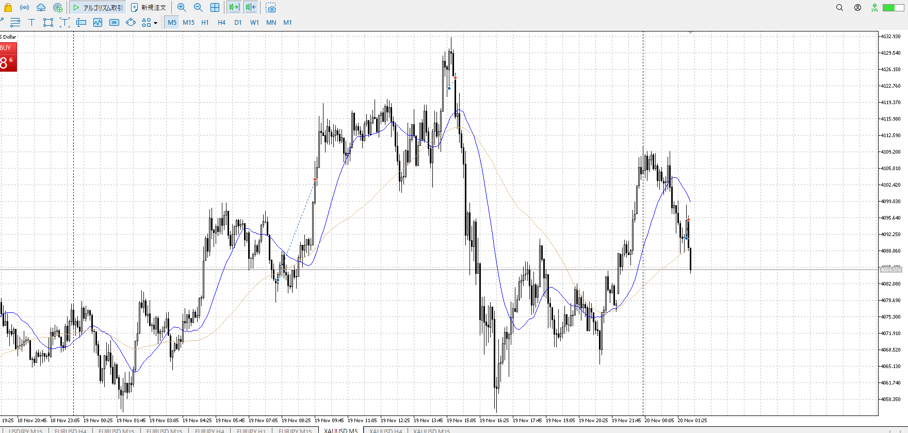

## 1

- 背景
    - 1hr買い
- 事実
    - レンジ上二度下髭試し
- 目標値
    - 直近高値
- 損切値
    - 下髭
- 実際値
    - 上昇後上髭切り

昨日の上昇が残っているとはいえ、高値に届かないうちに落ちている。
下への力がある中、買いを一応試したが買いにしては上髭が大きかったので撤退。
5mで撤退は早くないかというとこだけど。利確損切もエントリーなので、一番早く反応する5mがこれな時点で切るのはおかしくないとも言える、と思う。

