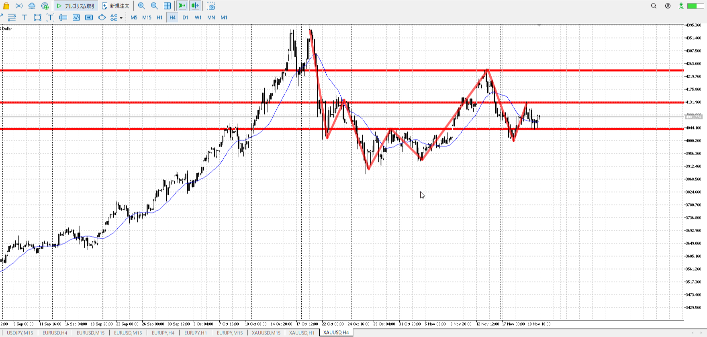
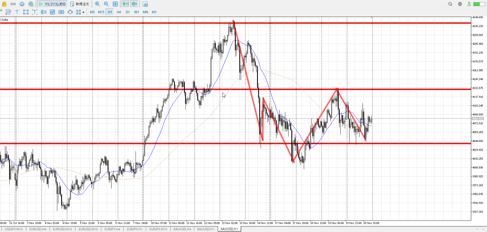
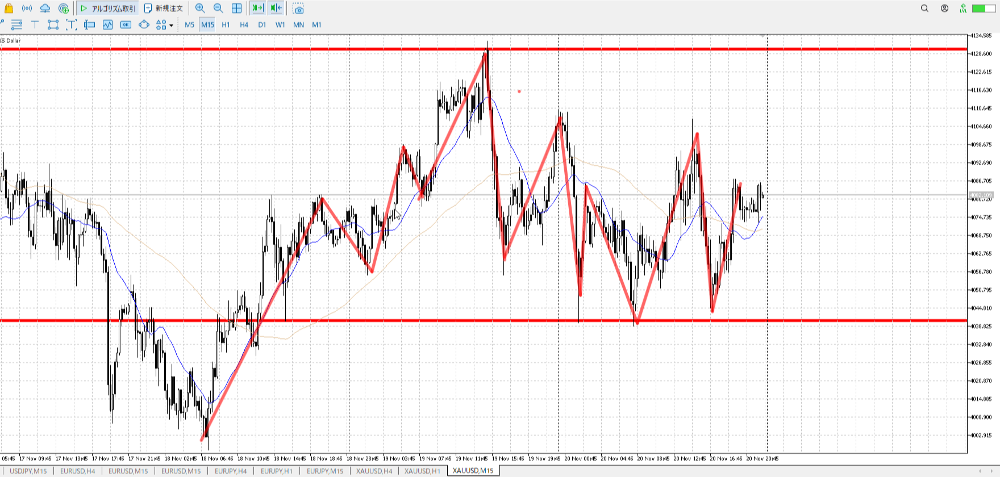
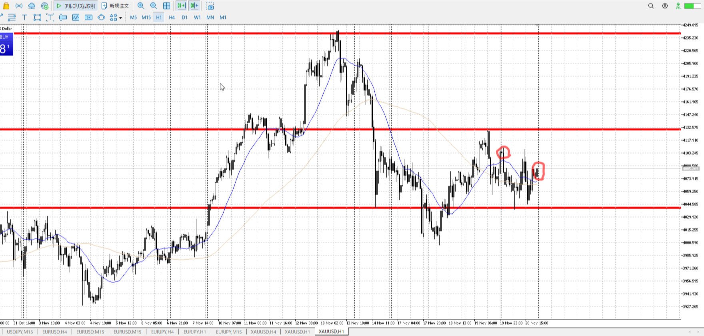
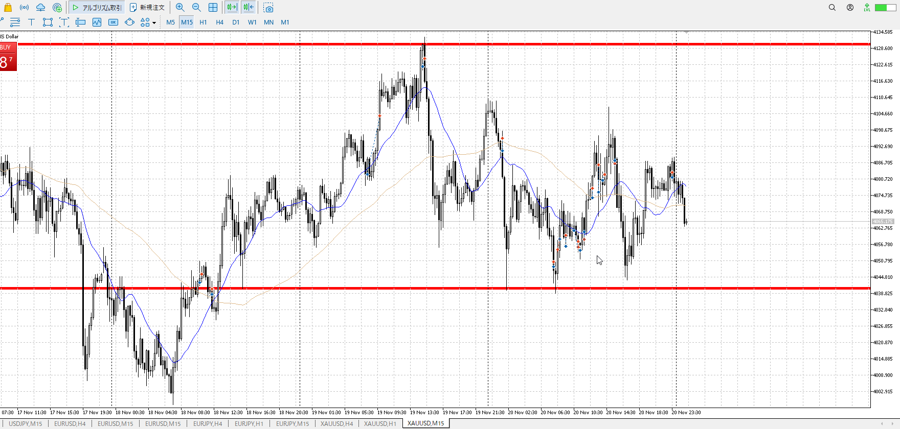
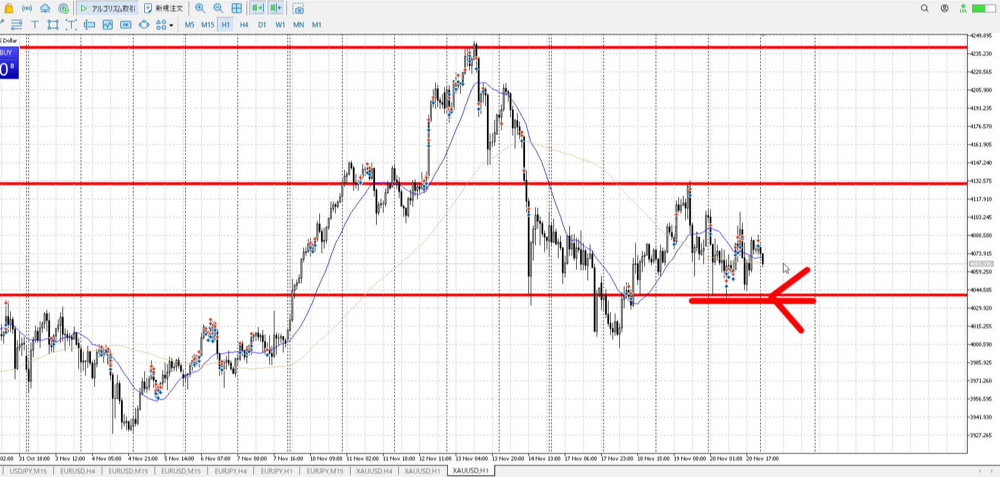
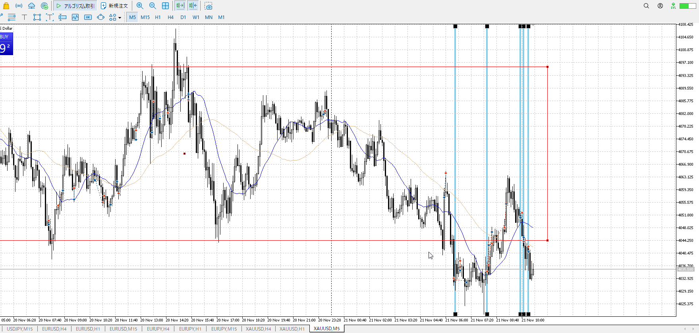
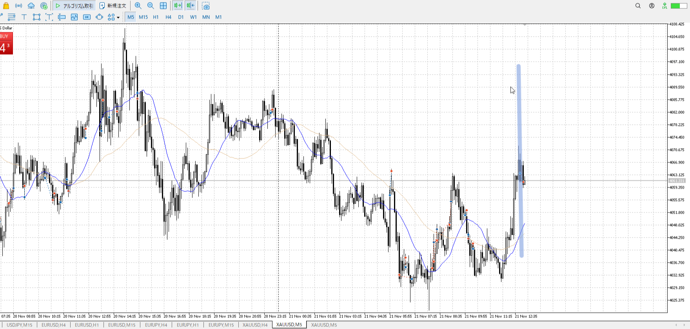

> [!note]
>- +1万 事前認識 **開始5分**

- [x] [my](obsidian://open?vault=Teino&file=FX/my)(見ないと増える)
- [x] 指標

4h

＜ここに目線画像＞

- [x] トレーディングレンジ

方向：u

1h

＜ここに目線画像＞

方向：u

15m

＜ここに目線画像＞

方向：u

全方向：uuu

- [x] 使用足全ての目線確認

＜ここにシナリオ画像＞

1h高値売り、1h安値買い
b;1hレンジ4番底？
s:1h高値二番天井

- [x] シナリオ
- [x] ぶつかり

＜ここに出入り画像＞

前日の高さに対し、下降を受けていく。
上昇するも切り下げ100戻し。この下降の影響を考える。

- [x] 日出日入

目線・シナリオ・強弱・横幅・PA
目線はuuuだが、強弱としては100戻しが痛い。
基本買い。売るのは目線変わってか、買いを明確に否定してから短期。そのための横幅とPA。

> [!check]
> - [x] +1万 事前認識 **開始5分**
> - [x] +1万 5枚

---

買いを仕掛けたが、上がらない。
環境認識：昨日の開幕と比べて、今度は目線も横幅もあると思った
エントリー：ちょっと遅い
問題：シナリオの真ん中にいるせい？昨日がシナリオからちょっと遠くても買えたのは、目線と合わせて買いが続いてる認識だったから？
出来始めてるレンジ真ん中ともいえる位置？

ここの売りはシナリオに無い……？

最近の売り偏重を考えると、売りシナリオがこちらにはなっても現在値からの売りのシナリオは少なくとも1hにはない。
18日あそこから買えたのはシナリオ通りっちゃシナリオ通りだし。20日買い続けはしっかり下が無いのを下まで来て否定したし。

[[./2025-11-21-t]]

- 1
    - 入る場所が遅い、抜けなら最初
- 3
    - 入る場所が早すぎ、押しなら押し位置で
- 4
    - 買いは一瞬、それが早いローソクで潰えてるなら見切り抜け売り
- 5
    - 損切上げ早すぎ

ここまで来ても、シナリオ以上のことはない。

- 6
    - 早すぎ。確定を待て。