> [!note]
>- +1万 事前認識 **開始5分**

- [ ] [my](obsidian://open?vault=Teino&file=FX/my)(見ないと増える)
- [ ] 指標

4h
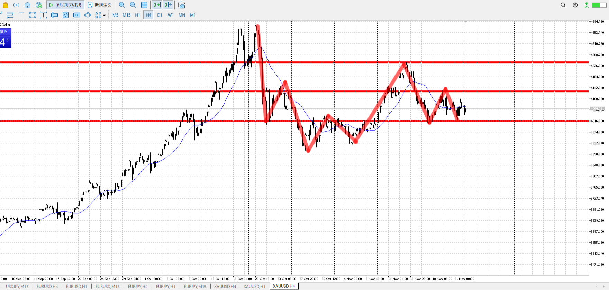
＜ここに目線画像＞

- [x] トレーディングレンジ

方向：u

1h
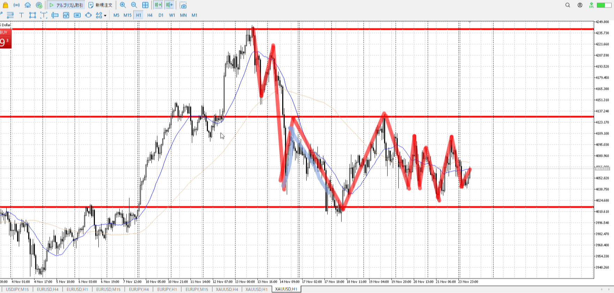
＜ここに目線画像＞

方向：u

15m
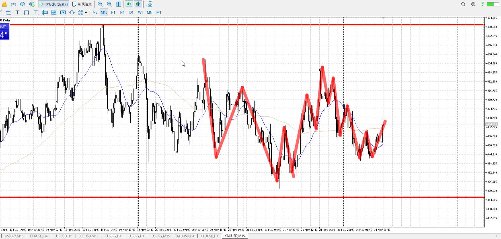
＜ここに目線画像＞

方向：d(uTrend)

全方向：uuduT

- [x] 使用足全ての目線確認

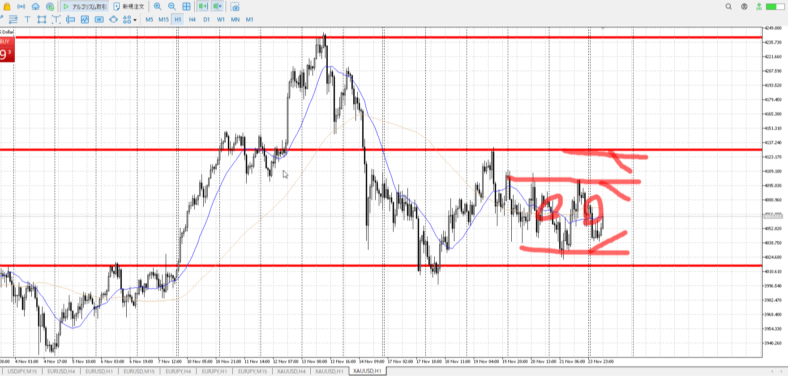
＜ここにシナリオ画像＞

b:1h安値、4h安値
s:1h高値

上の売りシナリオは後の話だから今いらないわ

売りから入り1h直近高値で止められ半値止まり。

- [x] シナリオ
- [x] ぶつかり
- [x] 日出日入

目線・シナリオ・強弱・横幅・PA
半値の買いは無視され下へ。安値に触れるより早く上へ。uuduT。
~~短期でなら買えるかというとこ。1hで買うには証拠が足りなさげ。~~
uuduTに上昇とトレンドなので充分。買いを持って待て。

> [!check]
> - [x] +1万 事前認識 **開始5分**
> - [x] +1万 5枚

---

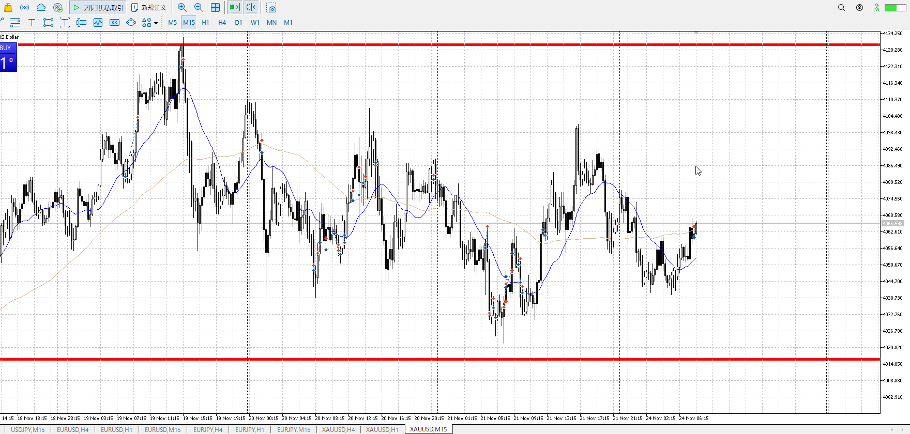

短期なら短期なりに取る長さがあるような。

1h上髭、15m上髭、5m上髭。PAが上無さそうな雰囲気。
もう一回15mで返ってきて、それが下髭だったりしたら考える。下がらねえよと言う~~PA~~横幅とPAが欲しい。

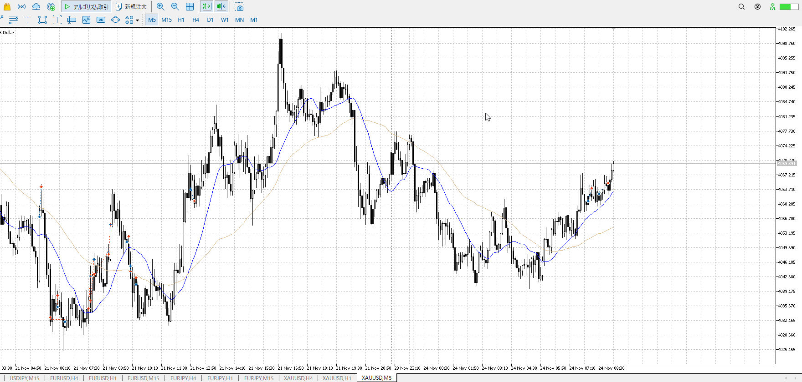

今度こそ気を抜いていた。
15m確定でここまでで止まるなら、確かに上行って遜色ない。

確定後のPA。取り幅。
落ちるの止めた時点で上。

一番まずいのは、どっちなのかまだ判断つかない内部情報だけで利確したこと。
~~切るのもPAは欲しい~~
取るとこまでまでちゃんと取れ。

[確定買いと深押し買い](../エントリー.md#確定買いと深押し買い)

![[../../images/2025-11-24 2025-11-24 22.48.01.excalidraw]]

11/19のこれ
上過ぎるので、ここから上を狙うのは難しい
横幅が無く、実際の利確が自信もって決められないのが辛い

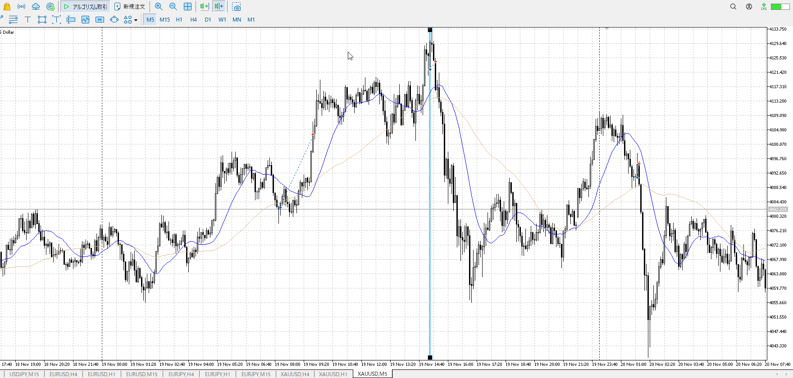
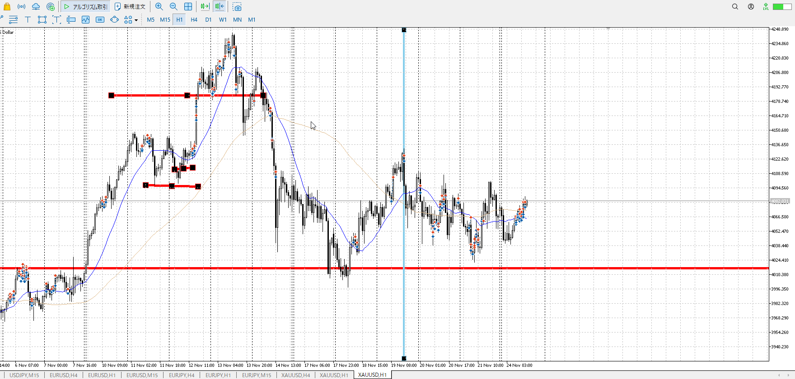

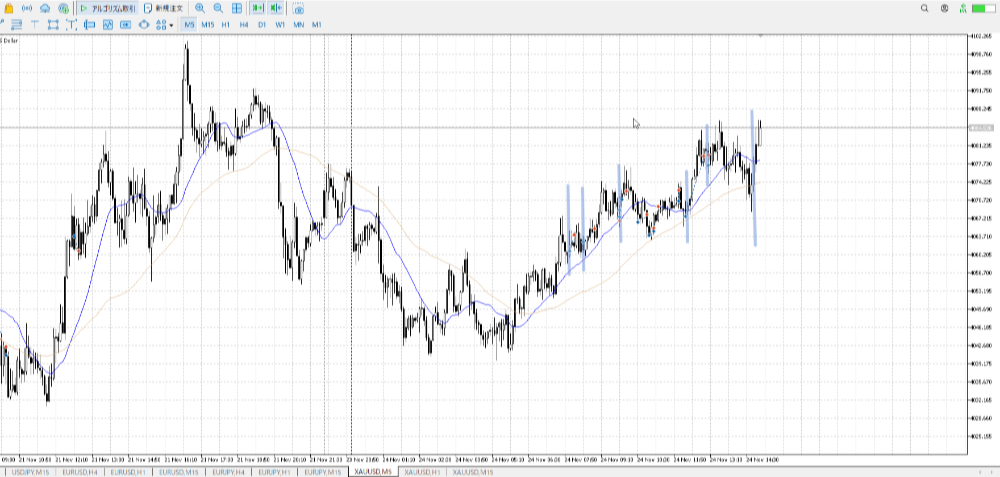

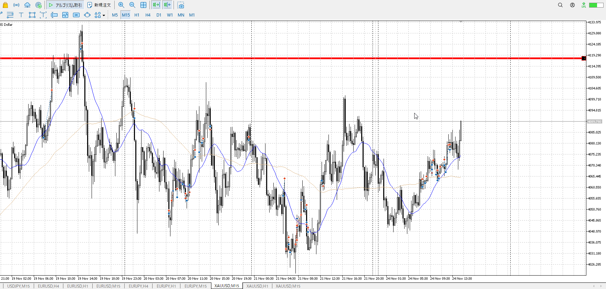

そもそも5mでしか見えない時点でアレ

- 1
- 2
    - 本来の買い場
    - [確定買いと深押し買い](../エントリー.md#確定買いと深押し買い)
    - 入りはいいが、切りが駄目
    - 上まで行けるので持つ
- 3
    - 上なのに確定を待っていたので、損切が大きくなってしまった
- 4
    - 横幅を待ち、下降が下髭で切られてからひきつけ
    - 切りはちゃんと15mを待つ、せめて15mを見る
- 5
    - 15m上髭から横幅もPAもない、駄目
- ex
    - 本来の買い場を分かっていれば、横幅取った後のここでPA買いできる

---

明日分

やっぱりフロントマターが描き直される
dailyは別にすべき

> [!note]
>- +1万 事前認識 **開始5分**

- [x] [my](obsidian://open?vault=Teino&file=FX/my)(見ないと増える)
- [x] 指標

4h
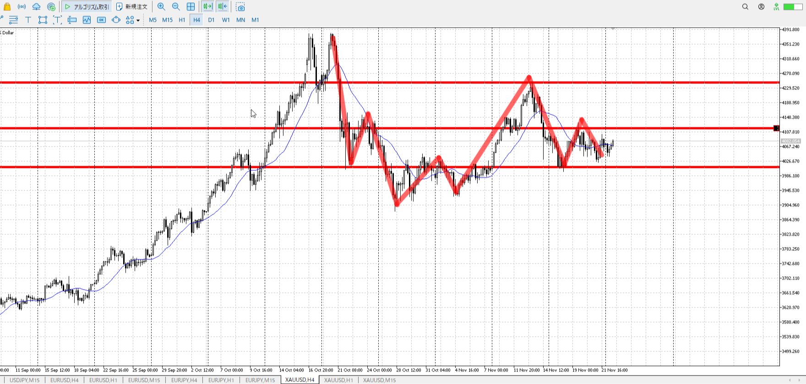
＜ここに目線画像＞

- [x] トレーディングレンジ

方向：u

1h
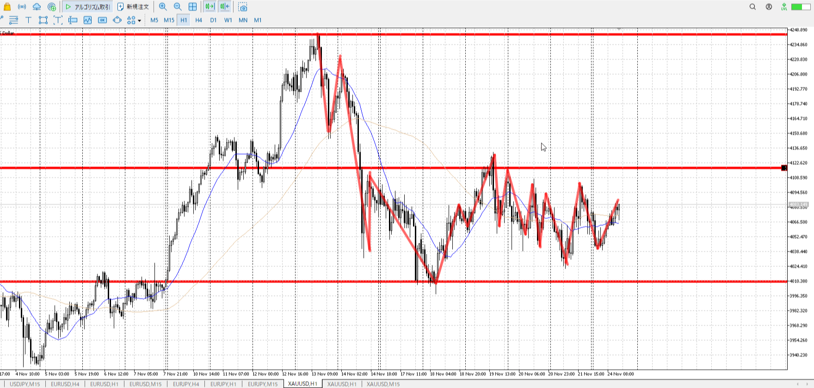
＜ここに目線画像＞

方向：u

15m
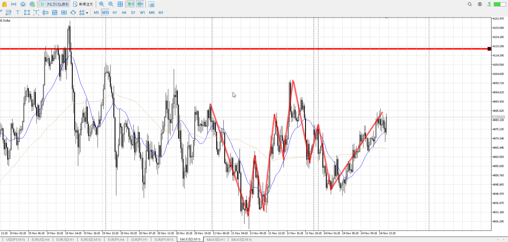
＜ここに目線画像＞

方向：u

全方向：uuu

- [x] 使用足全ての目線確認

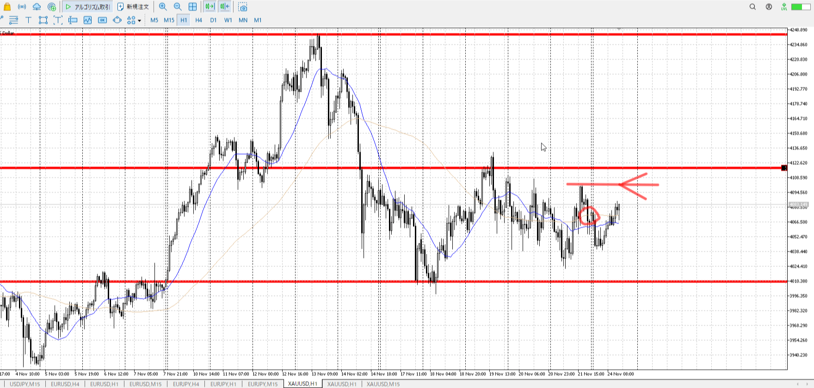
＜ここにシナリオ画像＞

b:1h安値切り上げ
s:1h高値

始値越え

- [x] シナリオ
- [x] ぶつかり
- [x] 日出日入

目線・シナリオ・強弱・横幅・PA
上まで行って一旦売られたいくらいの高さ
uuuなので売りから買い場に戻ってきてほしい、そこから沢山買うので
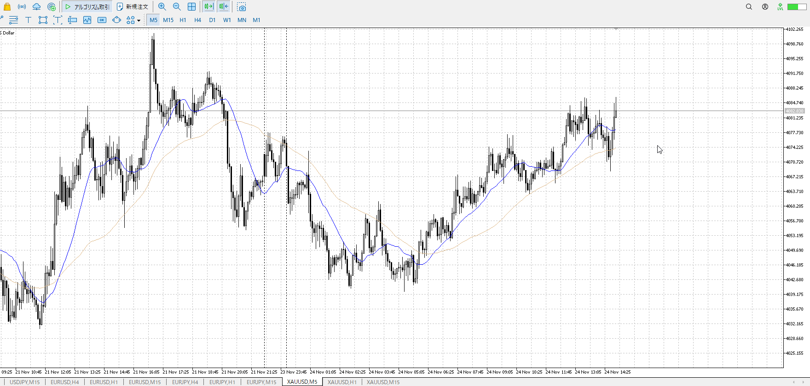
だからこういうのが効く
もちろんそれに至るまでの横幅とPAは必要

> [!check]
> - [x] +1万 事前認識 **開始5分**
> - [x] +1万 5枚

---

