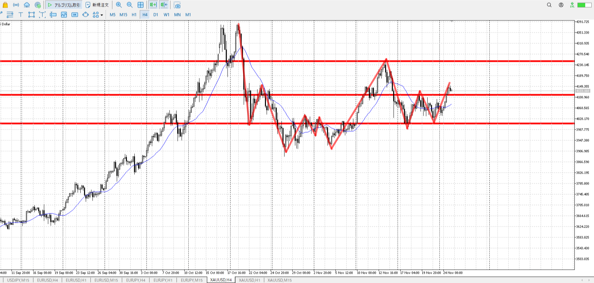
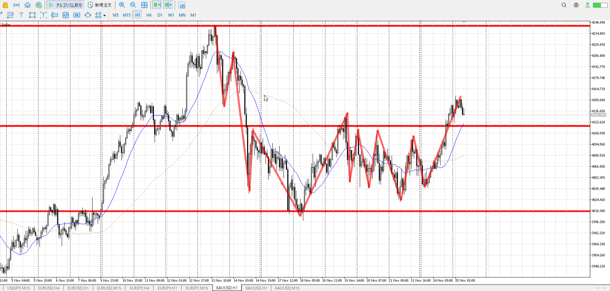
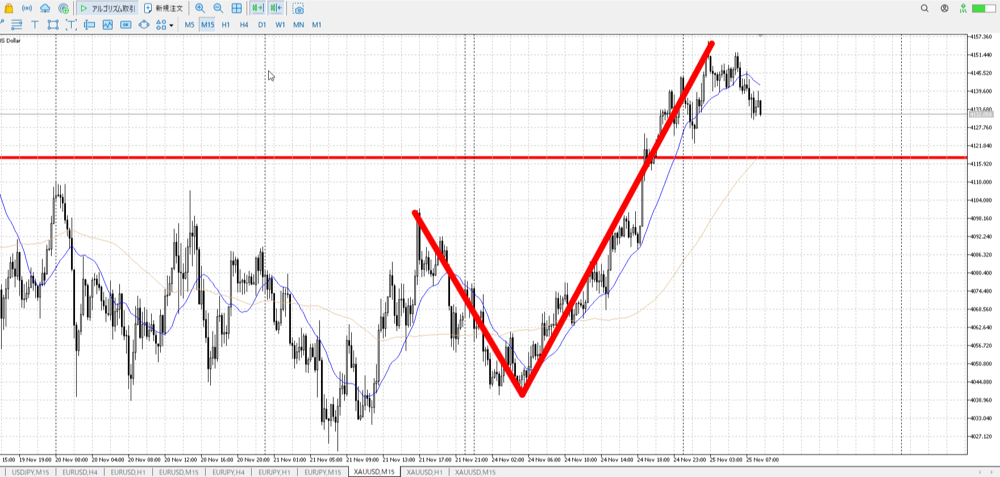
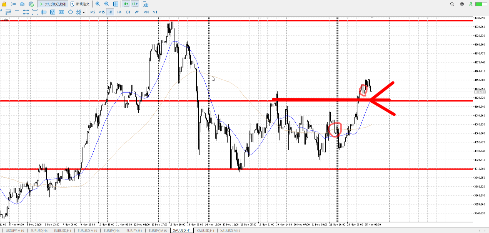
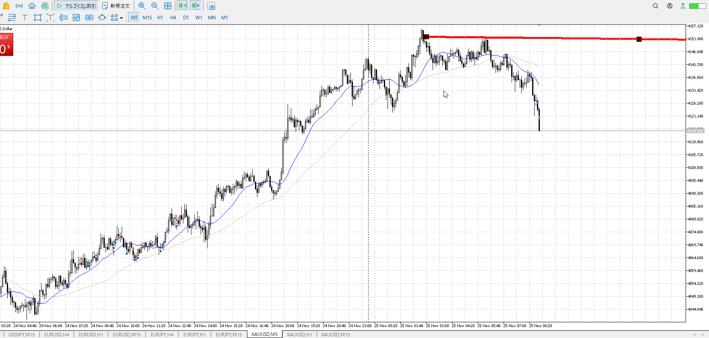
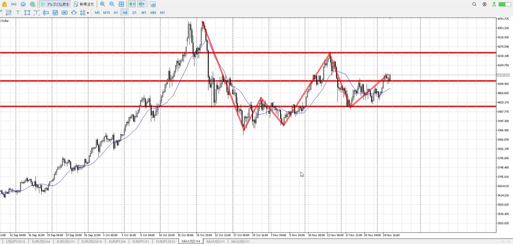
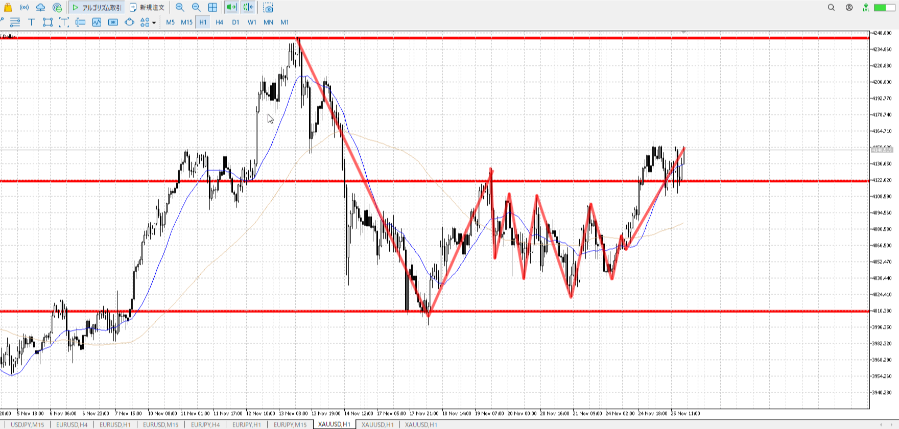
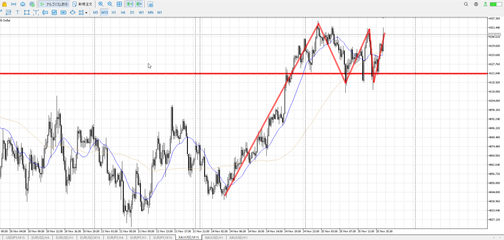
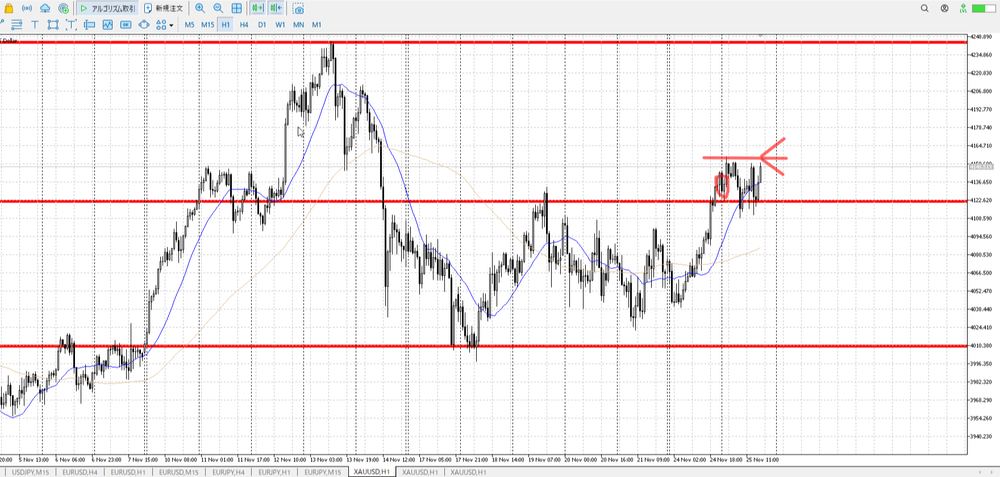

 > [!note]
>- +1万 事前認識 **開始5分**

- [ ] [my](obsidian://open?vault=Teino&file=FX/my)(見ないと増える)
- [ ] 指標

4h

＜ここに目線画像＞

- [x] トレーディングレンジ

方向：u

1h

＜ここに目線画像＞

方向：u

15m

＜ここに目線画像＞

方向：u

全方向：uuu

- [x] 使用足全ての目線確認

＜ここにシナリオ画像＞

b:1h前回高値
s:1h深戻り

上昇

- [x] シナリオ
- [x] ぶつかり
- [x] 日出日入

目線・シナリオ・強弱・横幅・PA
買いの連中はまだいるのだが、昨日が一直線に上がっている以上それを元にした一日分の横幅が欲しい。今日一日は調整でつぶれるんじゃないか、その中で買うことは下が固まればできるだろうけど。

だから早い。
深戻りでないという印が欲しい。ので。

> [!check]
> - [ ] +1万 事前認識 **開始5分**
> - [ ] +1万 5枚

send

---

ok!
exchage start

> [!note]
>- +1万 事前認識 **開始5分**

- [x] [my](obsidian://open?vault=Teino&file=FX/my)(見ないと増える)
- [x] 指標
    - 差し込まれる可能性有り、毎日

4h

＜ここに目線画像＞

- [x] トレーディングレンジ

方向：u

1h

＜ここに目線画像＞

方向：u

15m

＜ここに目線画像＞

方向：u

全方向：uuu

- [x] 使用足全ての目線確認

＜ここにシナリオ画像＞

b:1h高値
s:4hネック、15m二番天井

上昇を維持

- [x] シナリオ
- [x] ぶつかり
- [x] 日出日入

目線・シナリオ・強弱・横幅・PA・平均線方向・波
一日横。
明後日は休場なので、明日に集中。

相場は買い。シナリオは上抜きか下からか買い。1hも下がりそうで、それからなら買い場に触れた時のPAで1hで買える。つまり上抜き期待。

> [!check]
> - [x] +1万 事前認識 **開始5分**
> - [x] +1万 5枚

send

---

ok!
exchage start