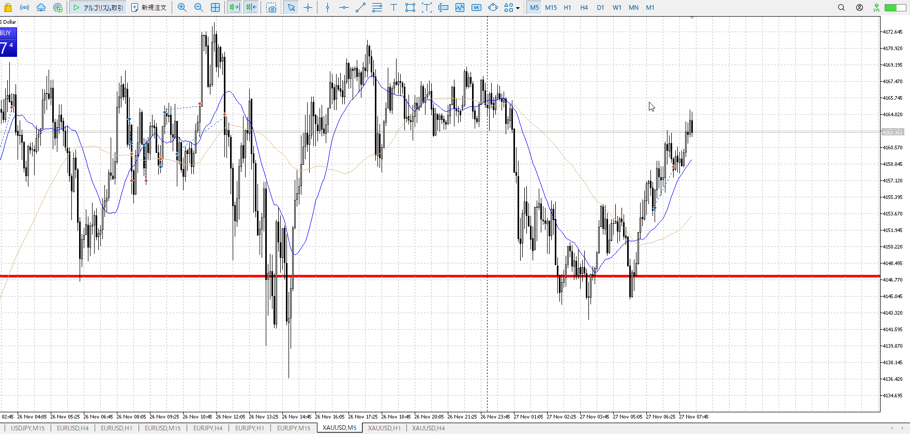
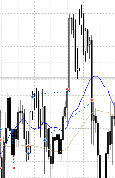
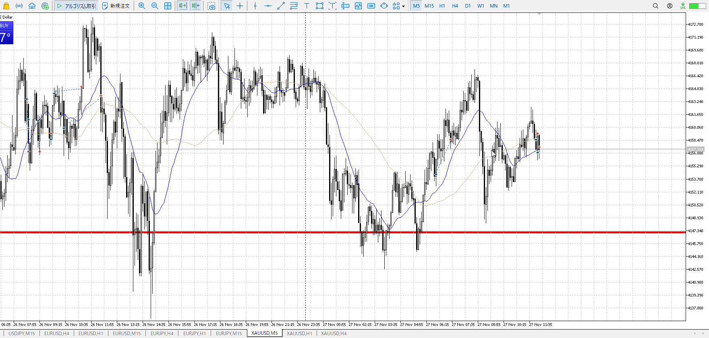
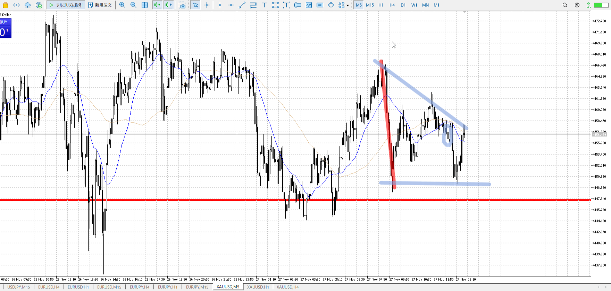
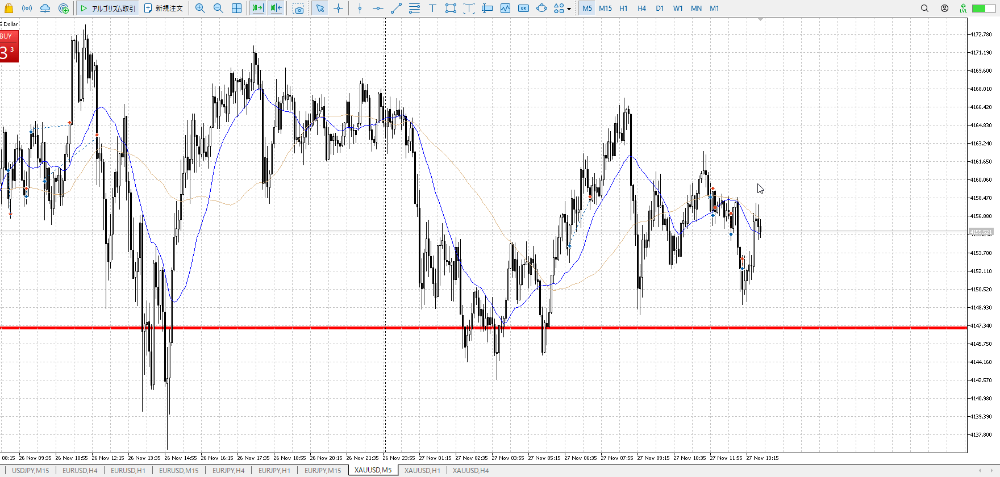
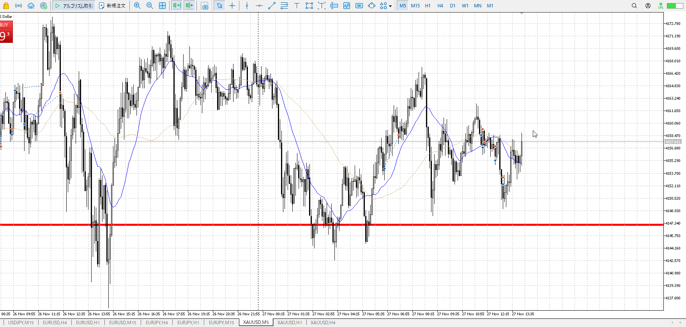
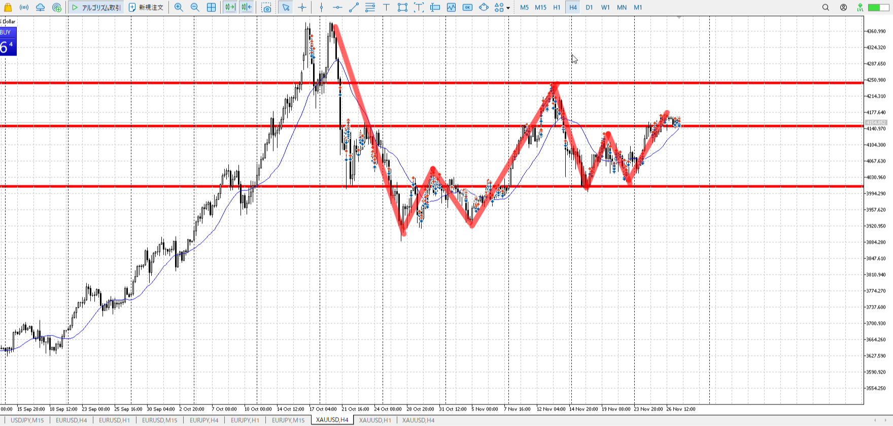
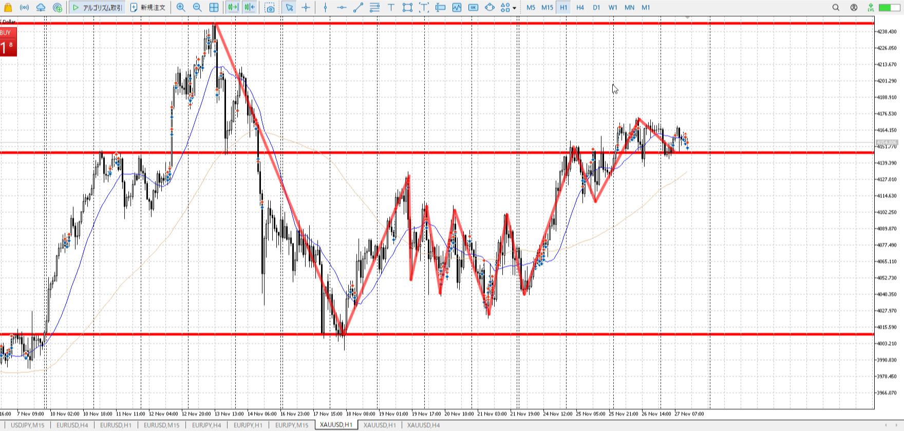
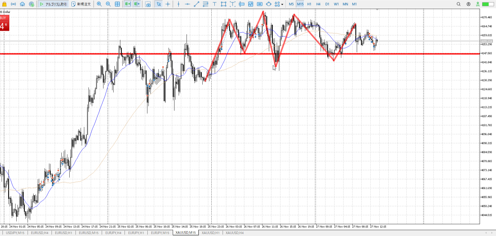
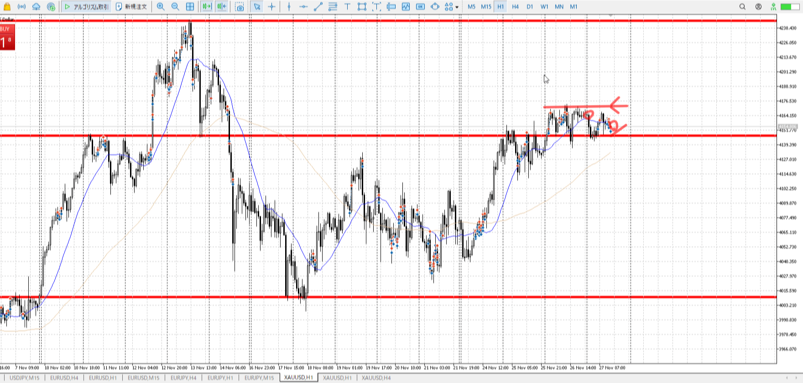

> [!note]
>- +1万 事前認識 **開始5分**

- [x] [my](obsidian://open?vault=Teino&file=FX/my)(見ないと増える)
- [x] 指標
    - 差し込まれる可能性有り、毎日

4h

＜ここに目線画像＞

- [x] トレーディングレンジ

方向：u

1h

＜ここに目線画像＞

方向：u

15m

＜ここに目線画像＞

方向：d

全方向：uud

- [x] 使用足全ての目線確認

＜ここにシナリオ画像＞

b:1h前回天井
s:1h天井

昨日から上昇し、止められつつ下げ否定しつつ上で終了

- [x] シナリオ
- [x] ぶつかり
- [x] 日出日入

目線・シナリオ・強弱・横幅・PA・平均線方向・波
uudながら100戻しが通り上続行。
1h下向きはじめを狙い、15mの小レンジと押しを待ちたい

> [!check]
> - [x] +1万 事前認識 **開始5分**
> - [x] +1万 5枚

---

OK!
Exchage Start.

大変よくない
何の場所でもない、わけではないが
1hでじっくり入ってるのにこれは駄目
放置したほうがマシ

T昨日のこれは高値抜け後
今日の場所はレンジ中、多少なら戻って当然
休場なので陽線出っ放しになるほど勢いはない

まだ15m調整内部
休場分力が無く、上を抜くとは考えにくい中、切り上げ
つまりだんだん小さくなる->勢いを失っている

調整内部で、休場で力が無く抜けにくい
そもそも勢いを失っている
よって伸びない、取れたとしても直近高値

上昇で上まで来てから、一気に下へ　利確
この一本を無視することはできない

そのうえで上がりつつ、頂点で上髭　途中で下崩れ
ここで赤線の下まで売れる

なので下降途中でも売ることはできる
ちゃんと決めてればどこからでも取れる
今は1hから下がっていく方法であり、これは主流じゃないのでやるべきではないが

ここまでで下降を清算できたように見えるが、まだ決定的ではなく分からない
しっかり後を見ること

これが実線で確定して初めて清算、となるか。

---

> [!note]
>- +1万 事前認識 **開始5分**

- [x] [my](obsidian://open?vault=Teino&file=FX/my)(見ないと増える)
- [x] 指標
    - 差し込まれる可能性有り、毎日

4h

＜ここに目線画像＞

- [x] トレーディングレンジ

方向：u

1h

＜ここに目線画像＞

方向：u

15m

＜ここに目線画像＞

方向：dr

全方向：uudr

- [x] 使用足全ての目線確認

＜ここにシナリオ画像＞

b:1h天井
s:1h底

下降を底耐え

- [x] シナリオ
- [x] ぶつかり
- [x] 日出日入

目線・シナリオ・強弱・横幅・PA・平均線方向・波
買いたいのは間違いない
ただ1hも15mもレンジに突入、15mは下

つまり調整区間内
力を溜める段階であり、明日の指標が無い中だと抜くのはさらに難しそう

> [!check]
> - [x] +1万 事前認識 **開始5分**
> - [x] +1万 5枚

---

