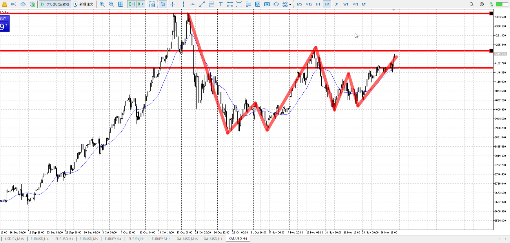
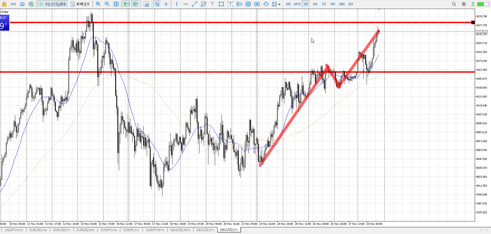
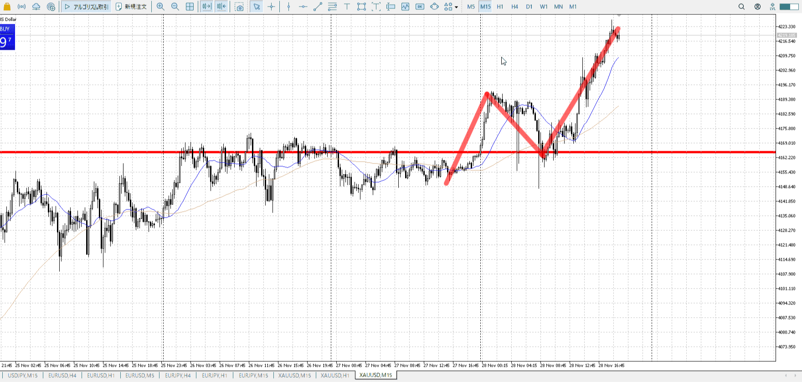
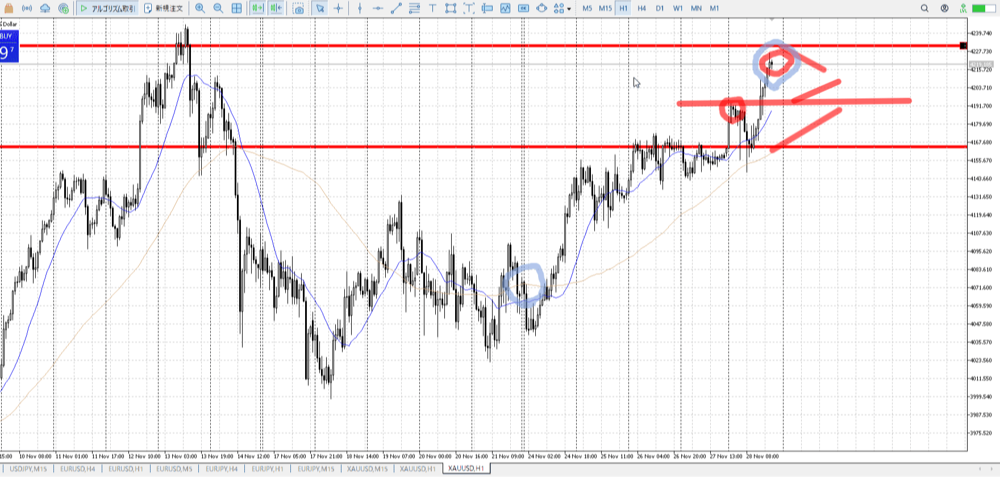

> [!note]
>- +1万 事前認識 **開始5分**

- [x] [my](obsidian://open?vault=Teino&file=FX/my)(見ないと増える)
- [x] 指標
    - 差し込まれる可能性有り、毎日
二日火曜10:00パウエル

4h

＜ここに目線画像＞

- [x] トレーディングレンジ

方向：u

1h

＜ここに目線画像＞

方向：u

15m

＜ここに目線画像＞

方向：u

全方向：uuu

- [x] 使用足全ての目線確認


＜ここにシナリオ画像＞

b:1h前回高値
s:4h前回高値

T週が高値どまり、利確なく上昇力あり
これを活かすため一旦調整したらぐんと行きそう

日レベルだけでなく、上昇の後利確されたかどうかも

- [ ] シナリオ
- [ ] ぶつかり
- [ ] 日出日入、週出週入


目線・シナリオ・強弱・横幅・PA・平均線方向・波
週が高値どまり、利確なく上昇力あり
これを活かすため一旦調整したらぐんと行きそう
なので月曜を丸々調整にするだろう読み

> [!check]
> - [ ] +1万 事前認識 **開始5分**
> - [ ] +1万 5枚

```meta-bind-button
style: default
label: Send
actions:
  - type: "replaceSelf"
    replacement: "OK!\nExchage Start.\n\n---"
```


---

- 1
- 2
- 3

---

```meta-bind-button
style: default
label: 明日分
actions:
  - type: "insertIntoNote"
    line: selfEnd+1
    value: "Temp/defFXEnvAnalysis.md"
    templater: true
  - type: "replaceSelf"
    replacement: ""
```
