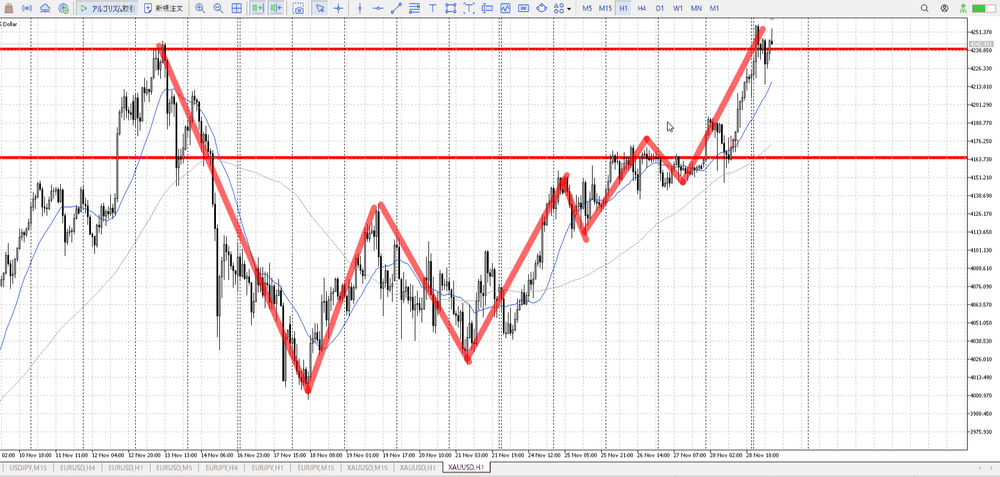
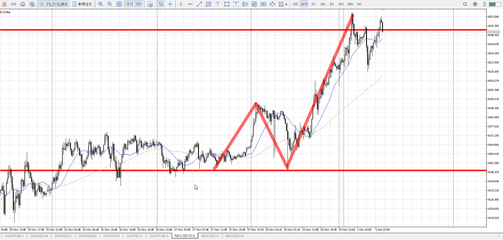
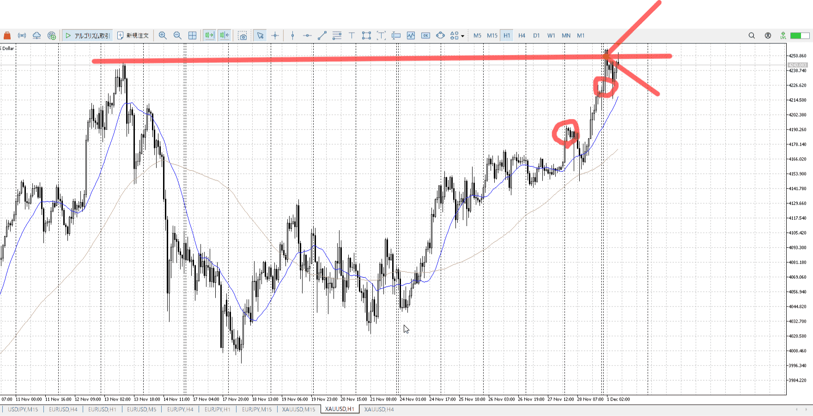
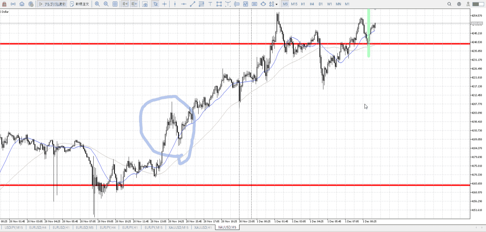
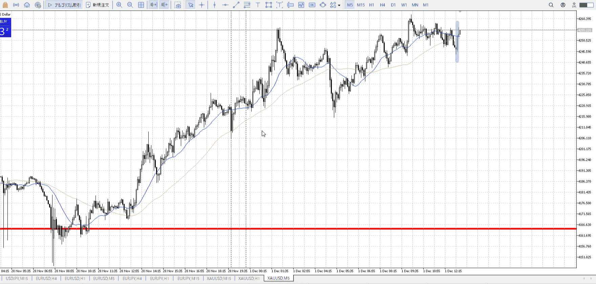
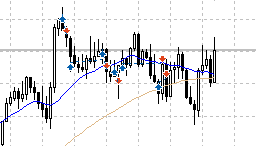

> [!note]
>- +1万 事前認識 **開始5分**

- [x] [my](obsidian://open?vault=Teino&file=FX/my)(見ないと増える)
- [x] 指標
    - 差し込まれる可能性有り、毎日

4h

＜ここに目線画像＞

- [x] トレーディングレンジ

方向：u

1h

＜ここに目線画像＞

方向：u

15m

＜ここに目線画像＞

方向：u

全方向：uuu

- [x] 使用足全ての目線確認


＜ここにシナリオ画像＞

b:15m安値
s:4h高値

上昇。4h高値近く。

- [x] シナリオ
- [x] ぶつかり
- [x] 日出日入、週出週入


目線・シナリオ・強弱・調整・横幅・PA・平均線方向・波
1h上昇。見た目は4h高値を破る。
これを抜くと4h上トレンドなので抜きたいが、力が無い。1hの調整を入れてから一気にやりたい。
一応15mで買えるが、相手は4hであることに注意。15mも今は上昇なので買えない。よほどぶち抜いたら流石に買うが。

> [!check]
> - [x] +1万 事前認識 **開始5分**
> - [x] +1万 5枚

OK!
Exchage Start.

---



5mまで下に曲がらない状態だと何もできない。
青丸のところはちゃんと横幅取って上がったやつの続き。

そう考えると、この緑戦から買う方法はないわけではなかった気がするが。
横の代わりに縦で上がってるし。

しかし月曜。

T

ダイブ上がった後
だが短期で下降を否定するような動きを見せると、すぐに上がる
まだ短期の買いはいる



全時間軸上、上張り付き
上への期待があるので、下がった後5m買い場下髭一本でも買える
買い場はいろんな目線がいるが、それが揃う一手



---

- 1
- 2
- 3

---

```meta-bind-button
style: default
label: 明日分
actions:
  - type: "insertIntoNote"
    line: selfEnd+1
    value: "Temp/defFXEnvAnalysis.md"
    templater: true
  - type: "replaceSelf"
    replacement: ""
```
