> [!note]
>- +1万 事前認識 **開始5分**

- [x] [my](obsidian://open?vault=Teino&file=FX/my)(見ないと増える)
- [x] 指標
    - 差し込まれる可能性有り、毎日

4h
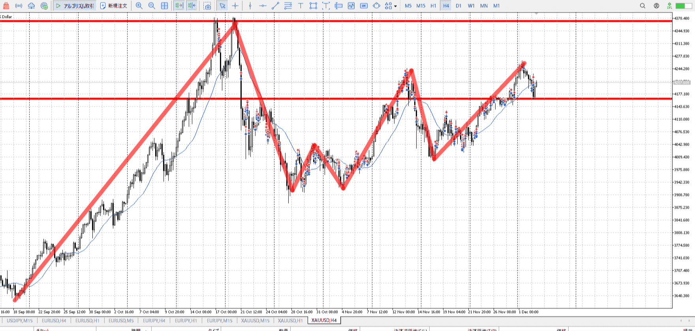
＜ここに目線画像＞

- [x] トレーディングレンジ

方向：u

1h
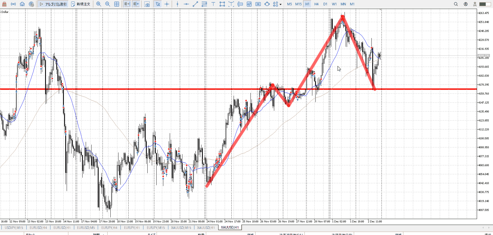
＜ここに目線画像＞

方向：u

15m
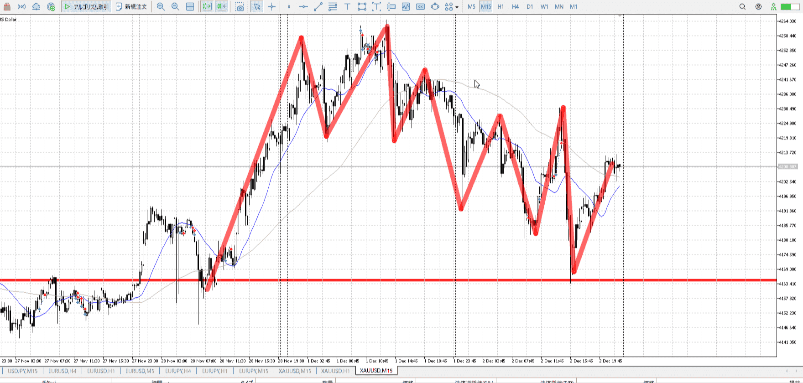
＜ここに目線画像＞

方向：d

全方向：uud

- [x] 使用足全ての目線確認

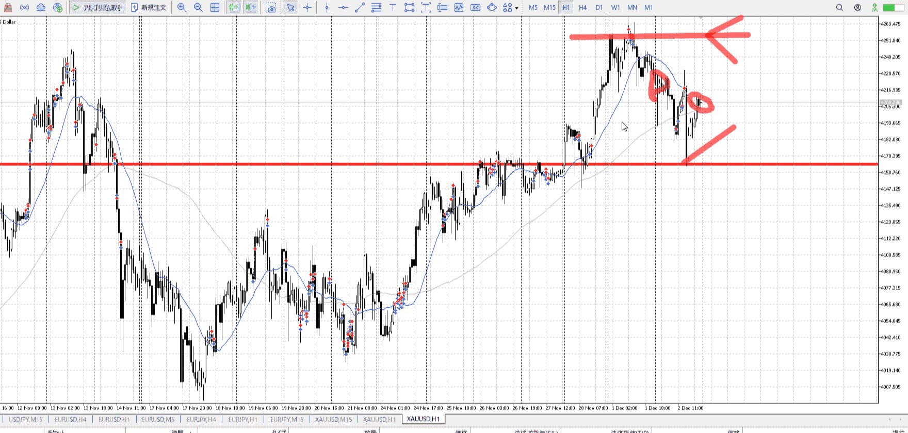
＜ここにシナリオ画像＞

b:1h安値
s:4h高値

一度降下したが再度浮上

- [x] シナリオ
- [x] ぶつかり
- [x] 日出日入、週出週入


目線・シナリオ・強弱・調整・横幅・PA・平均線方向・波
一度降下して1h安値に触れ上昇。買い。
理想は02:00頃1h安値下髭、05:00頃の5mレンジで買いたかった。

買い。
1hがそろそろ上向きそう。そうなったら手出しは難しい。
15mが上向いてるのでちょっと手出ししにくい。がここしかない。

でも流石に上過ぎるか。
抜けなどでは入れない。


> [!check]
> - [x] +1万 事前認識 **開始5分**
> - [x] +1万 5枚

OK!
Exchage Start.

---

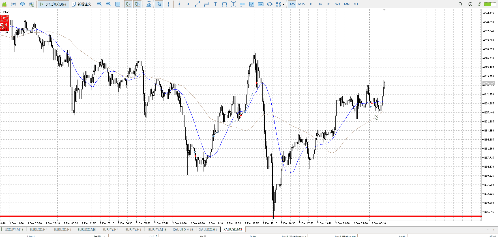

抜けでは入れないか🄬、押しの押しを待って入ろうとしたのに。
見ろ。


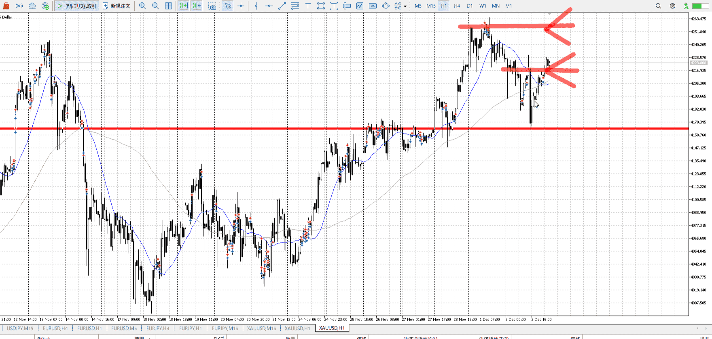

シナリオ立て直し。
uudだったがもう少しでuuuになりそう。ここを抜けたら。

15m上、1h上になりかけ。
1hが上に成ったら買えない。

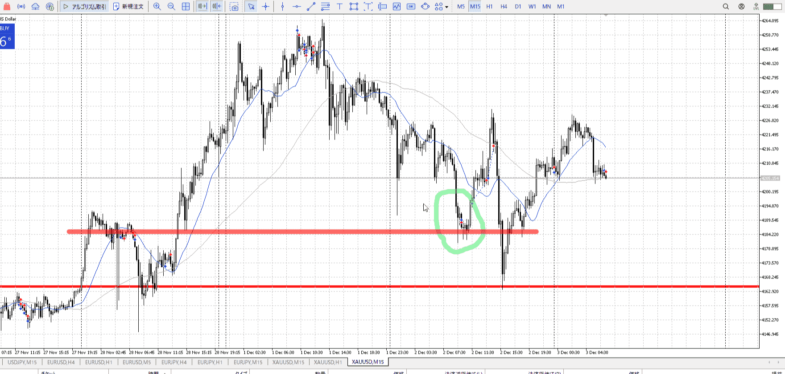

緑丸地点を参照して買ったが、明らかに1h買い場の影響を受けているこことは状況が違う。
そりゃ落ちる。小さく買う場合でも、大きい目線は必要。何で止まってる？

次、uud内で1h上、15m下。
1hが下になるくらい、15mが追いついてくるまで待つ。特に15mと相反することやろうとしてるし。証拠を揃えて


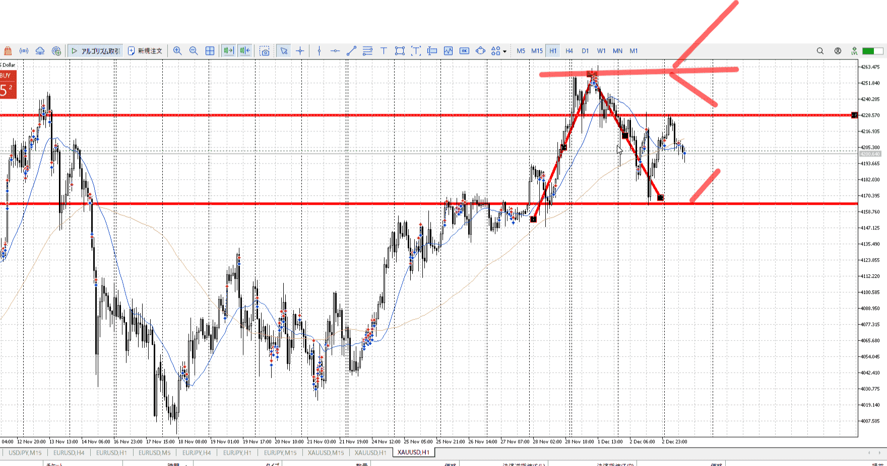


T1hのシナリオは1hだけ
15mは15mに書く
[シナリオ](../シナリオ.md)

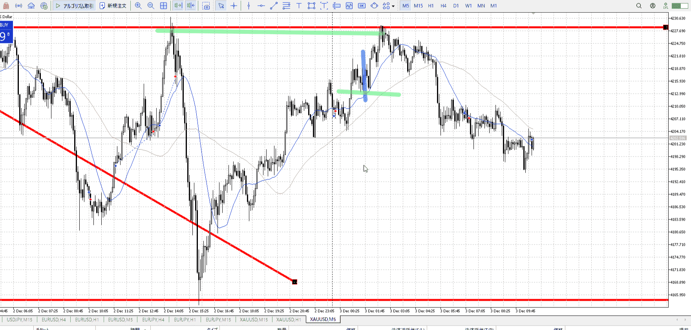

T青線部は緑上下利確損切で買える
1:2を超えなければいい、目安
[確定買いと深押し買い](../エントリー.md#確定買いと深押し買い)

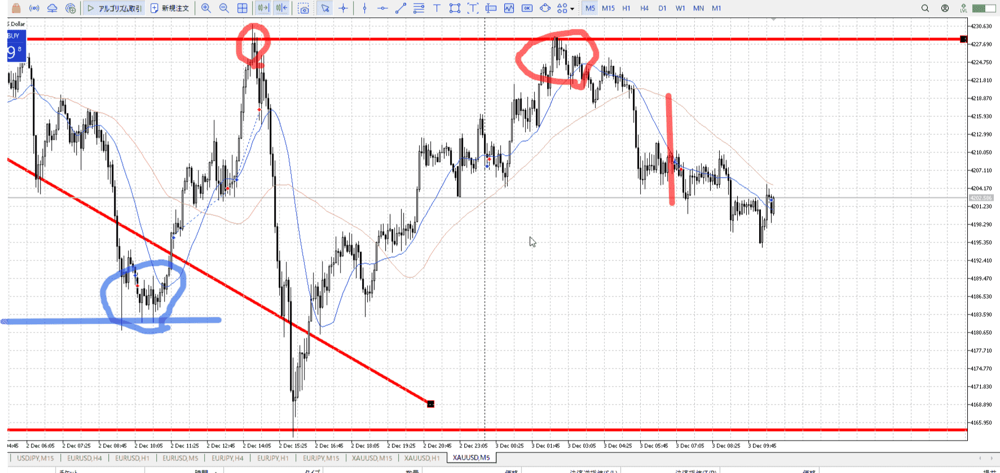

T青線部は1hの支えを受けてる
赤縦は受けてないほか、15mの高値で弾かれた後
この高寝落ちを否定するなら、15mで止まってPA出してその後
[前回勢いの止め（トレンド転換）](../前回勢いの止め（トレンド転換）.md)

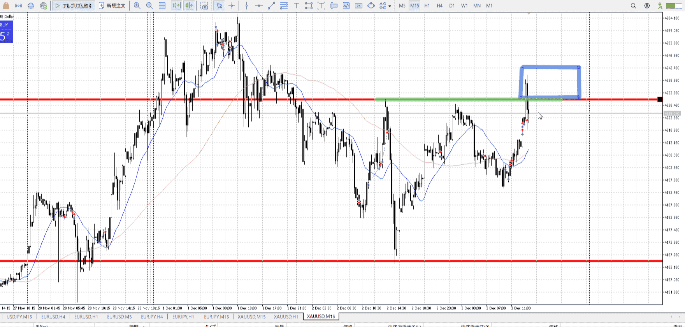

15m高値上でレンジを期待していた。
~~すると何が必要かというと、15mに勢いがあってはいけない。
なので10000くらいは取れたはず。~~

T
元々勢いがあって期待していた。なら持っておいて正解。
問題はこれに耐えられない高さから入ってること。

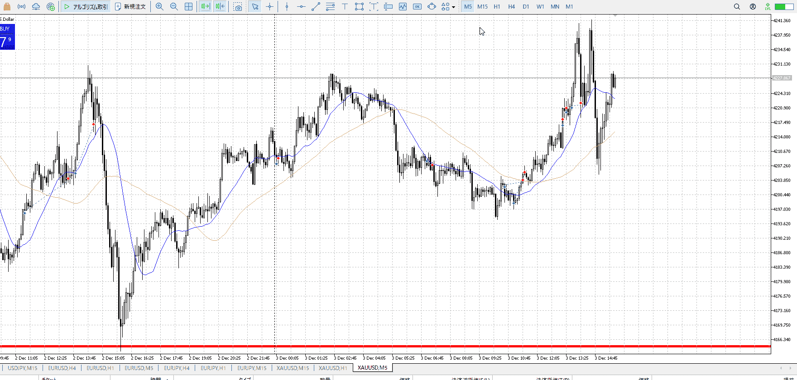

二回目上昇は無理にしても、下買い場まで落ちてくるのはシナリオにもあり買いが通ったはず。


---

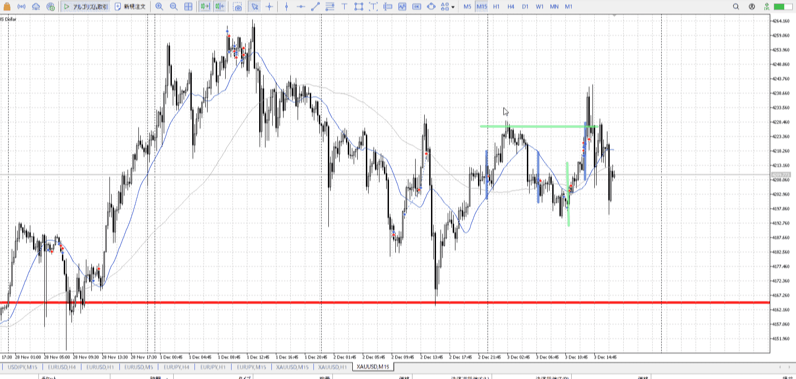
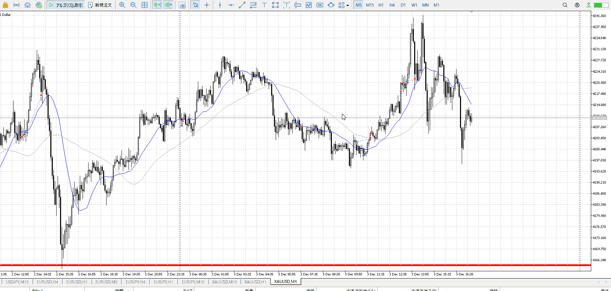

- 1
    - 上昇途中。上まで15mで。そのまま持ってて良かった。
    - 手放すなら次のを本気で入れ。

- 2
    - 前のは1hの支えがあった
    - 今度はない、さらに15m高値で抑えられた後
    - 15mで横幅などで否定しないといけない、まだ早い
- 3
    - 抜け、確定セット
    - T上の方なので、利確までの揉みが耐えられない可能性有り
    - 第二利確を狙うべきだった、[確定買いと深押し買い](../エントリー.md#確定買いと深押し買い)
    - T入ったところは（下の調整中と違い）トレンドであり、押すための下の力が薄い
    - なので抜けの方が確実、その意味でも持ってて良かった
    - また、本来の利確が近いことも留意
- ex
    - 緑で入る時点では、上目線ではない
    - なので利確は緑横線まで、ここが本来の利確

---


> [!note]
>- +1万 事前認識 **開始5分**

- [ ] [my](obsidian://open?vault=Teino&file=FX/my)(見ないと増える)
- [ ] 指標
    - 差し込まれる可能性有り、毎日

4h

＜ここに目線画像＞

- [ ] トレーディングレンジ

方向：

1h

＜ここに目線画像＞

方向：

15m

＜ここに目線画像＞

方向：

全方向：

- [ ] 使用足全ての目線確認


＜ここにシナリオ画像＞

b:
s:

- [ ] 1hシナリオ
- [ ] ぶつかり
- [ ] 日出日入、週出週入


目線・シナリオ・強弱・調整・横幅・**PA**後・平均線方向・波


> [!check]
> - [ ] +1万 事前認識 **開始5分**
> - [ ] +1万 5枚

```meta-bind-button
style: default
label: Send
actions:
  - type: "replaceSelf"
    replacement: "OK!\nExchage Start.\n\n---"
```


---

- 1
- 2
- 3
