> [!note]
>- +1万 事前認識 **開始5分**

- [ ] [my](obsidian://open?vault=Teino&file=FX/my)(見ないと増える)
- [ ] 指標
    - 差し込まれる可能性有り、毎日

4h
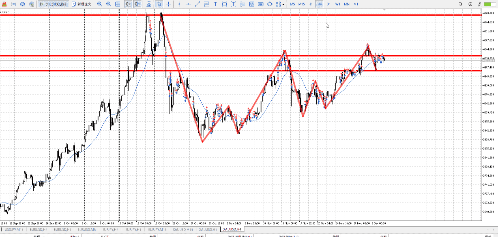
＜ここに目線画像＞

- [x] トレーディングレンジ

方向：u

1h
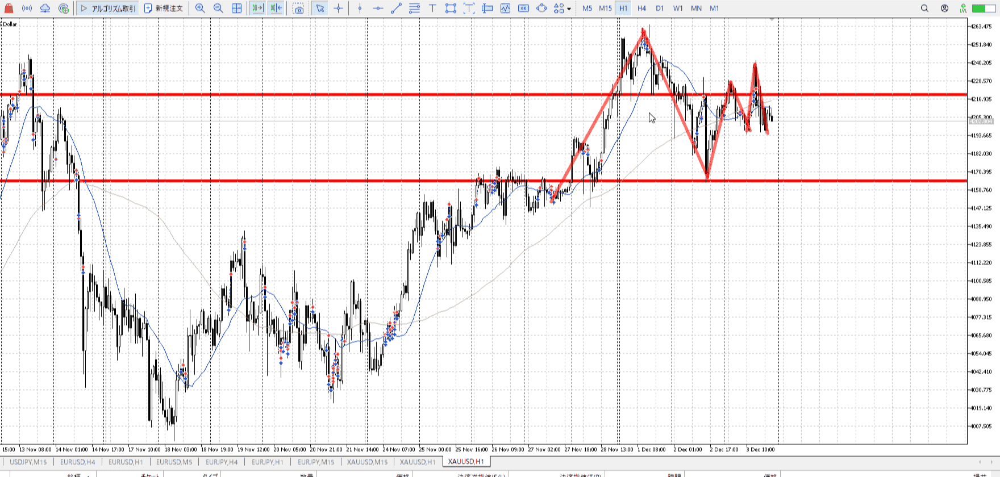
＜ここに目線画像＞

方向：u

15m
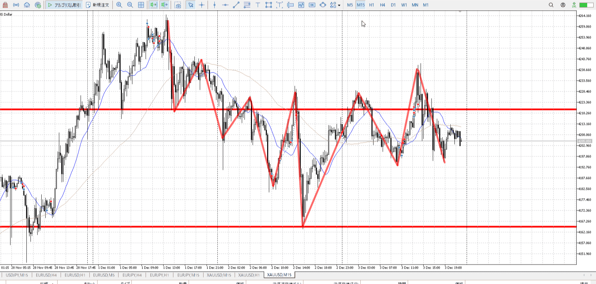
＜ここに目線画像＞

方向：u

全方向：uuu

- [x] 使用足全ての目線確認

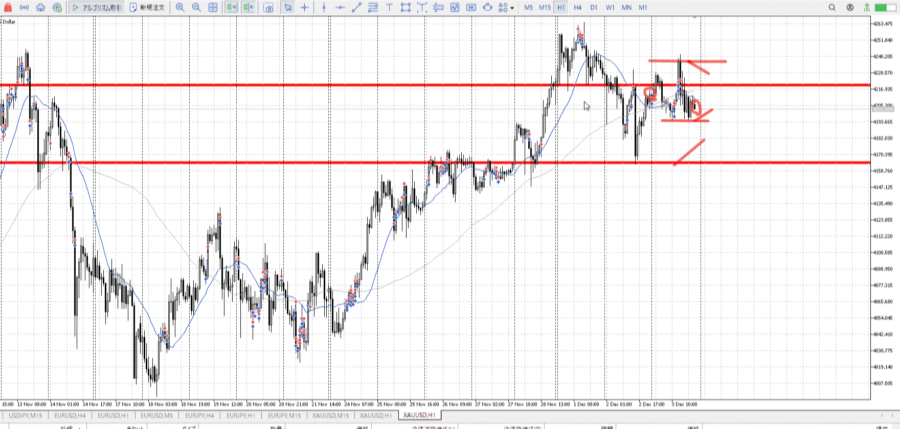
＜ここにシナリオ画像＞

b:1h二番底
s:1h高値

開幕からレンジ、ちょい下

- [x] 1hシナリオ
- [x] ぶつかり
- [x] 日出日入、週出週入

目線・シナリオ・強弱・調整・横幅・**PA**後・平均線方向・波
目線は全部上。下から買い。
最近待ててないのでしっかりPA待ち。

> [!check]
> - [x] +1万 事前認識 **開始5分**
> - [x] +1万 5枚

OK!
Exchage Start.

---

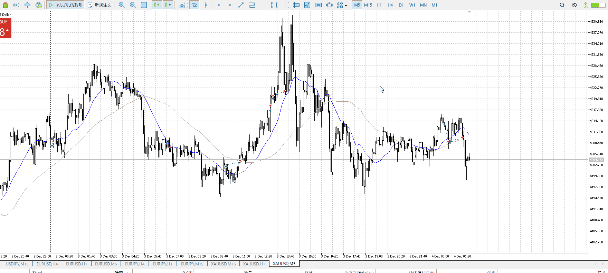

最初のやつはちょっと早すぎ。上昇に入ったわけではない。
だったら二回目入った場所まで待つべき。そこから上までで、変な足が出た時に止めるべきであった。フラッグ型だし。以前落ちてるの無視できないし。
上に上がりそうなら持ってていいけど、それがないからフラッグ。

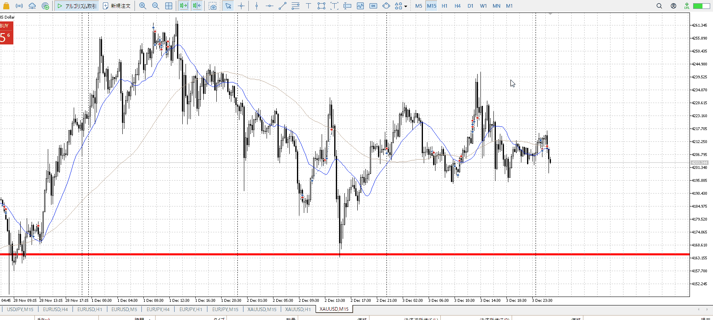

1hが下なのは変わらない。15mとまた離れ始めたので、これが追いつくまで。
15mで下髭を取ってるので、これで買う、のは辛いので再びPA待って。

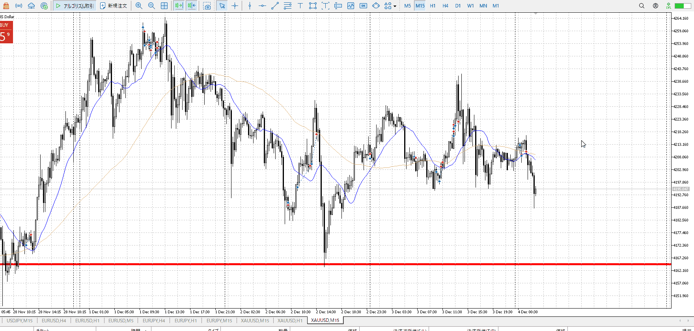

再びuud。1hも下トレンドでちょっと厳しい。
1h安値を破るまでは買いたいが、しっかりこれが止まるのを15mで見てから。

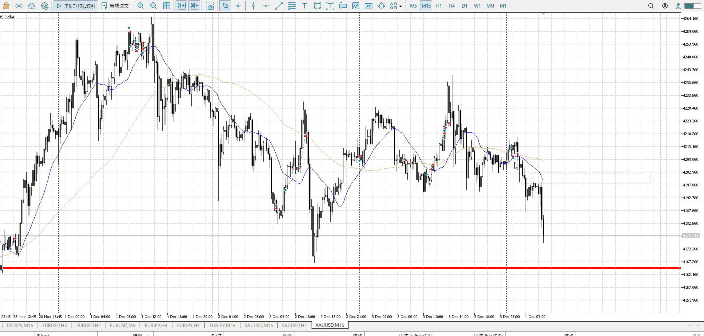

15m確定で売れたと思うが。
それはともかく同じく止まり待ち。

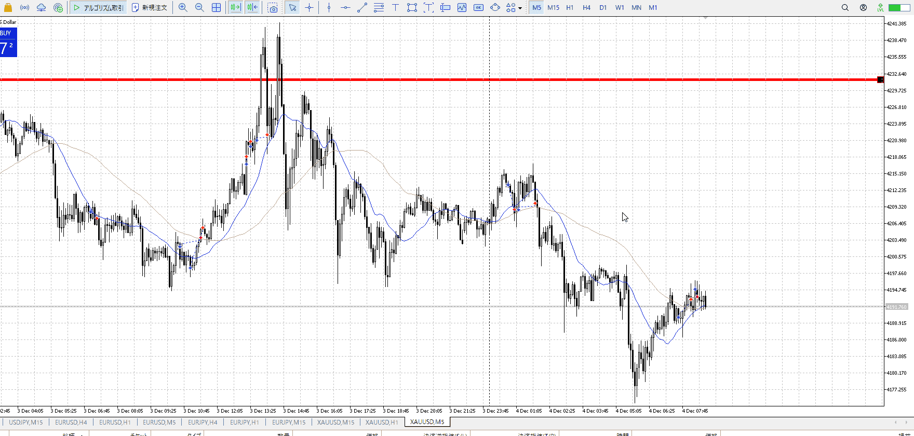

勢いを察知して抜けた後で、確定待つならもっと決定的なのを。
そうでないなら二回目でもひきつけて。損切分の高さが足りない。
**ひきつけの意識は二回目以降全部で。**

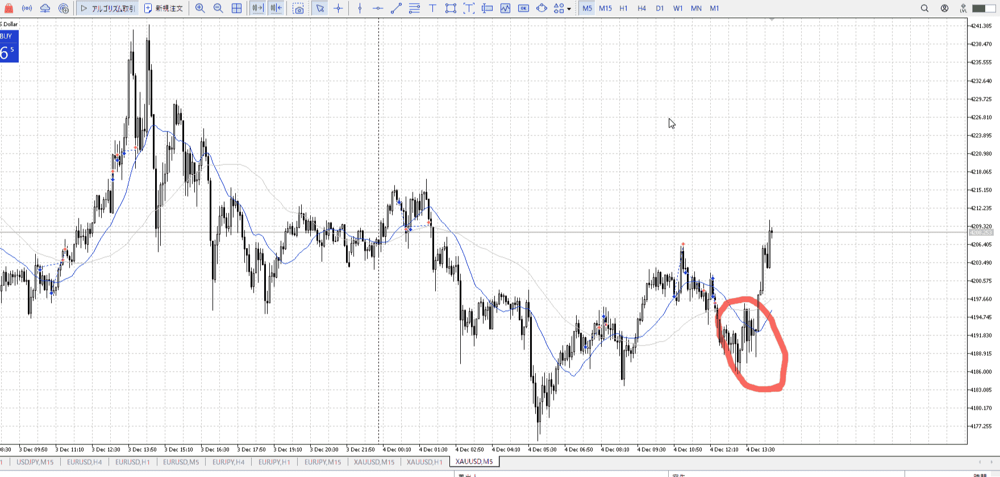
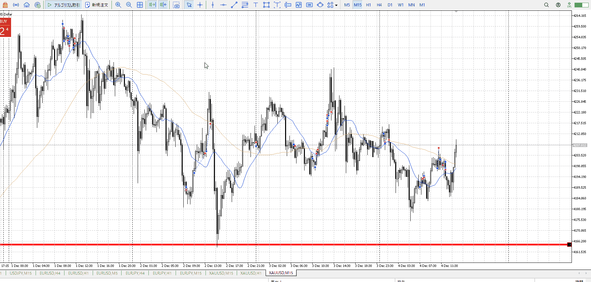
これ買えたな……

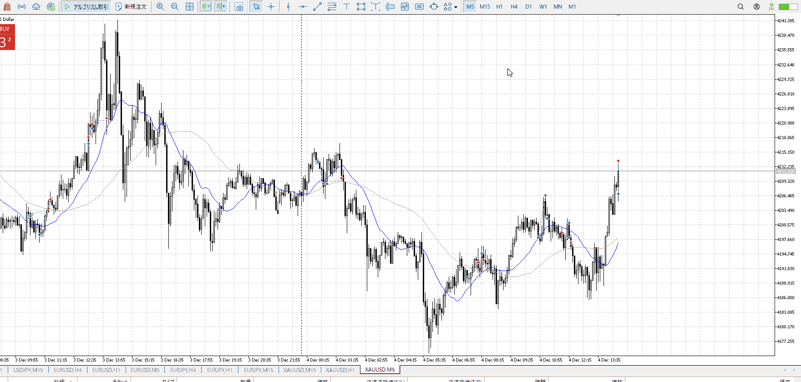

最低限だけ取って撤退。
上取るには損切が足りない。

---

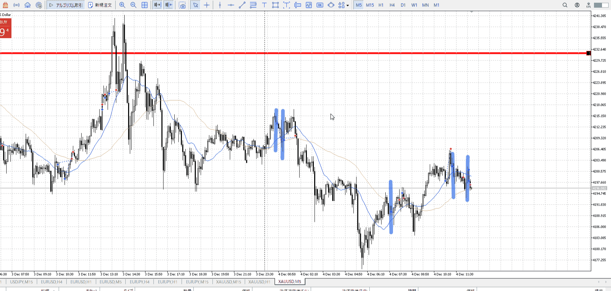

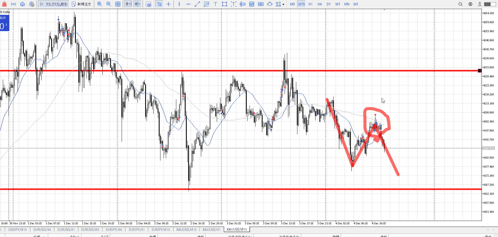

- 1
- 2
    - 上の方であるため、ひきつけ重要
- 3
    - ここは15mネック。**買うのはない**
    - 必ずあるネック戻りの様子を見てから
- 4
    - 15mで上髭。ちょっと悪い
- 5
    - 二回目、**ひきつけ重要**
    - 15mが下向きはじめなので、落ちる様子なら落ちる
    - というか1h上髭なのでキツイ、さっさと抜けるべき
    - T
    - 15m上髭が出ており、警戒していた戻り売りが活発化する
        - 元々ネックからの戻り売りがある、危ない場所
            - まだ無くなってない
        - 一回目だけは期待で入れる、それが否定されている
    - これを抑える大きい陽線が出たりしない限り、買いは入れにくい

現状把握、利確予想まで落ち耐え

今回は**ひきつけが出来てない**
それで10000近く落ちてる。5000程度には抑えられたはず。
また、進むにつれ出るネックなども。自分の場所の把握とは、自分が何で入ってるか、シナリオ上何を気にしなければならないか。
今回なら15mで入り、ネックを気にする。正直シナリオ見ればわかる。

極めると方向感は見てすぐわかるし、上位足もうまくいかないときに見ればいいだけになる。
でも今は上から見てって方向感を明確に。

---

> [!note]
>- +1万 事前認識 **開始5分**

- [x] [my](obsidian://open?vault=Teino&file=FX/my)(見ないと増える)
- [x] 指標
    - 差し込まれる可能性有り、毎日

4h
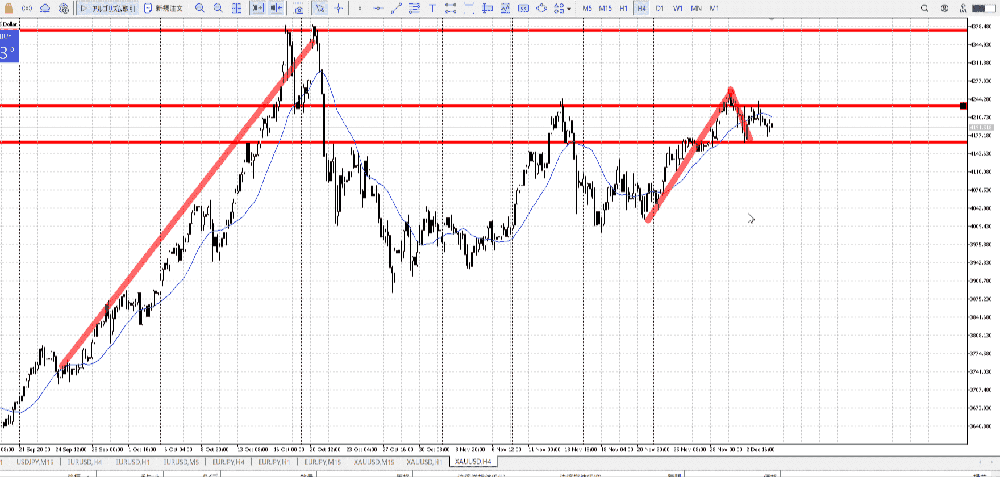
＜ここに目線画像＞

- [x] トレーディングレンジ

方向：u

1h
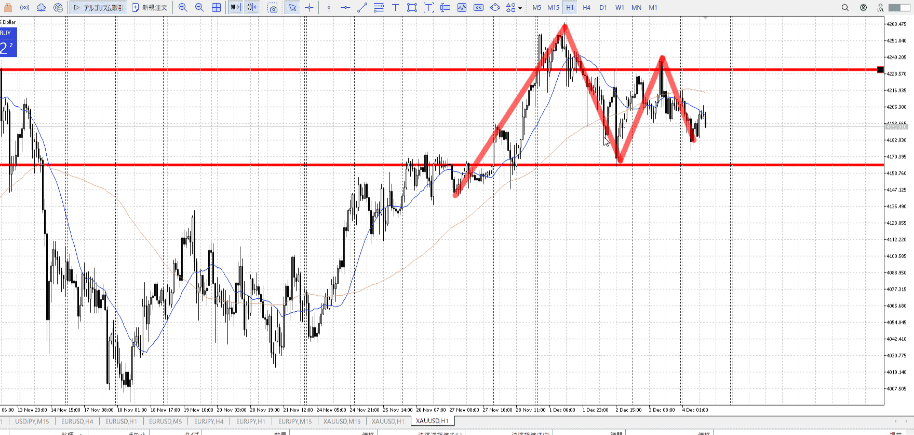
＜ここに目線画像＞

方向：u

15m
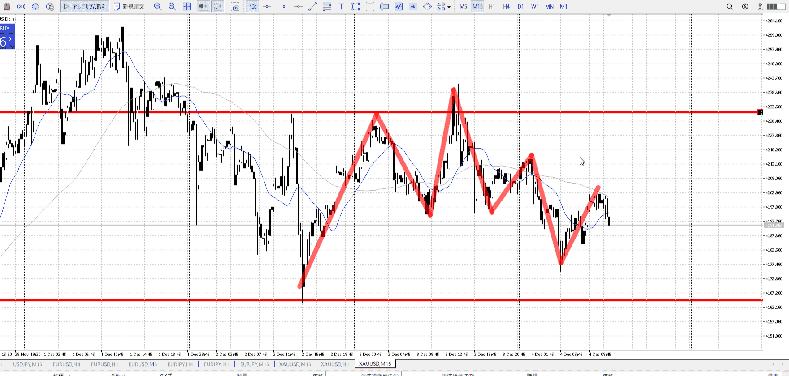
＜ここに目線画像＞

方向：d

全方向：uud

- [x] 使用足全ての目線確認

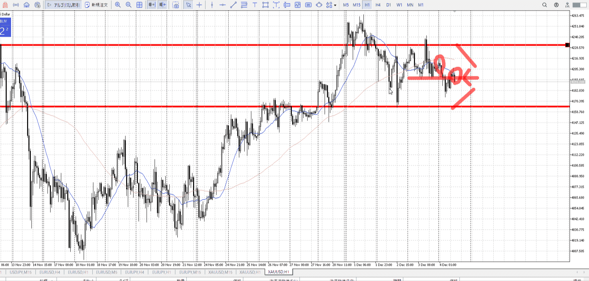
＜ここにシナリオ画像＞

b:1h二番底
s:1h天井

折角シナリオ立ててるんだから、それ以外で入る必要が無い。
勝率が下がる。

ここ三日ほどレンジ
下がってネック割り。

- [x] 1hシナリオ
- [x] ぶつかり
- [x] 日出日入、週出週入

目線・シナリオ・強弱・調整・横幅・PA後・平均線方向・波・**ひきつけ**
uud。下が強い。1hネックの上割りは失敗。
このまま完全に下から買うことになる。下で横軸PA後。

一番下ならひきつけより確実性だが、その後ひきつけを忘れずに。
シナリオを意識。

> [!check]
> - [x] +1万 事前認識 **開始5分**
> - [x] +1万 5枚
