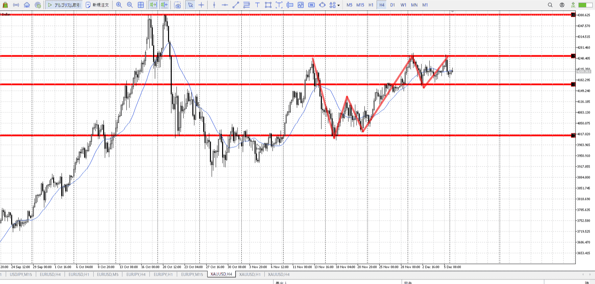
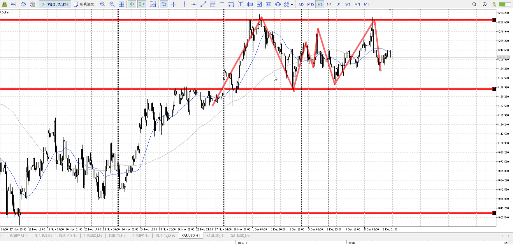
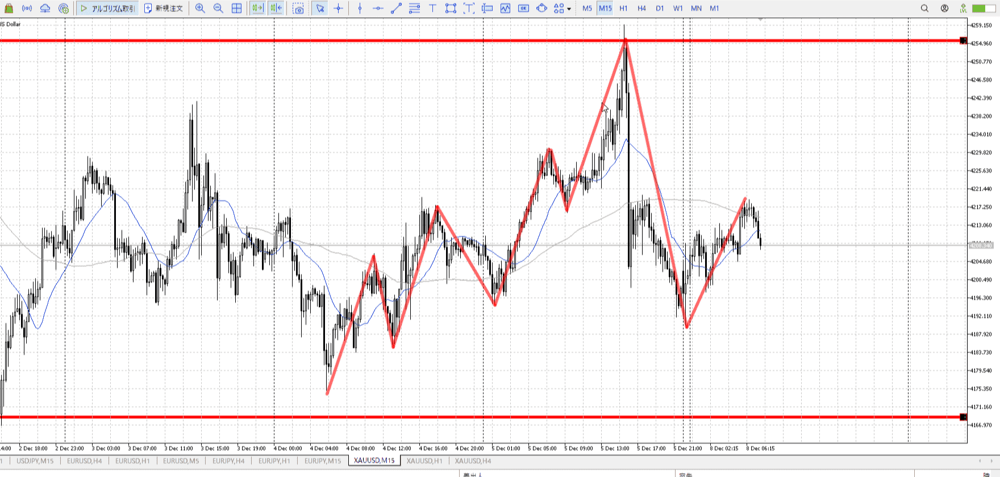
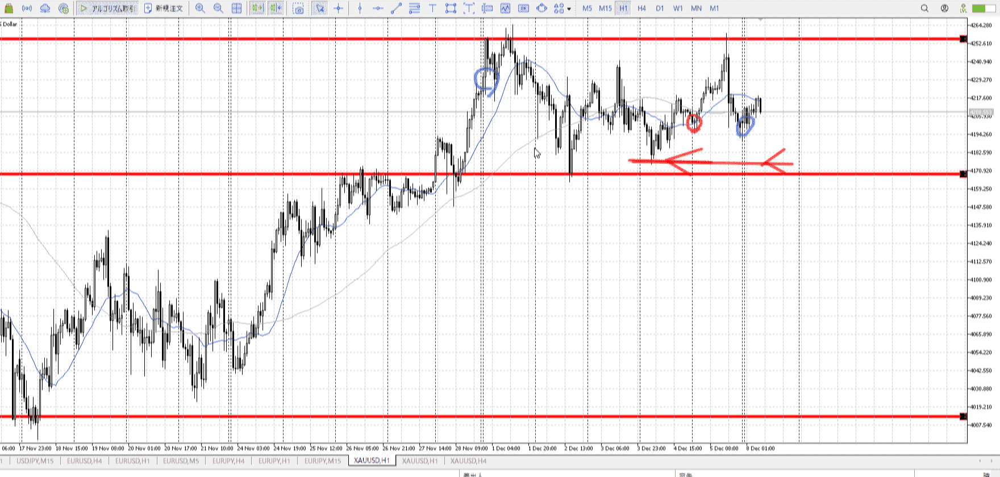
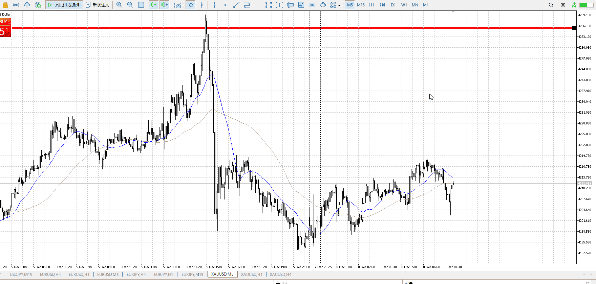
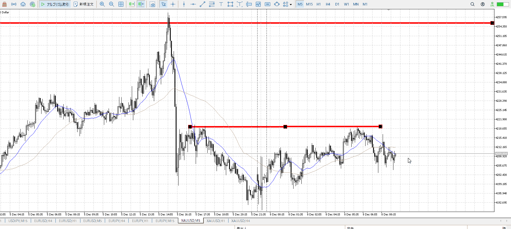
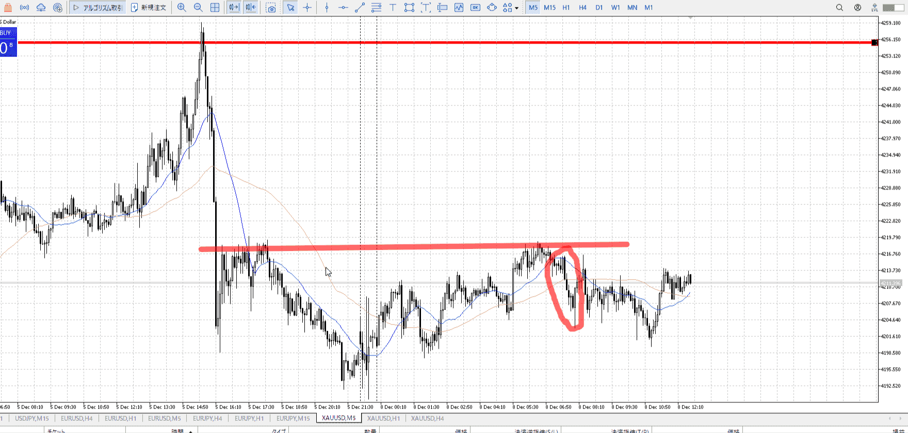
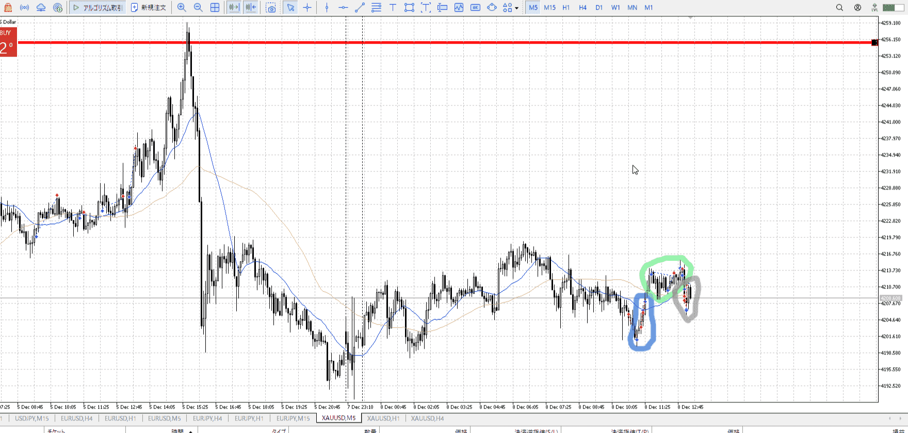
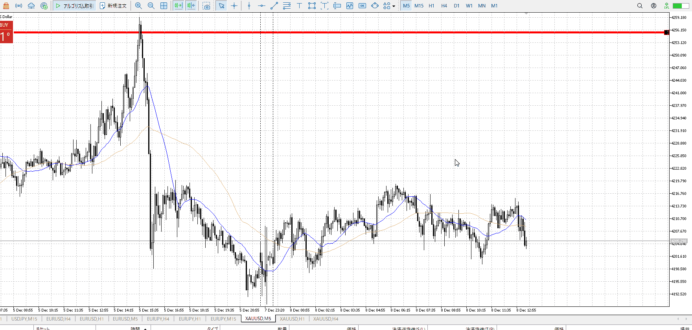

> [!note]
>- +1万 事前認識 **開始5分**

- [x] [my](obsidian://open?vault=Teino&file=FX/my)(見ないと増える)
- [x] 指標
    - 差し込まれる可能性有り、毎日

4h

＜ここに目線画像＞

- [x] トレーディングレンジ

方向：u

1h

＜ここに目線画像＞

方向：u

15m

＜ここに目線画像＞

方向：d

全方向：uud

- [x] 使用足全ての目線確認


＜ここにシナリオ画像＞
ちょっと書き損じ

b:1h底
s:1h天井

1w落ち。昨日は天井触れ落ち。買いg満足してもういないか。

- [x] 1hシナリオ
- [x] ぶつかり
- [x] 日出日入、週出週入


目線・シナリオ・強弱・調整・横幅・PA後・平均線方向・波・**ひきつけ**
uud。昨日の終わり的に下まで落ちる、その為の横幅区間か。
昨日の終わりが15mを下割、さらに割とやった割に1hも破れないで戻ってくるのはちょっと奇妙。底が見えているので、PAがあったら普通に押しを買っていける。ただし目線が上向いたら。今は証拠が足りない。

> [!check]
> - [ ] +1万 事前認識 **開始5分**
> - [ ] +1万 5枚

OK!
Exchage Start.

---



ただこの形だと小さく戻りがあるだろうと。ちょっと危ない。
二度目が欲しいが。



二度目から押し目が欲しかった。
二度目が切り下げっぽくつらみ。

5mでさえこの高さを超えないと。
15mは一番上を抜かないといけない。それは遠すぎるから今調整して新しく高値を抜ける準備をしていそう。

### 15m


T
大前提、今日は**方向感が無い**
だから動きに**即応**して短期で入る

これは15m。
今日は1hが買えず15m短期売り。その場合、慣習に基づくと15mで全体俯瞰、5mで場を確認、1mでエントリーになる。

もちろん実際にノイズが多い1mを見る必要はなく、5m確定で入ればいい。

今回良くなかったのは短期で売る意識への移行の遅さ、
1h買えないので15m売り、15mがレンジから赤丸下抜き。この戻りが第一に売れる、

そのあともレンジの上から売れる。一回目で決めてる以上、残りは全部[二回目押し・戻し](../エントリー.md#二回目押し・戻し)。



だから青丸はまだ売り。緑は上に抜いたので短期買い。灰は買いにしては下に振りすぎの買い失敗なので売り



そうと決めたら、一回目の戻りは売れる

![[../../images/2025-12-08 2025-12-08 22.29.06.excalidraw]]
こういう即応だと、こういう崩れも反応で売れる
これは1mだと半分いって売られるみたいな動き
今回の売りもその崩れ

[短期](../エントリー.md#短期)


---

- 1
- 2
- 3
現状把握、利確予想まで落ち耐え

---

```meta-bind-button
style: default
label: 明日分
actions:
  - type: "insertIntoNote"
    line: selfEnd+1
    value: "Temp/defFXEnvAnalysis.md"
    templater: true
  - type: "replaceSelf"
    replacement: ""
```
