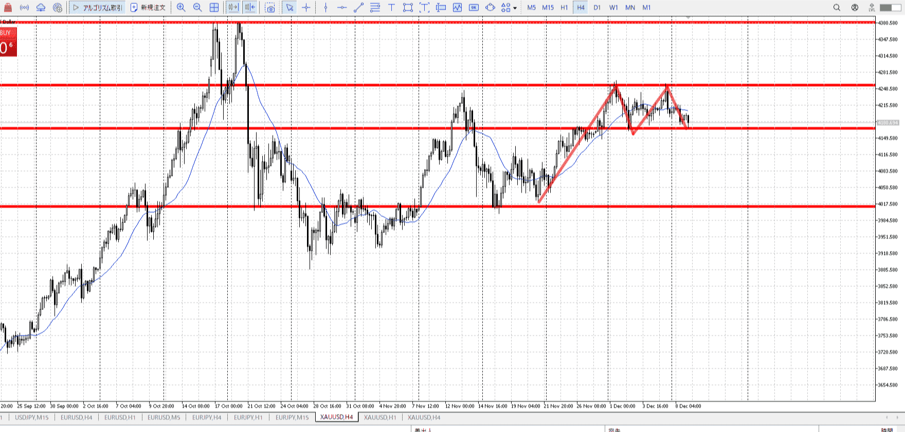
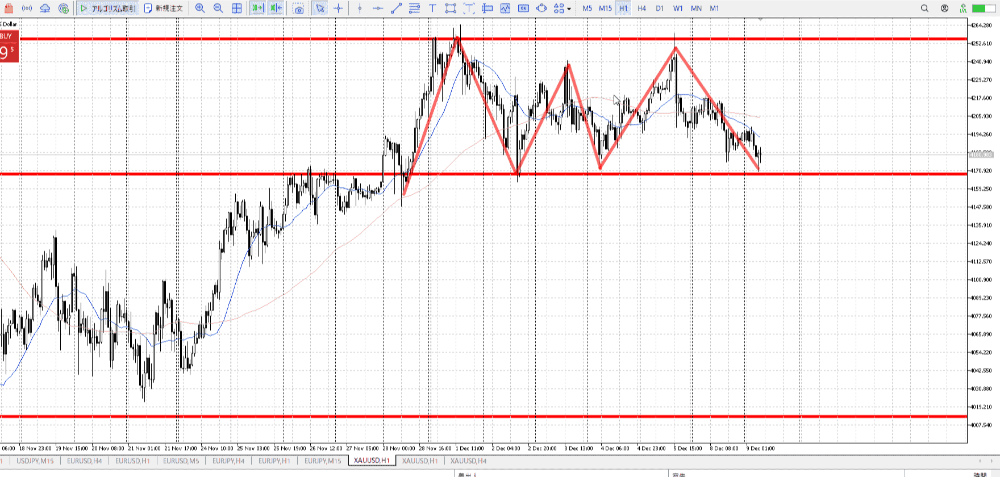
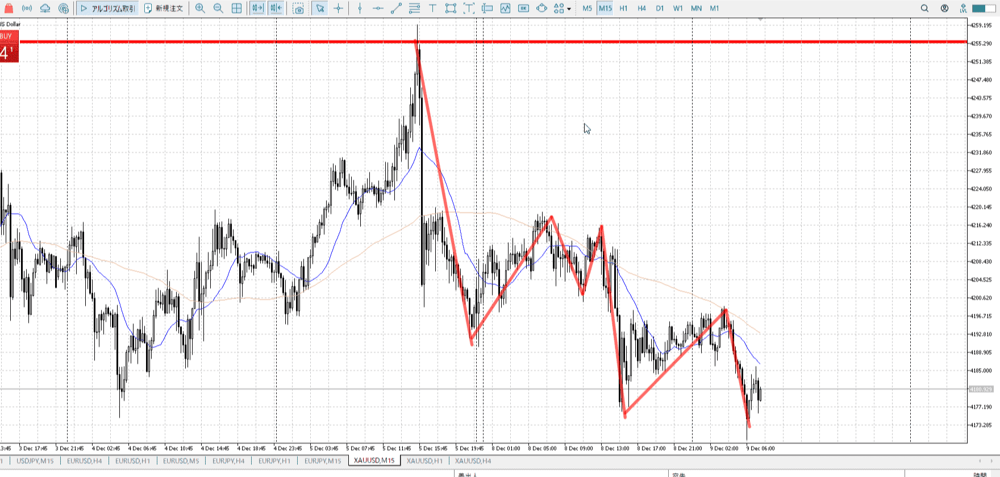
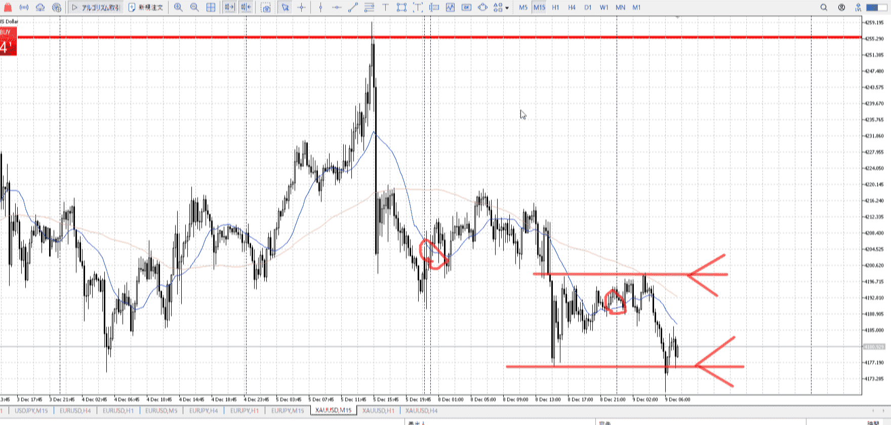
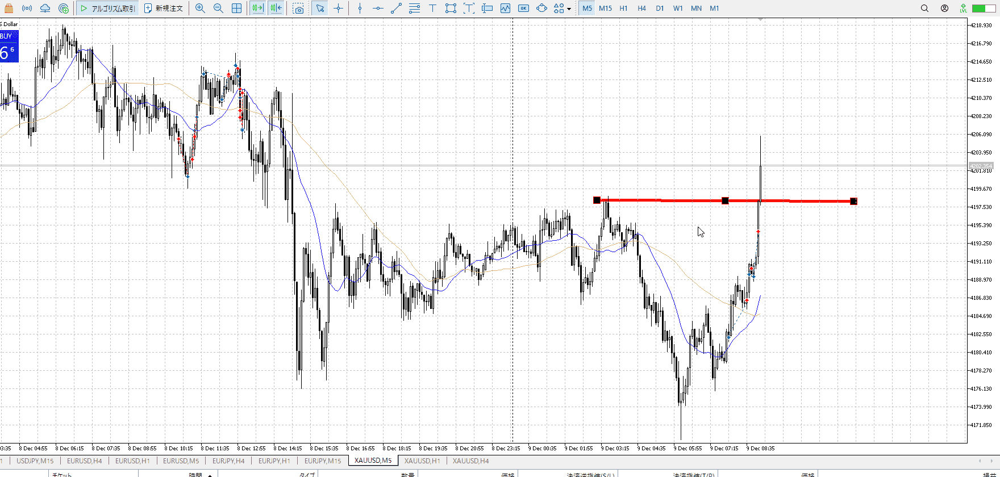
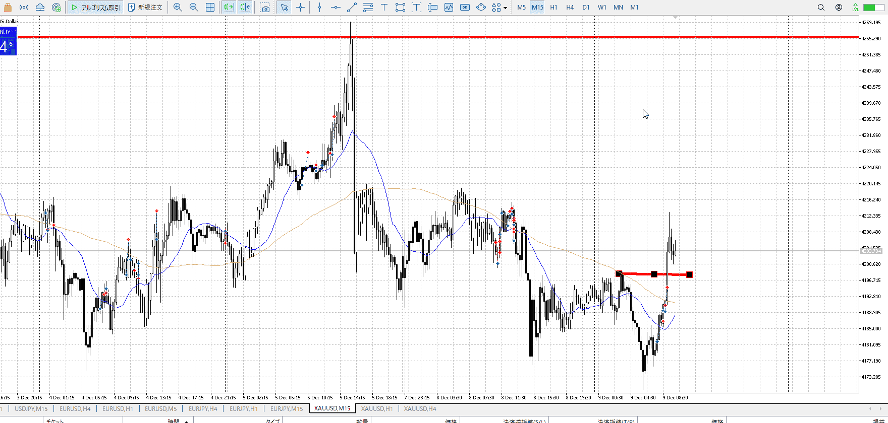
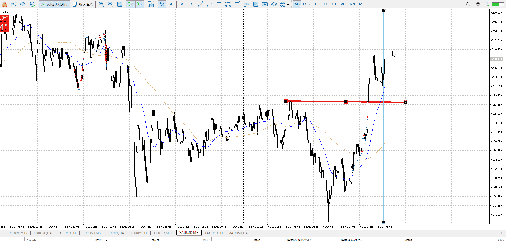
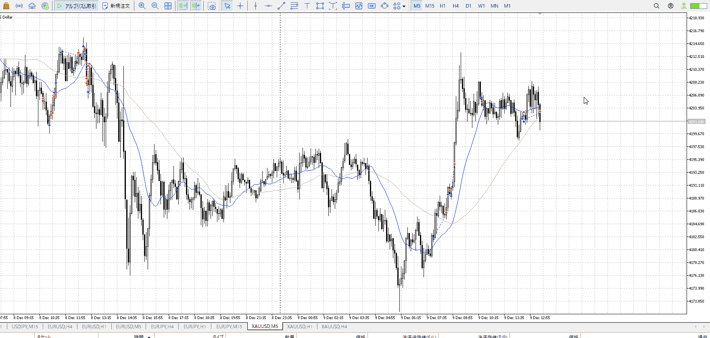
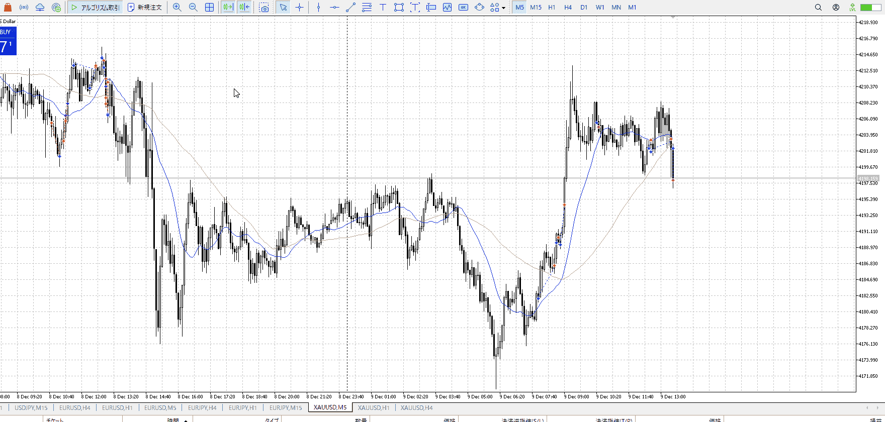

> [!note]
>- +1万 事前認識 **開始5分**

- [x] [my](obsidian://open?vault=Teino&file=FX/my)(見ないと増える)
- [x] 指標
    - 差し込まれる可能性有り、毎日

4h

＜ここに目線画像＞

- [x] トレーディングレンジ

方向：u

1h

＜ここに目線画像＞

方向：uR

15m

＜ここに目線画像＞

方向：d

全方向：uuRd

- [x] 使用足全ての目線確認


＜ここにシナリオ画像＞

b:15m安値
s:15m高値

1hがレンジなので15mで
落ちで終了だが、1h安値でちゃんと止まった

- [x] 1hシナリオ
- [x] ぶつかり
- [x] 日出日入、週出週入


目線・シナリオ・強弱・調整・横幅・PA後・平均線方向・波・**ひきつけ**
1h底にいる
uuRdで、15mとしては売り　1h方向感なし
短期で1hレンジ底で買っていきたい場面

5m横幅を取り、PAで底からの押しを取っていく
1hを根拠にしていても短期であることに注意
[短期](../エントリー.md#短期)

> [!check]
> - [x] +1万 事前認識 **開始5分**
> - [x] +1万 5枚

OK!
Exchage Start.

---


1. 確定した後、改めての下割を確認してない。もったいない。
2. 上まで取るはずだったのに、平均を無視して手前の小さい揉みまでで止めてしまった。もったいない。

T
一つ目は早い



15mもuになり、uuuに復帰。
となると同じように15ｍレンジから押しを狙いたい。この辺まだ高すぎ。



5mで下髭三本確定、そのうち最後が下試しを下髭返し
買えた？

15m抜けた後で、15m横幅取るほうがセオリー
ただこれ目線切替わりすぐ。


逆にエントリーする場合、トレンドはせめて逆を剥く必要がある
つまり売りから買いを取る場合、エントリー足の売り場を抜く。

レンジも上に売り場を作り、それを抜くこと。
レンジは利確の下げもあるので同じでない

今回は15mレンジ下が売り場

Wは小さく見すぎ

二回目は早すぎ、普通に持ってていい

三回目はちゃんと平均線的な利確迄持つ




15m上髭、5m下髭揃いから崩れ
流石にきついかと切ったが



上に行くはずのやつが止まった->否定
**買いがいなくなったので様子見必須**

---

- 1
- 2
- 3
現状把握、利確予想まで落ち耐え

---

```meta-bind-button
style: default
label: 明日分
actions:
  - type: "insertIntoNote"
    line: selfEnd+1
    value: "Temp/defFXEnvAnalysis.md"
    templater: true
  - type: "replaceSelf"
    replacement: ""
```
