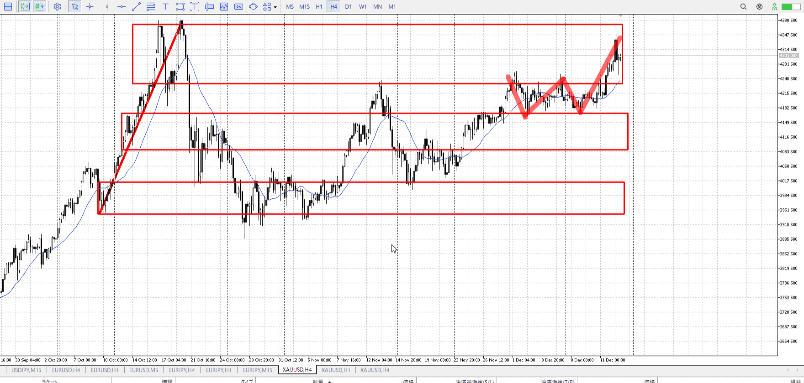
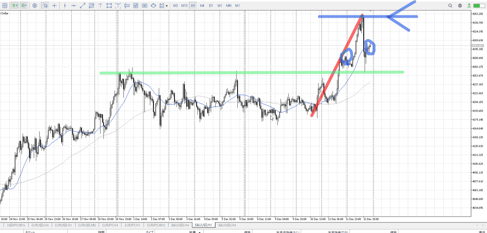
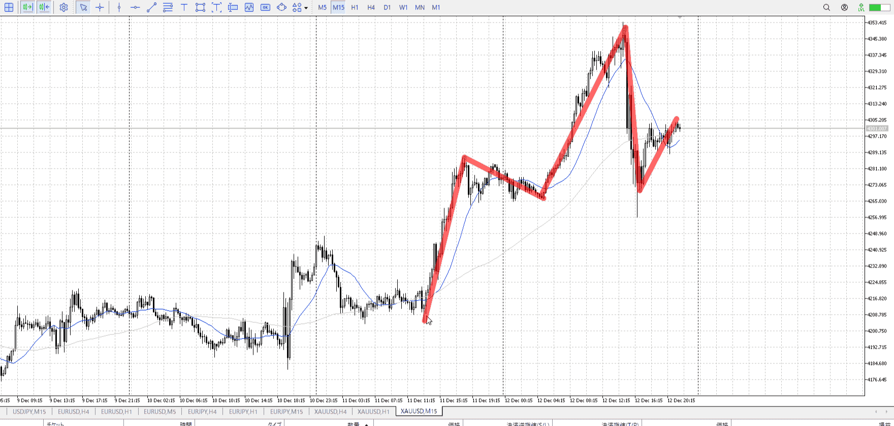
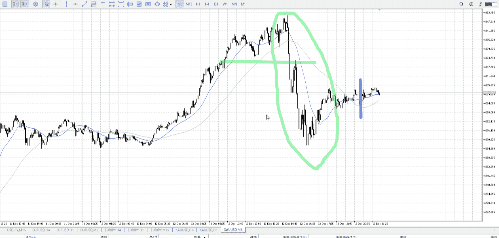

> [!note]
>- +1万 事前認識 **開始5分**

- [x] [my](obsidian://open?vault=Teino&file=FX/my)(見ないと増える)
- [x] 指標
    - 差し込まれる可能性有り、毎日

火曜22:30雇用統計
木曜22:30CPI

4h

＜ここに目線画像＞

- [x] トレーディングレンジ
    - u

方向：u

1h

＜ここに目線画像＞

方向：u

15m

＜ここに目線画像＞

方向：u

全方向：uuu

- [x] 使用足全ての目線確認


＜ここにシナリオ画像＞

b:4hレンジ上
s:4h高値

4h高値後、4hレンジ上で押され上で終了

- [x] 1hシナリオ
- [x] ぶつかり
- [x] 日出日入、週出週入


目線・シナリオ・強弱・調整・横幅・PA後・平均線方向・波・**ひきつけ**
uuu。落ちているのですぐには買いにくいが、押した理由が4hレンジ上と明確。4h1hは下髭。かなり買いやすい。

5m
15mAが上を向き始める前に買いたかったが、それは過ぎている、青線ポイント
月曜開始の瞬間に5mレンジ上にぶち抜きがひとつ
もう一回下に行って15mレンジを確定させてからがひとつ
いずれにせよ買いは間違いなく、その場合の利確は再び4h高値が理想

ただ4h高値を狙う割に、4h押しというには横幅が足りない
落ちて押していると見えるのは15mから、ここから入るなら短期になる

なので、この緑横線で一度利確が挟まれることを考えておく
これは5mなので、15mでちゃんと入れれば損切的に問題なさそうではあるが
そもそももっと横幅取るのがセオリーなのですぐ気にする必要もなさそうだが
でも伸びた時は。


> [!check]
> - [x] +1万 事前認識 **開始5分**
> - [x] +1万 5枚

OK!
Exchage Start.

---

とりあえず昨日の復習。
横幅取る、押し目を数える。

[my2025-12-13](../My_Test/my2025-12-13.md)

---

- 1
- 2
- 3
現状把握、利確予想まで落ち耐え

---

```meta-bind-button
style: default
label: 明日分
actions:
  - type: "insertIntoNote"
    line: selfEnd+1
    value: "Temp/defFXEnvAnalysis.md"
    templater: true
  - type: "replaceSelf"
    replacement: ""
```
