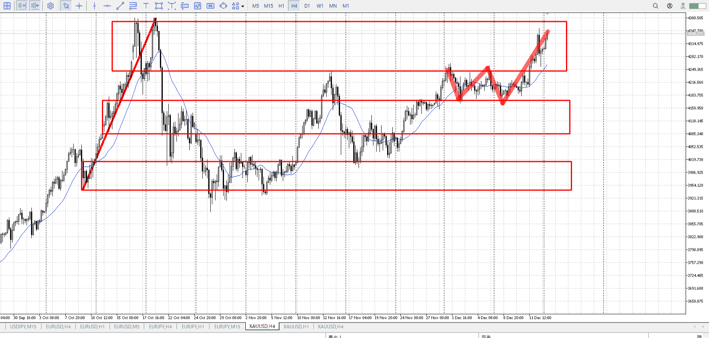
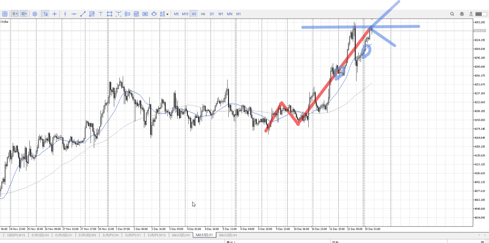
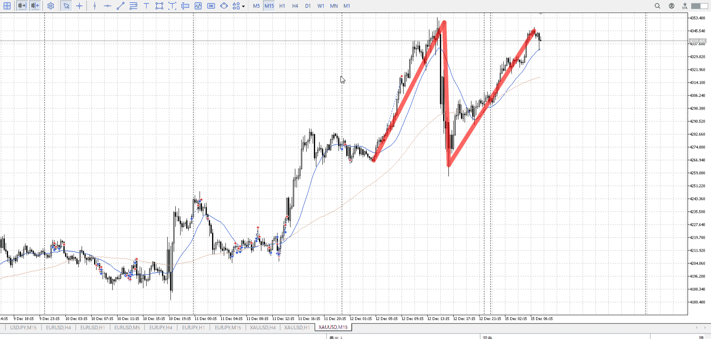
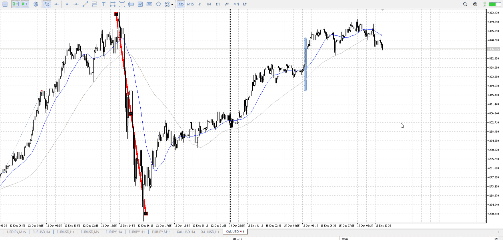
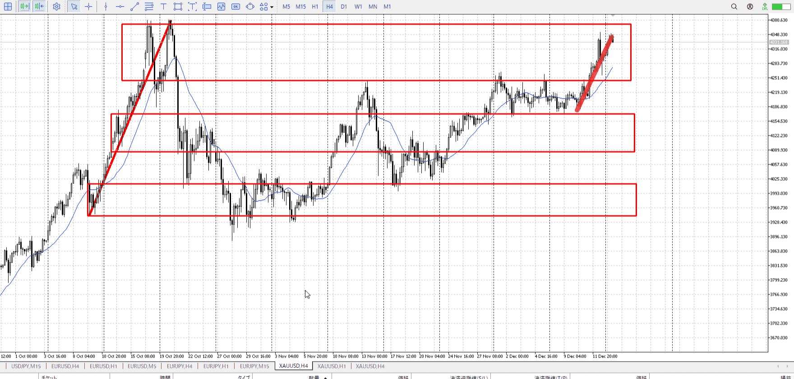
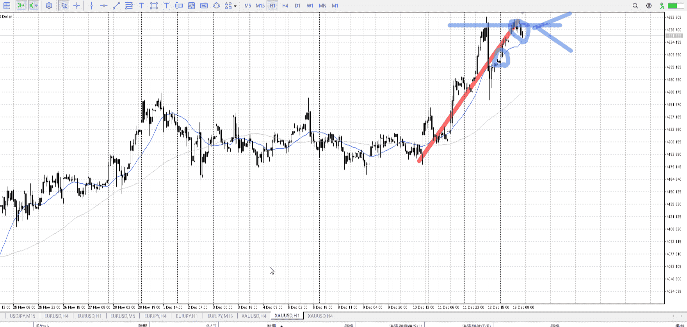
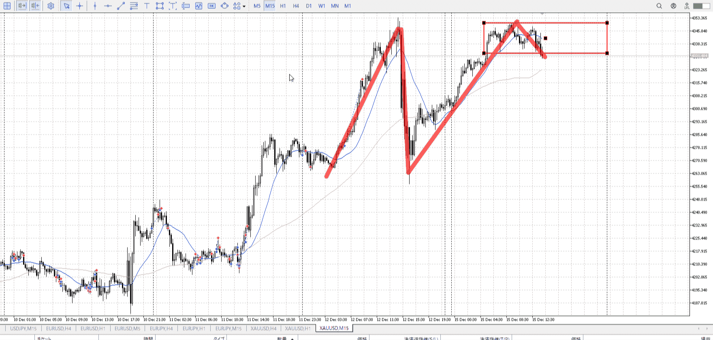

> [!note]
>- +1万 事前認識 **開始5分**

- [x] [my](obsidian://open?vault=Teino&file=FX/my)(見ないと増える)
- [x] 指標
    - 差し込まれる可能性有り、毎日

4h

＜ここに目線画像＞

- [x] トレーディングレンジ
    - u

方向：u

1h

＜ここに目線画像＞

方向：u

15m

＜ここに目線画像＞

方向：u

全方向：uuu

- [x] 使用足全ての目線確認


＜ここにシナリオ画像＞

b:15m安値
s:1h高値

下がり切らず上から

- [x] 1hシナリオ
- [x] ぶつかり
- [x] 日出日入、週出週入


目線・シナリオ・強弱・調整・横幅・PA後・平均線方向・波・**ひきつけ**
土曜に読んだ一つ、5mぶち抜き。
上に触れたがシナリオはまだ達成されてない。1h高値を抜くか1hA下がりから買い場抜きくらいしないと。

月曜。5mで入れる気はあまりない。1hAが追いつくまで待ちが一つ。
少なくとも15mA下向きはじめは必要と考える。

いくら底っぽくても、MAが折れてないうちからは数えない。
底振れを待ち、どこから入ってるかを明確に押さえる。


> [!check]
> - [x] +1万 事前認識 **開始5分**
> - [x] +1万 5枚

OK!
Exchage Start.

---



T
今日は入れたのはここくらい
下降に対しての戻り売りを完全に帰し、その後の底づくりも下に行かずさらに空白を作る

ただ時間は14:00ごろ
どの道入りにくい

## 良いエントリー目安
あくまで入った後の話であって、これを目安に入らない事。


入った方向に対し、平均線より向こう側にあればいいエントリー。青線。
買いなら上、売りなら下。

普段は1h->15mで見てるので、15mの平均線を使用。

気にしなくても、横幅->PAで大抵抜いてる

それより下で入る場合は、引きつけになる。緑線。
だからリスク高い、ギリギリまでひきつけること
[平均線](../平均線.md)


---

- 1
- 2
- 3
現状把握、利確予想まで落ち耐え

---


> [!note]
>- +1万 事前認識 **開始5分**

- [x] [my](obsidian://open?vault=Teino&file=FX/my)(見ないと増える)
- [x] 指標
    - 差し込まれる可能性有り、毎日

火曜22:30 雇用統計

4h

＜ここに目線画像＞

- [x] トレーディングレンジ
    - u

方向：u

1h

＜ここに目線画像＞

方向：u

15m

＜ここに目線画像＞

方向：u

全方向：uuu

- [x] 使用足全ての目線確認


＜ここにシナリオ画像＞

b:1hレンジ上
s:1h高値

1hレンジ上の上昇が続いている。
高値で止まる。

- [x] 1hシナリオ
- [x] ぶつかり
- [x] 日出日入、週出週入


目線・シナリオ・強弱・調整・横幅・PA後・平均線方向・波・**ひきつけ**
uuu。シナリオは続いている。
このままレンジ作って、それがどっち行くかで出方が変わる。
下なら止まり待ち、上なら押し待ち。

> [!check]
> - [x] +1万 事前認識 **開始5分**
> - [x] +1万 5枚

```meta-bind-button
style: default
label: Send
actions:
  - type: "replaceSelf"
    replacement: "OK!\nExchage Start.\n\n---"
```


---

- 1
- 2
- 3
