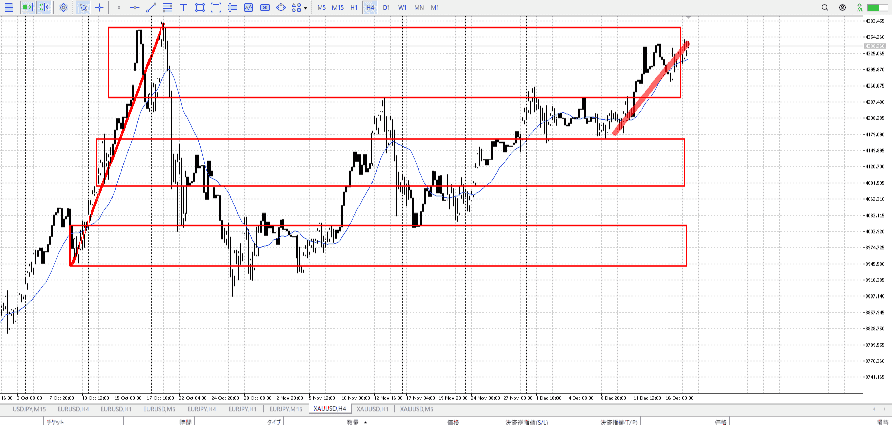
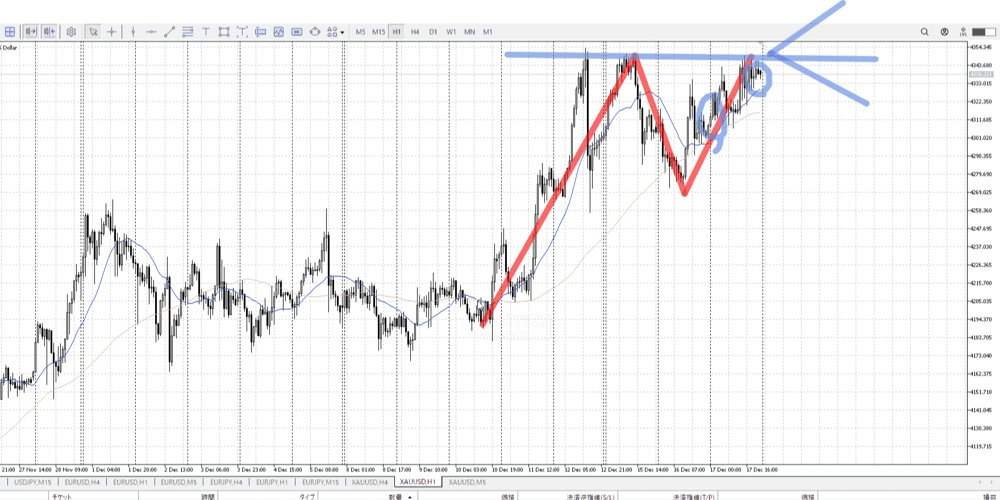
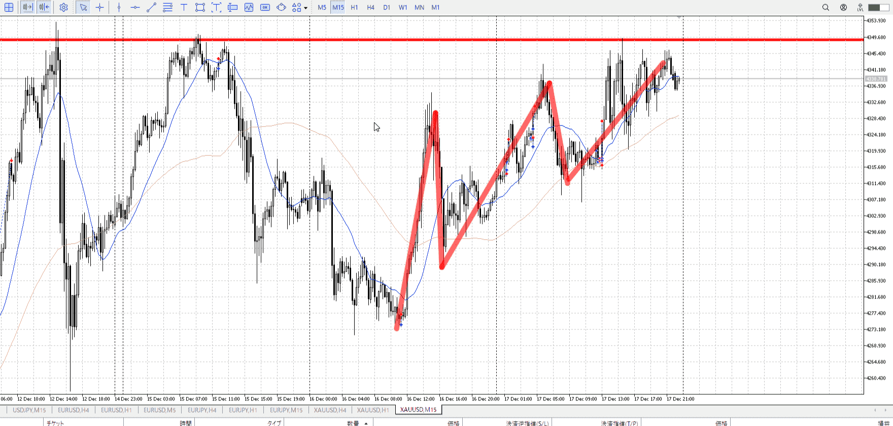
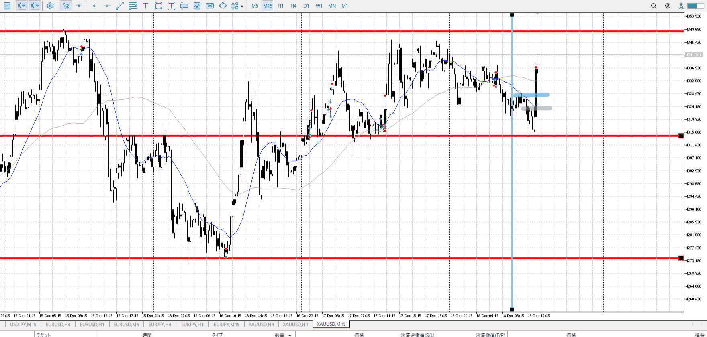

> [!note]
>- +1万 事前認識 **開始5分**

- [x] [my](obsidian://open?vault=Teino&file=FX/my)(見ないと増える)
- [x] 指標
    - 差し込まれる可能性有り、毎日

22:30 CPI

4h

＜ここに目線画像＞

- [x] トレーディングレンジ
    - u

方向：u

1h

＜ここに目線画像＞

方向：u

15m

＜ここに目線画像＞

方向：u

全方向：uuu

- [x] 使用足全ての目線確認


＜ここにシナリオ画像＞

b:1h安値
s:1h高値

頭ぶつけつつ高いとこ

- [x] 1hシナリオ
- [x] ぶつかり
- [x] 日出日入、週出週入


目線・シナリオ・強弱・調整・横幅・PA後・平均線方向・波・**ひきつけ**
uuu、昨日より高いとこ
シナリオ的に1h高値を抜いてしまいたいが、細かく切り上げが起きていてすごく落ちやすい状態
抜いてから考えたいが、指標があるのでここでこのままレンジが一番現実的か
あるいは上から一気に落として上げる火曜方式か


> [!check]
> - [x] +1万 事前認識 **開始5分**
> - [x] +1万 5枚

OK!
Exchage Start.

---



T
指標で上昇。ほぼ確上がる。
入れず青で入ったが、緑まで落ちるのは想定
なので分割して0.05、緑に来たら残りをやる予定
偶々落ちなかった


---

- 1
- 2
- 3
現状把握、利確予想まで落ち耐え

---

```meta-bind-button
style: default
label: 明日分
actions:
  - type: "insertIntoNote"
    line: selfEnd+1
    value: "Temp/defFXEnvAnalysis.md"
    templater: true
  - type: "replaceSelf"
    replacement: ""
```
