> [!note]
>- +1万 事前認識 **開始5分**

- [x] [my](obsidian://open?vault=Teino&file=FX/my)(見ないと増える)
- [x] 指標
    - 差し込まれる可能性有り、毎日

4h
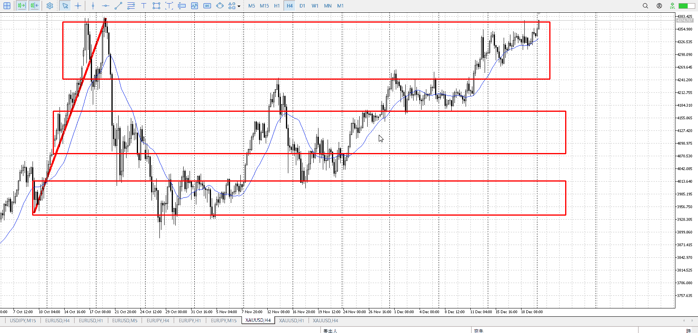
＜ここに目線画像＞

- [x] トレーディングレンジ
    - u

方向：u

1h
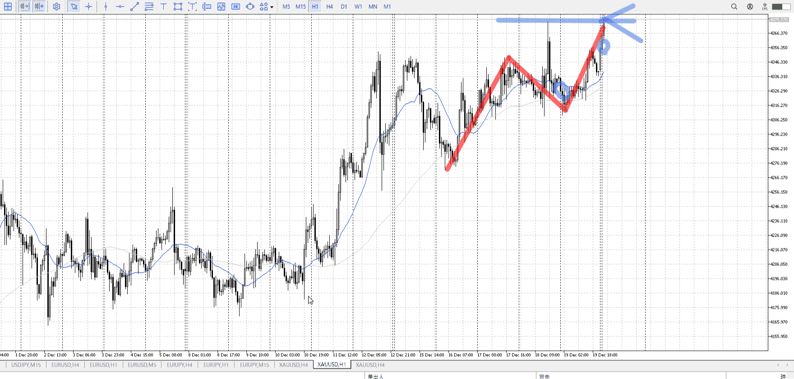
＜ここに目線画像＞

方向：u

15m
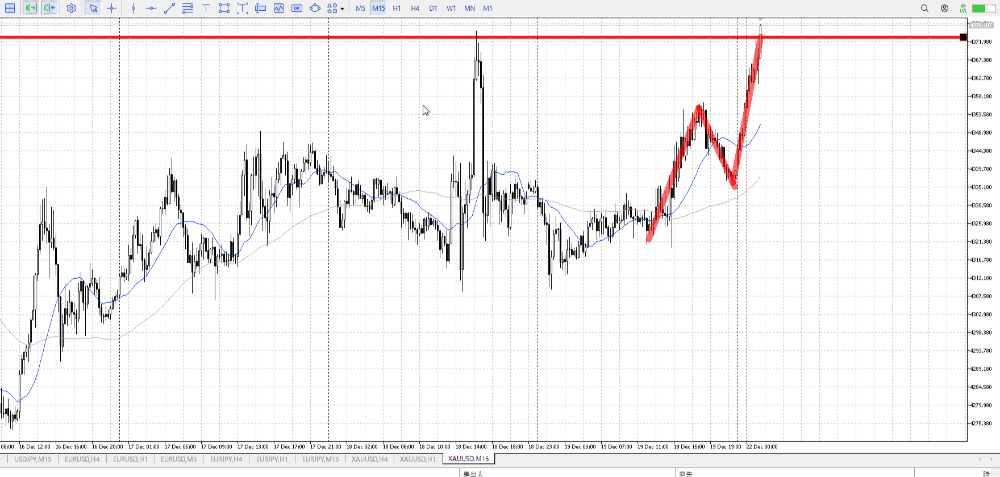
＜ここに目線画像＞

方向：u

全方向：uuu

- [x] 使用足全ての目線確認


＜ここにシナリオ画像＞

b:1h安値
s:4h高値

上昇

- [x] 1hシナリオ
- [x] ぶつかり
- [x] 日出日入、週出週入


目線・シナリオ・強弱・調整・横幅・PA後・平均線方向・波・**ひきつけ**
月曜から急上昇。
これが4hにぶつかりにいく。

買えたかという話。無理じゃないか、1h高値からの売りがこんなとこで止まると思えないし。
唯一は近場の1h高値、上髭を二度目で抜いたときくらいか。

要するに1h高値に戻ってくるまで待ち。
4h抜いたとしてもここまでは戻ってほしいはず。現状抜いたほどの長さに見えないが。

> [!check]
> - [x] +1万 事前認識 **開始5分**
> - [x] +1万 5枚

OK!
Exchage Start.

---

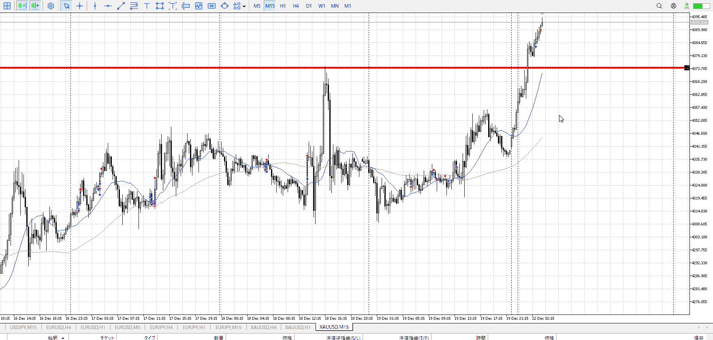
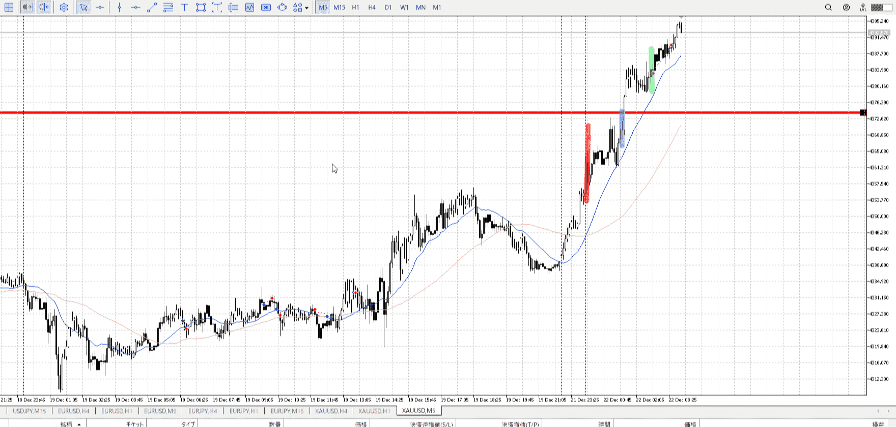


赤線、朝九時がベスト。
青線、15m確定がベター。この15mは頂点で出るものでない。
伸びたのならその反転の確定に注意。

結局大分後から入った、緑
朝はともかく、青の確定抜け入りはやれ

詰まってきたと感じたので止めた
これは月曜であることを加味しているのに注意


というわけでこの後も売り場抜きを待つ

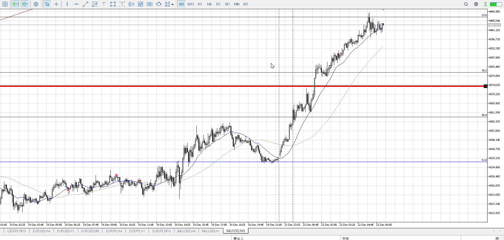

ちょっと溜まってきた
まだ5m、売り場抜き待ち

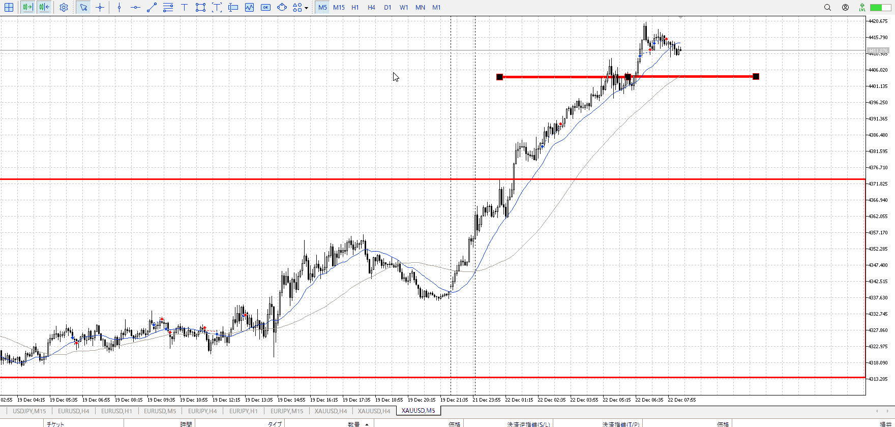

分析通り
損切
分析なしプラス
分析無しマイナス

この最新入りは、**落ちて来てから入**るでもなく
**下髭が出てから入る**でもない
分析のない入り

これでプラスを出すのは駄目

ちゃんと根拠を持ち、それに合わせてはいる
今はおちてきてから入る準備

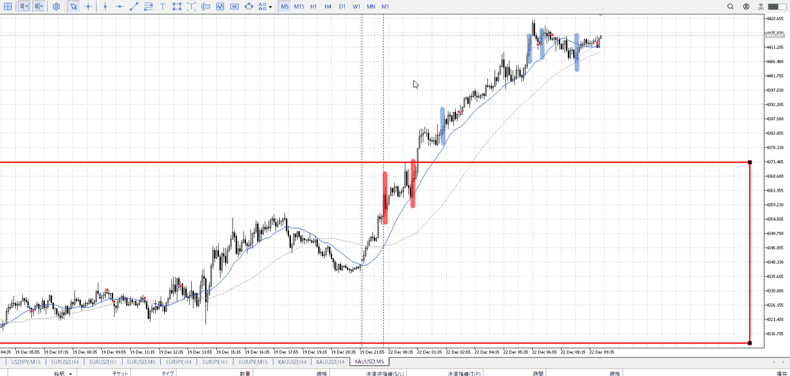

こう

諦める理由探しみたいになってるけど、今日はもう十分上がったので。
月曜でもあるしもういいだろう。

---


- 1
    - これ自体はまあいい
    - 入るのが遅かった、九時や十時の15m確に注意
- 2
    - 降りてこなかったので抜けを狙ってるのだが、どうせ押されるので押しを待ったほうが確実
- 3
    - だめ。落ちて来て入るとか、下髭見て入るとかあるが、どちらでもない入り。駄目。
- 4
    - 理想。切りがちょっと悪いがまあまあ。


---


> [!note]
>- +1万 事前認識 **開始5分**

- [x] [my](obsidian://open?vault=Teino&file=FX/my)(見ないと増える)
- [x] 指標
    - 差し込まれる可能性有り、毎日

4h
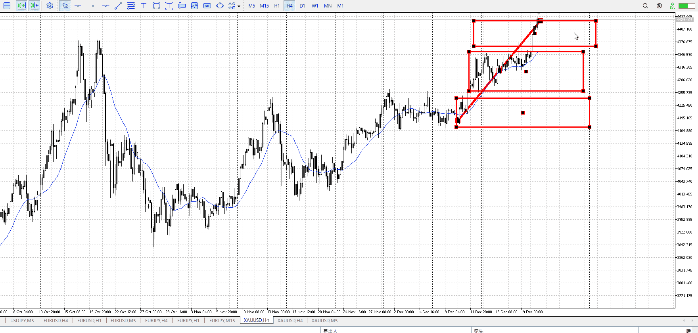
＜ここに目線画像＞

- [x] トレーディングレンジ
    - u

方向：u

1h
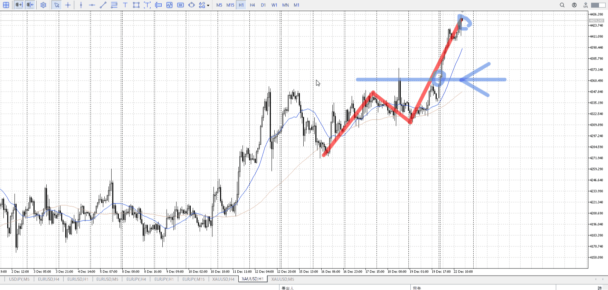
＜ここに目線画像＞

方向：u

15m
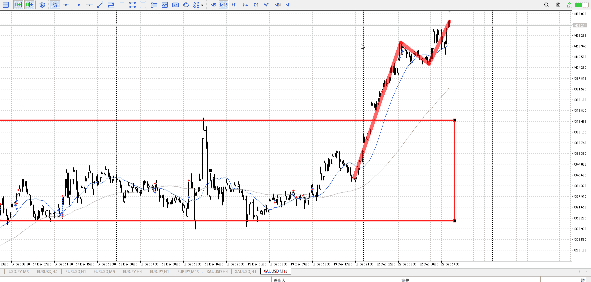
＜ここに目線画像＞

方向：u

全方向：uuu

- [x] 使用足全ての目線確認


＜ここにシナリオ画像＞

b:1h高値
s:前回上昇261.8？

- [x] 1hシナリオ
- [x] ぶつかり
- [x] 日出日入、週出週入

上昇

目線・シナリオ・強弱・調整・横幅・PA後・平均線方向・波・**ひきつけ**
4hを抜いたので下がったら買い。
シナリオ的には1h高値まで戻ってこないと評価ができないが。

> [!check]
> - [x] +1万 事前認識 **開始5分**
> - [x] +1万 5枚

```meta-bind-button
style: default
label: Send
actions:
  - type: "replaceSelf"
    replacement: "OK!\nExchage Start.\n\n---"
```


---

- 1
- 2
- 3
