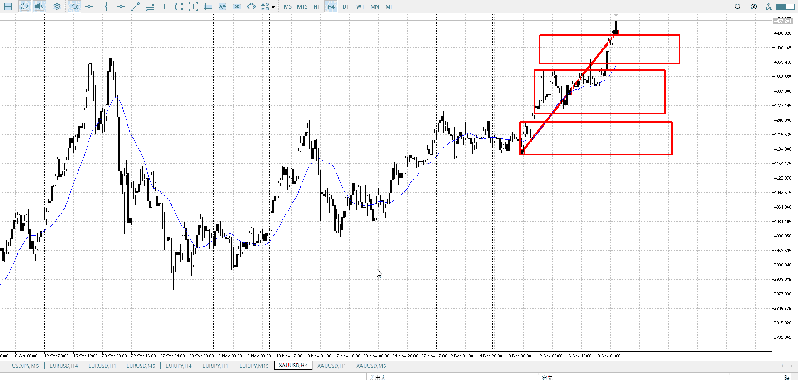
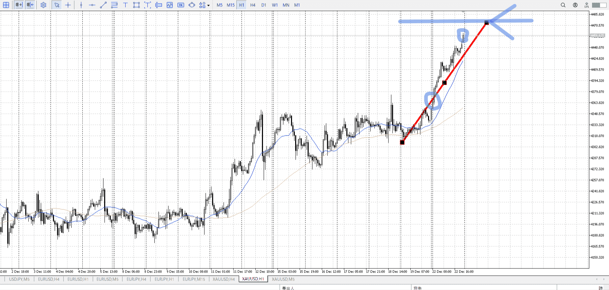
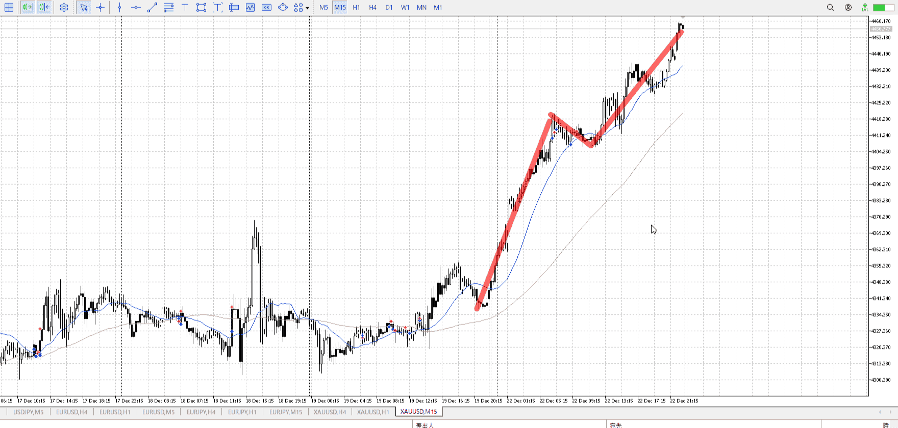
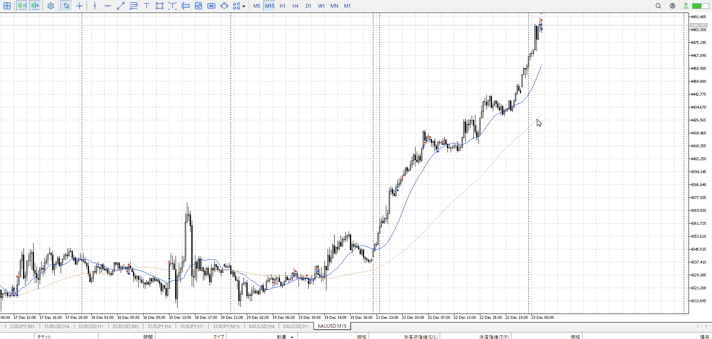

> [!note]
>- +1万 事前認識 **開始5分**

- [x] [my](obsidian://open?vault=Teino&file=FX/my)(見ないと増える)
- [x] 指標
    - 差し込まれる可能性有り、毎日

22:30GDP

4h

＜ここに目線画像＞

- [x] トレーディングレンジ
    - u

方向：u

1h

＜ここに目線画像＞

方向：u

15m

＜ここに目線画像＞

方向：u

全方向：uuu

- [x] 使用足全ての目線確認


＜ここにシナリオ画像＞

b:1h安値
s:1h前回上昇上限？

- [x] 1hシナリオ
- [x] ぶつかり
- [x] 日出日入、週出週入

上昇

目線・シナリオ・強弱・調整・横幅・PA後・平均線方向・波・**ひきつけ**
uuu
上がり倒した、1hの前回上昇ではもう少し上がる予定
横幅とってPA押し買い

> [!check]
> - [x] +1万 事前認識 **開始5分**
> - [x] +1万 5枚

OK!
Exchage Start.

---



ここまでくると、抜け買いでの目標が無い。
なので押し¡「」（../images/2025-12-23-1766480829020.png）「」（../images/2025-12-23-1766480829020.png）


朝は早すぎ、何も証拠がない
昼も証拠が薄い

最後のはまだ15mのレンジも出来てないので、早い
1hで入ってない、勢い任せであることに留意

本題はここから、赤線に引きつけて買っていく
1hAも来てない状態なので欲を言うともっと時間が欲しいが

---

- 1
- 2
- 3
現状把握、利確予想まで落ち耐え

---

```meta-bind-button
style: default
label: 明日分
actions:
  - type: "insertIntoNote"
    line: selfEnd+1
    value: "Temp/defFXEnvAnalysis.md"
    templater: true
  - type: "replaceSelf"
    replacement: ""
```
