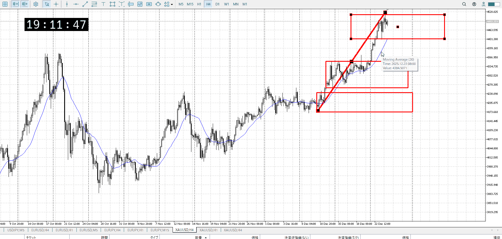
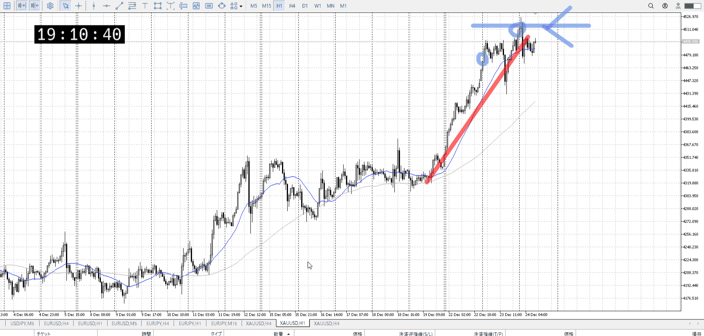
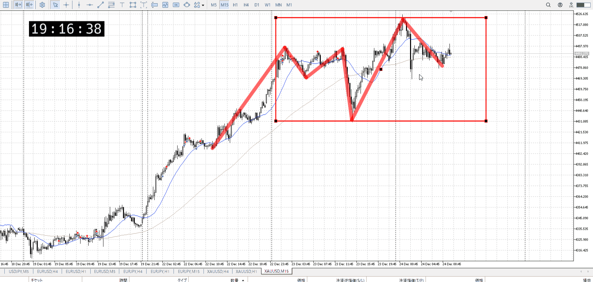
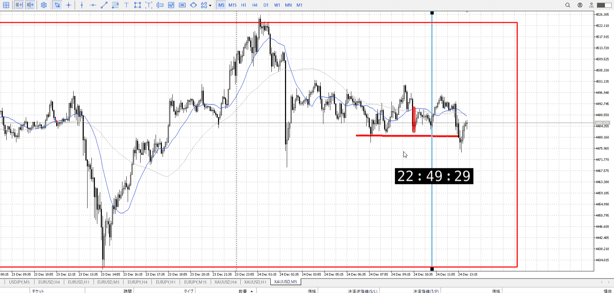

> [!note]
>- +1万 事前認識 **開始5分**

- [x] [my](obsidian://open?vault=Teino&file=FX/my)(見ないと増える)
- [x] 指標
    - 差し込まれる可能性有り、毎日

4h

＜ここに目線画像＞

- [x] トレーディングレンジ
    - u

方向：u

1h

＜ここに目線画像＞

方向：u

15m

＜ここに目線画像＞

方向：uR

全方向：uuuR

- [x] 使用足全ての目線確認


＜ここにシナリオ画像＞

b:1h安値
s:15m高値？

下振って上

- [x] 1hシナリオ
- [x] ぶつかり
- [x] 日出日入、週出週入


目線・シナリオ・強弱・調整・横幅・PA後・平均線方向・波・**ひきつけ**
uuuR
下振ったことで底っぽいのは見えた、ついでに天井も
1hがまだ下向いてないので買いにくい
もう一度底に来て小さいの抜けたら買いやすい、正体不明の天井を抜くための1h由来力。
ただまあクリスマス前なのでやらないだろうしこっちもやらない。

> [!check]
> - [x] +1万 事前認識 **開始5分**
> - [x] +1万 5枚

OK!
Exchage Start.

---



抜くのは無理だが、その間をやることはできる
出来始めた15mラインに落ちてきて赤縦とどまり、青縦で上昇。下から買うならこの下からもできるし、上昇に合わせて押しを拾うこともできる。

間をやる意識で、下から下からを考える。[二回目押し・戻し](../エントリー.md#二回目押し・戻し)。
その後は無理なので。

---

- 1
- 2
- 3
現状把握、利確予想まで落ち耐え

---

```meta-bind-button
style: default
label: 明日分
actions:
  - type: "insertIntoNote"
    line: selfEnd+1
    value: "Temp/defFXEnvAnalysis.md"
    templater: true
  - type: "replaceSelf"
    replacement: ""
```
