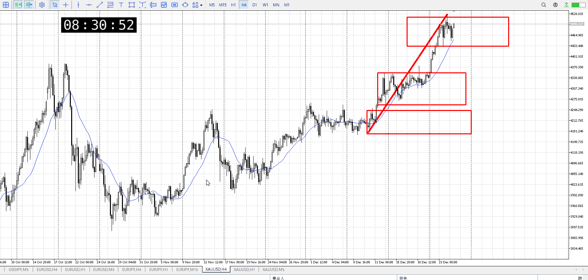
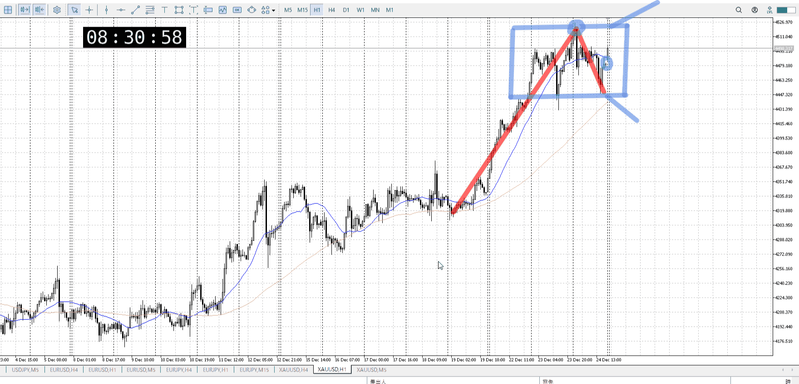
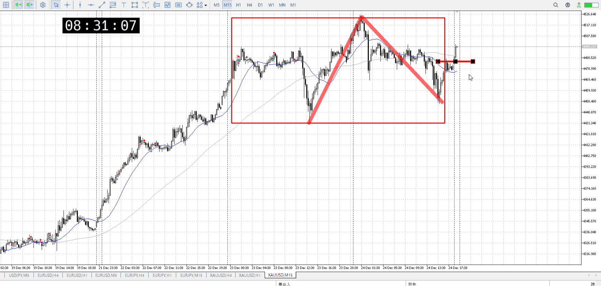
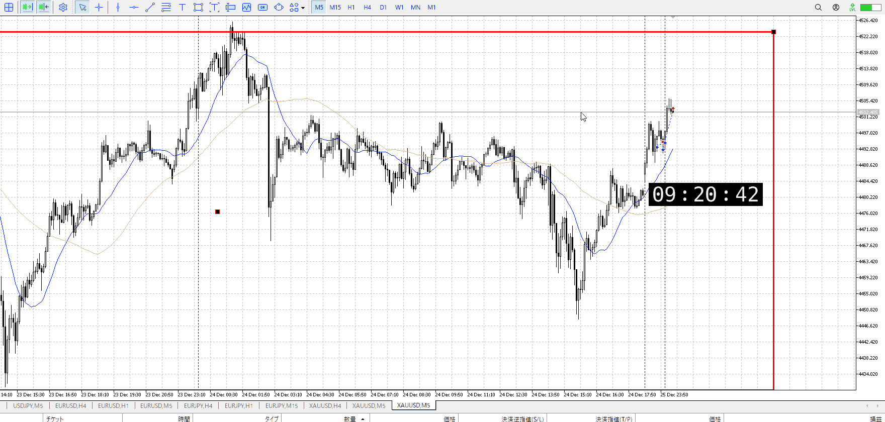
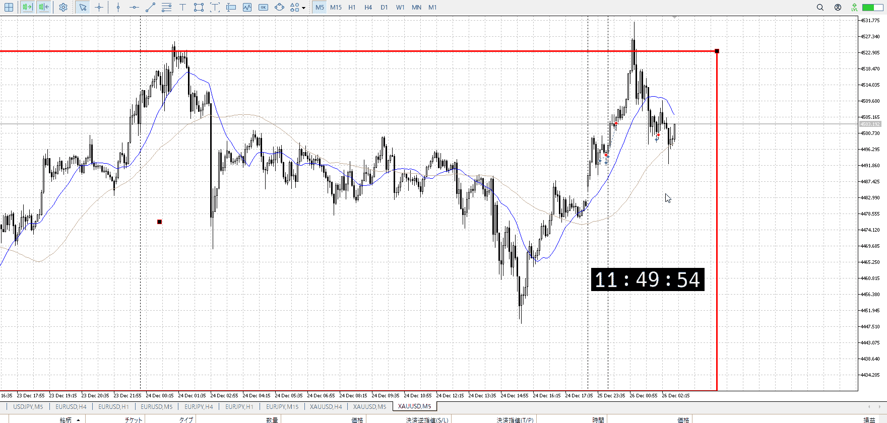
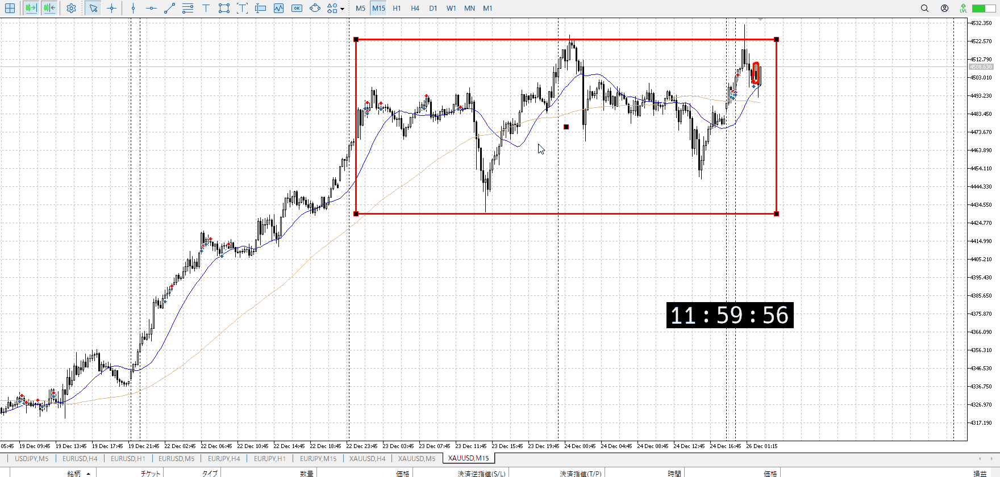
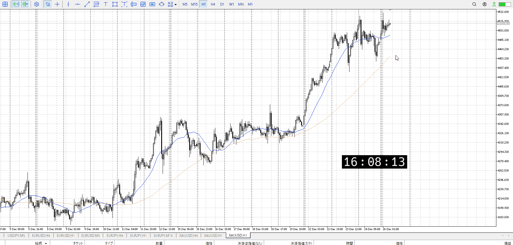
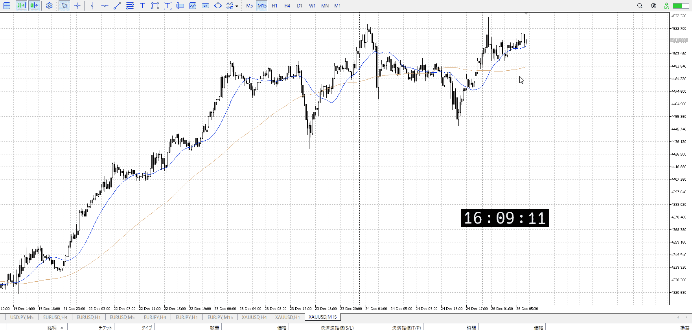
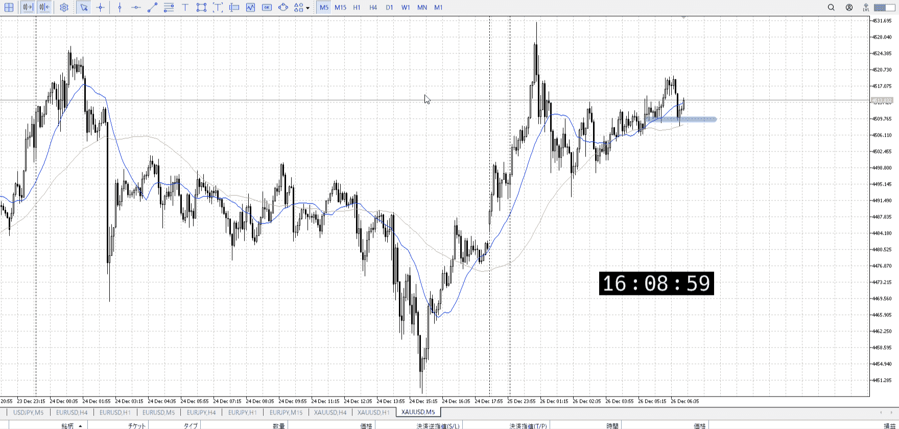

> [!note]
>- +1万 事前認識 **開始5分**

- [x] [my](obsidian://open?vault=Teino&file=FX/my)(見ないと増える)
- [x] 指標
    - 差し込まれる可能性有り、毎日

4h

＜ここに目線画像＞

- [x] トレーディングレンジ
    - u

方向：u

1h

＜ここに目線画像＞

方向：u

15m

＜ここに目線画像＞

方向：u

全方向：uuu

- [x] 使用足全ての目線確認


＜ここにシナリオ画像＞

b:15m安値
s:1h高値

レンジ上から下降、15m安値来る前に上昇

- [x] 1hシナリオ
- [x] ぶつかり
- [x] 日出日入、週出週入


目線・シナリオ・強弱・調整・横幅・PA後・平均線方向・波・**ひきつけ**
uuu
買いたいので売り場突破から押し

> [!check]
> - [x] +1万 事前認識 **開始5分**
> - [x] +1万 5枚

OK!
Exchage Start.

---

レポート
エントリー時刻、取引時間、lot



売り場突破から上昇狙い
朝なので無理せず、左急下落周辺での5m上髭二本で止め
これで上がっても朝だから

二回目の損切は要らなかった
普通に持ち続ければ行けた

もう一回下がったらまた買う
T
が、せめて5m曲がるまで待ち



損切上げるのは利益出てから
最低限の一本確定もまだなので情報足りない



15mの確定を待って切るなら次回にも活かせる
今回は早すぎ

T
昼前、それで入らないはあり
5m以外ももっと見ろ



**そもそも1hで上過ぎ**る、入りにくい
これを抜けるなら1hでの売り場抜きなどが欲しい。今回はない。




それでも入るなら、エントリーをシビアにするか、損切を許容するか
シビアにする場合、本来損切する位置までひきつける
今回は青線が損切位置、ここまでひきつける
    二回目押し

![[../../images/エントリー 2025-11-24 23.42.03.excalidraw]]

これ

最初から損切位置は見えてるはず
それで大きいと感じるならそれに近づくまで待つ、それだけで十分
今回のは推奨されたものではないが

登って上に触れて、一回目の下降部分はまだ一気に上がる可能性がある
その後はレンジと売り場抜きが必要、これは出てないので推奨できない、というか駄目

稼いだ金をここまで損しても大丈夫のように考えるのは流石に駄目
それで考えなくてもいいように無理と分かる実験をする癖はここでは不可能、とりわけFXは成功を積み重ねたほうが遥かに早い

- 1h上すぎ
- 実験は不必要
    - 駄目なもんは常に駄目、時間たっても
    - 理論で入る


---

- 1
- 2
- 3
現状把握、利確予想まで落ち耐え

---

```meta-bind-button
style: default
label: 明日分
actions:
  - type: "insertIntoNote"
    line: selfEnd+1
    value: "Temp/defFXEnvAnalysis.md"
    templater: true
  - type: "replaceSelf"
    replacement: ""
```
