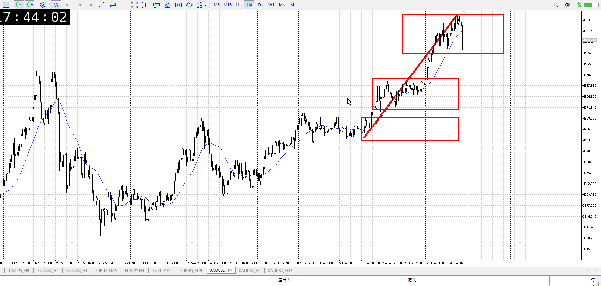
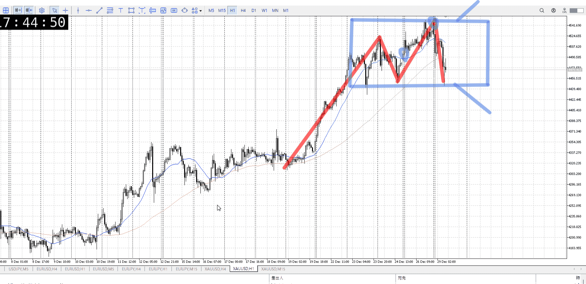
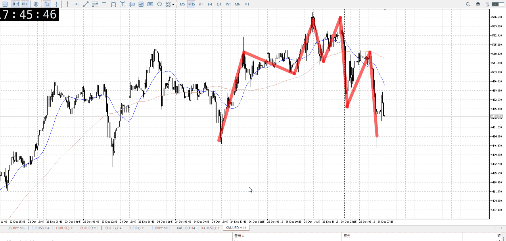
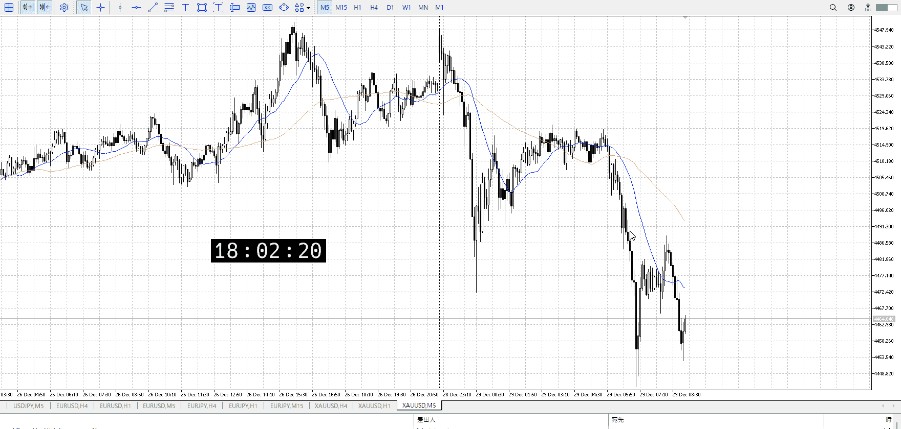
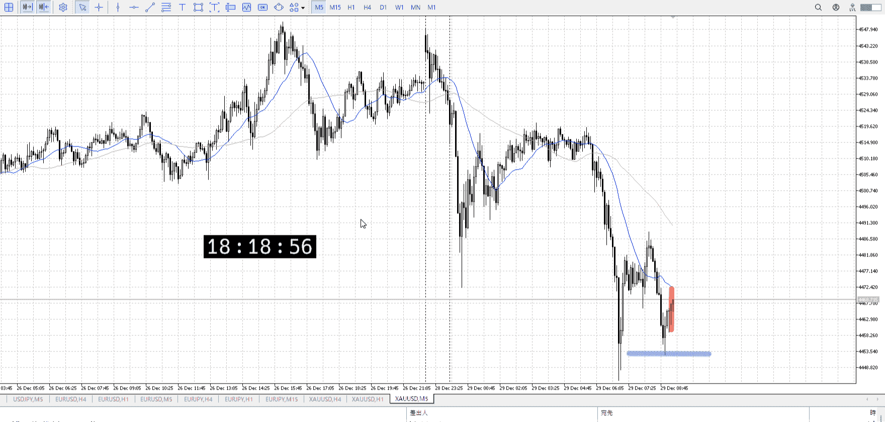

> [!note]
>- +1万 事前認識 **開始5分**

- [x] [my](obsidian://open?vault=Teino&file=FX/my)(見ないと増える)
- [x] 指標
    - 差し込まれる可能性有り、毎日

火曜28:00議事要旨

4h

＜ここに目線画像＞

- [x] トレーディングレンジ
    - u

方向：u

1h

＜ここに目線画像＞

方向：u

15m

＜ここに目線画像＞

方向：d

全方向：uud

- [x] 使用足全ての目線確認


＜ここにシナリオ画像＞

b:1h安値
s:1h高値

上昇

- [x] 1hシナリオ
- [x] ぶつかり
- [x] 日出日入、週出週入


目線・シナリオ・強弱・調整・横幅・PA後・平均線方向・波・**ひきつけ**
uud
ついに15mが下目線に。しかし天井がまだ定まらないレンジと見るとまだ普通。下から買える。

> [!check]
> - [x] +1万 事前認識 **開始5分**
> - [x] +1万 5枚

OK!
Exchage Start.

---



買えるは買えるんだけど、どこまでひきつけるんだって。
仮にこの二回目の一番下から買っても損切10000あったので見送り。

ちなみに15mに従い売りを指すと。
昼頃のレンジの戻りで売るくらいか。それで1h下まで取ってというのがこの下髭だろう。

1hを抜くのは15mレンジ位ほしいところ。だからここで抜く確率は低い、というのはあくまで一般論で。ここは金の上も上なので普通に売られてもおかしくない。

つーか切り下げがえぐすぎて、これは売ったほうが早いのでは？
もう売るとこないから今は放置だろうが。




4月まで
利確損切が正しいとこじゃない弱点
あとタイミング、入ってすぐ上がる下がるが起きれば利確損切関係なくいいとこ


画像に対する抽象化
一旦文字にエンコ

---

- 1
- 2
- 3
現状把握、利確予想まで落ち耐え

---

```meta-bind-button
style: default
label: 明日分
actions:
  - type: "insertIntoNote"
    line: selfEnd+1
    value: "Temp/defFXEnvAnalysis.md"
    templater: true
  - type: "replaceSelf"
    replacement: ""
```
