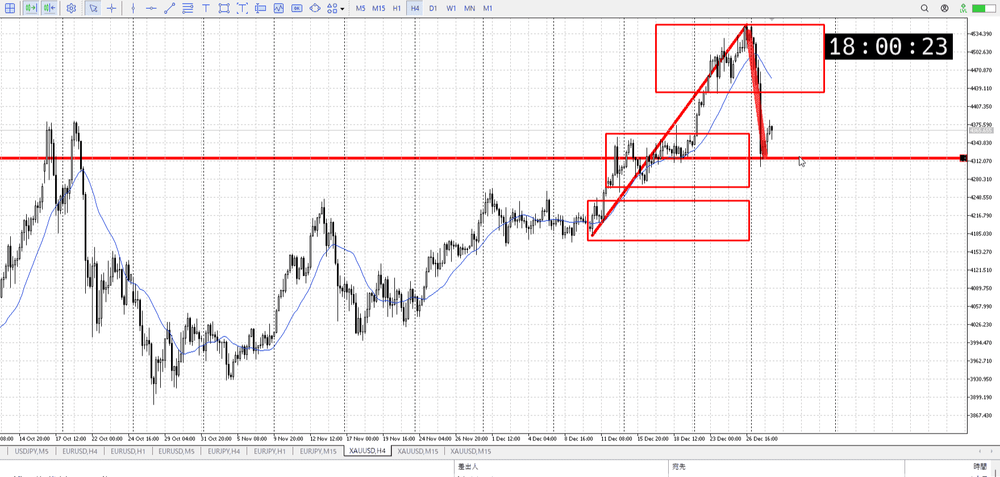
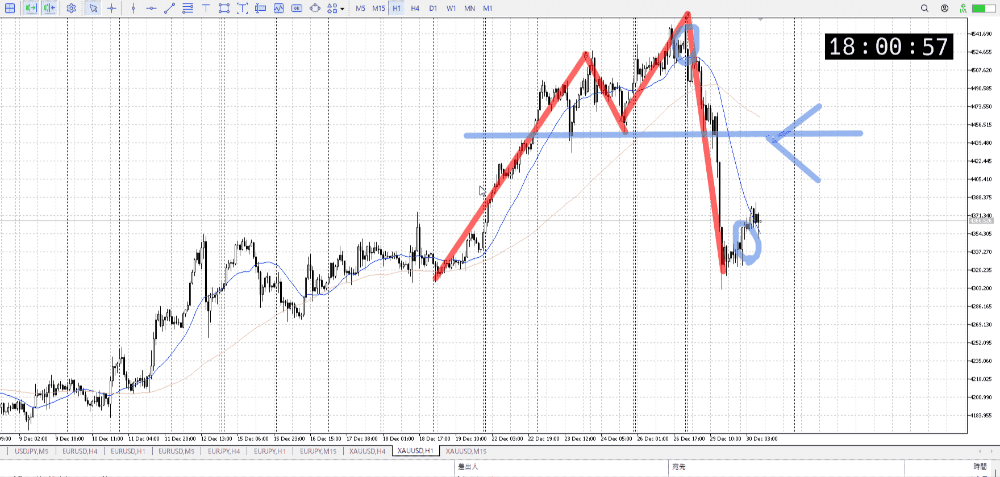
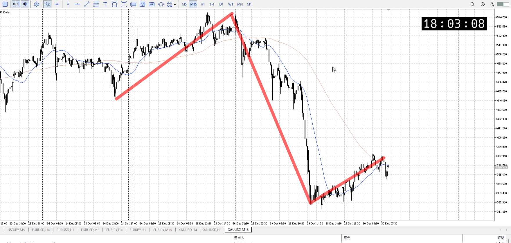

> [!note]
>- +1万 事前認識 **開始5分**

- [x] [my](obsidian://open?vault=Teino&file=FX/my)(見ないと増える)
- [x] 指標
    - 差し込まれる可能性有り、毎日

4h

＜ここに目線画像＞

- [x] トレーディングレンジ
    - c

方向：u

1h

＜ここに目線画像＞

方向：d

15m

＜ここに目線画像＞

方向：d

全方向：udd

- [x] 使用足全ての目線確認


＜ここにシナリオ画像＞

b:1h直近安値
s:1h前回レンジ下

- [x] 1hシナリオ
- [x] ぶつかり
- [x] 日出日入、週出週入

下降、1hレンジ損切位置で止まる

目線・シナリオ・強弱・調整・横幅・PA後・平均線方向・波・**ひきつけ**
udd。4hに気を付けつつ売りを考える。
今いるところは1h買い場、かつ4ｈの上昇の中ほど、そして昨日の下降の仮底なので何かはしにくい。やるとしても4h相手に取れるくらい横出てから。


> [!check]
> - [ ] +1万 事前認識 **開始5分**
> - [ ] +1万 5枚

OK!
Exchage Start.

---

どのみち金はないが。

[my2025-12-30](../My_Test/my2025-12-30.md)

---

- 1
- 2
- 3
現状把握、利確予想まで落ち耐え

---

```meta-bind-button
style: default
label: 明日分
actions:
  - type: "insertIntoNote"
    line: selfEnd+1
    value: "Temp/defFXEnvAnalysis.md"
    templater: true
  - type: "replaceSelf"
    replacement: ""
```
