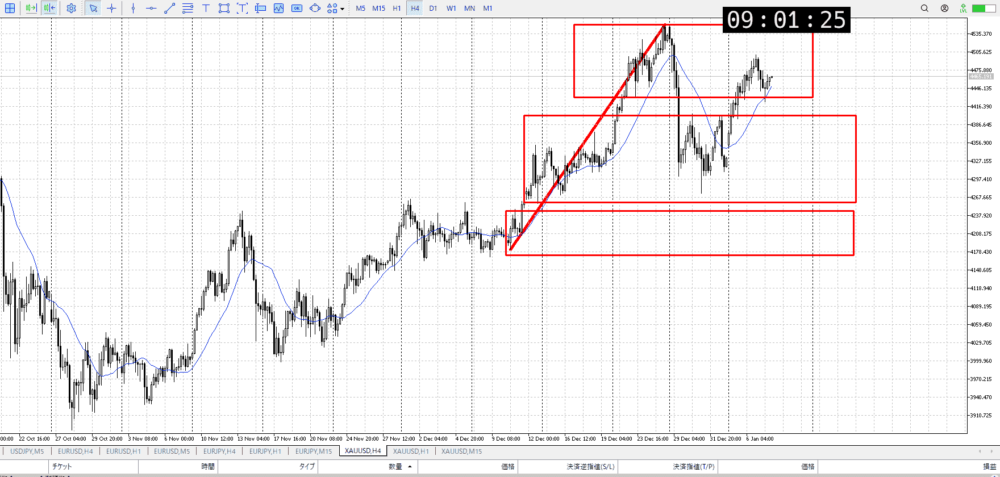
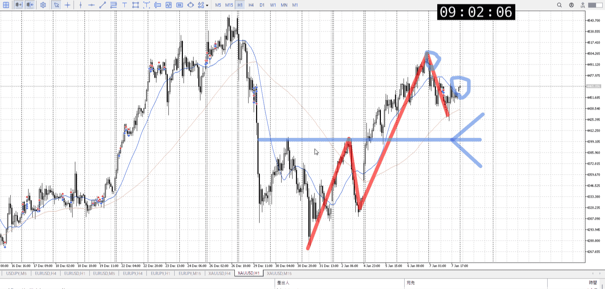
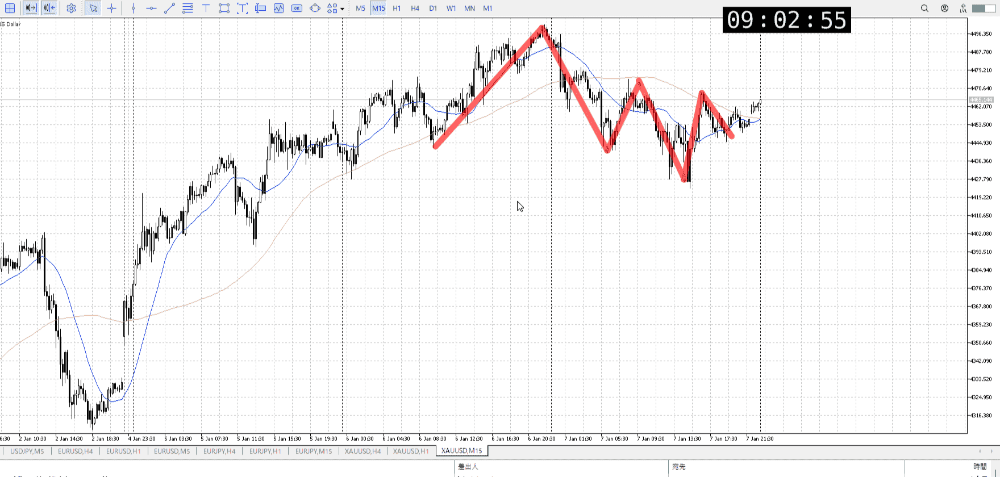
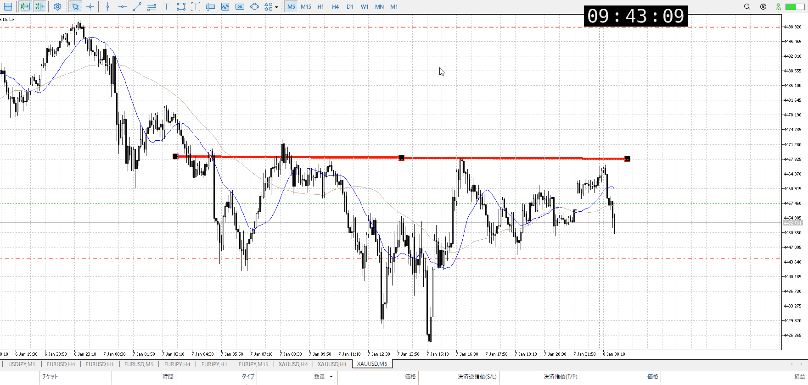
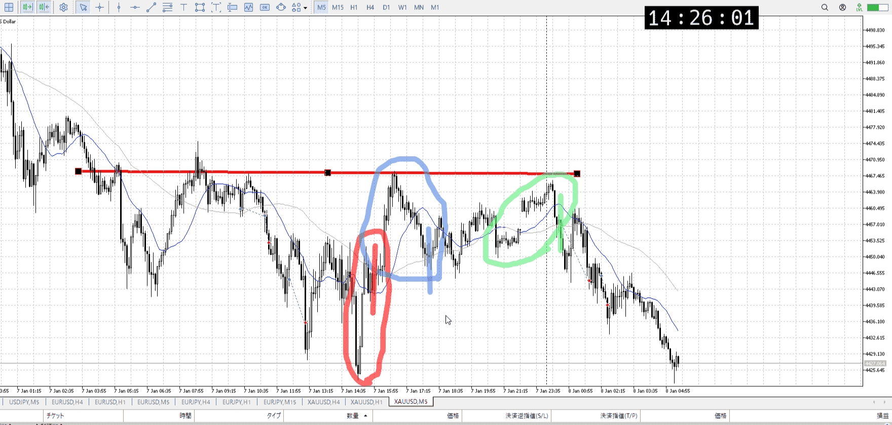
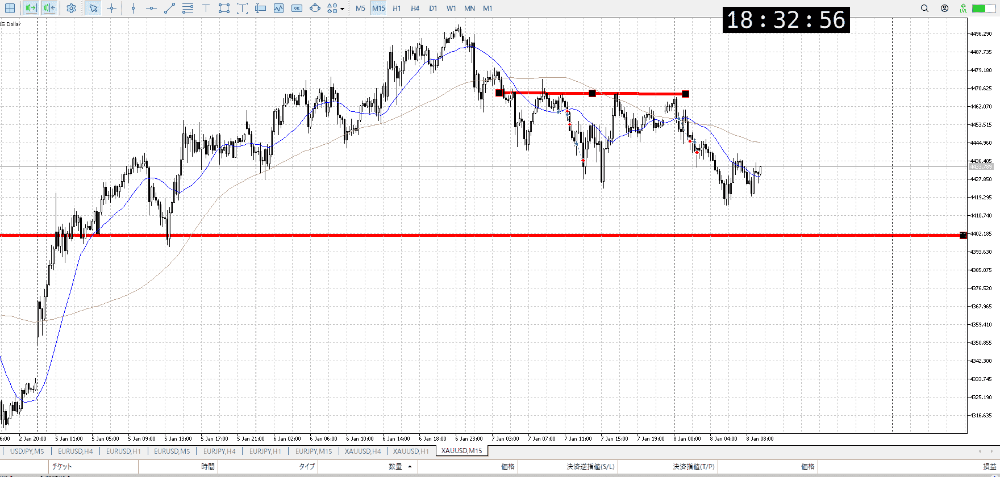
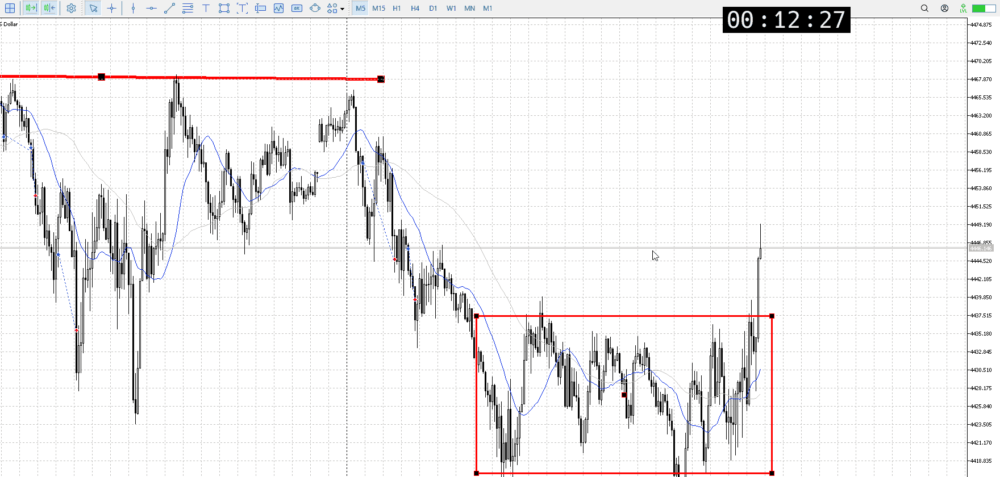

> [!note]
>- +1万 事前認識 **開始5分**

- [x] [my](obsidian://open?vault=Teino&file=FX/my)(見ないと増える)
- [x] 指標
    - 差し込まれる可能性有り、毎日

4h

＜ここに目線画像＞

- [x] トレーディングレンジ
    - u

方向：u

1h

＜ここに目線画像＞

方向：u

15m

＜ここに目線画像＞

方向：d

全方向：uud

- [x] 使用足全ての目線確認


＜ここにシナリオ画像＞

b:1hレンジ上
s:1h高値

ちょい下がるも下髭で止め

- [x] 1hシナリオ
- [x] ぶつかり
- [x] 日出日入、週出週入


目線・シナリオ・強弱・調整
横幅・PA後・平均線方向・波
**ひきつけ**・軸時間
uud
15mが下になったが、依然として1hは上
折れてるおかげで目線変更点も近い、ここを超える前に下から買えればベスト


OK!
Exchage Start.

---



昨日ガッツリ下振った割に上を割れてない
これは一回下までやっぱり降りるしかないのでは？



登る場合、下がらないよだけでなく上がるよも欲しい
赤丸や青丸と違い緑は何か大事なとこを抜いたわけでもないのでつらい

その後の買いはないわけではない、RR重視
ただ朝が上昇フリ無しで下がった状態なので上がりにくい
受け止めと強弱崩れ、崩れの部分を再度確認
[PA](../プライスアクション.md)

そのまま大分下がってきてるので、これの受け止めとPAまで待ち



受け止めは出てきたので、後はPAを待つ



下髭大量のPAがあった

---

- 1
- 2
- 3
現状把握、利確予想まで落ち耐え

---

```meta-bind-button
style: default
label: 明日分
actions:
  - type: "insertIntoNote"
    line: selfEnd+1
    value: "Temp/defFXEnvAnalysis.md"
    templater: true
  - type: "replaceSelf"
    replacement: ""
```
