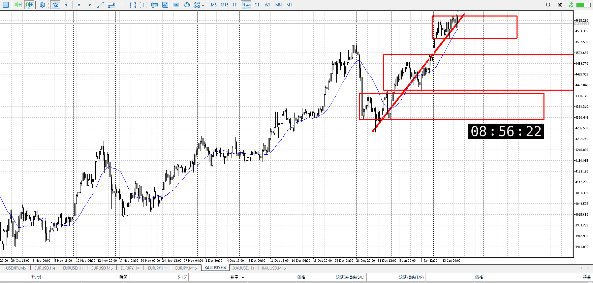
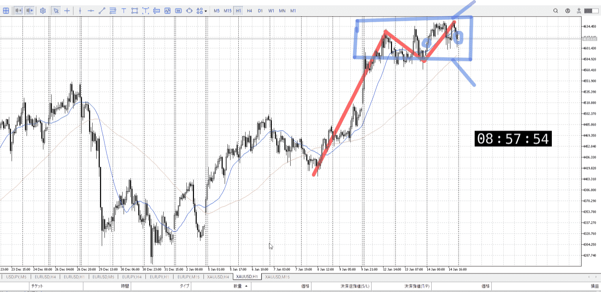
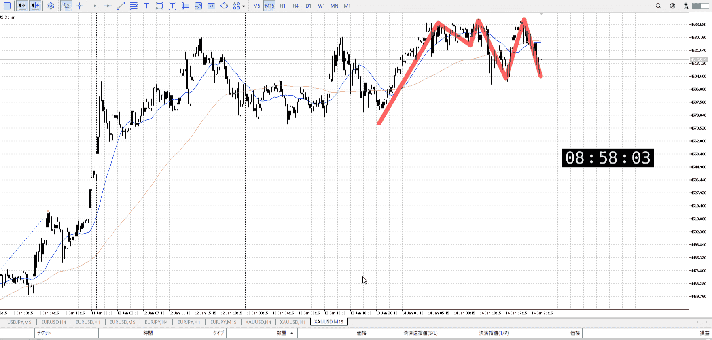
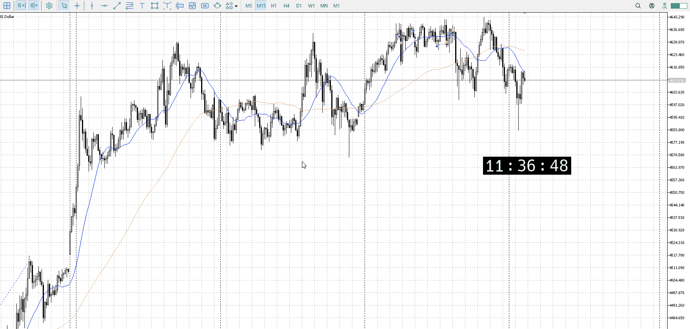
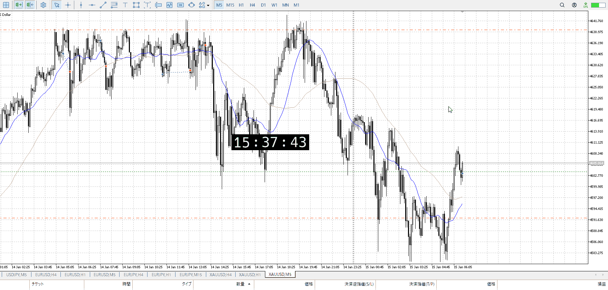
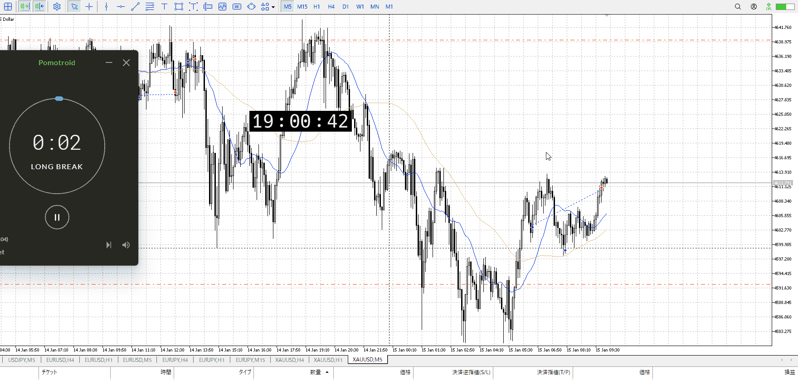

> [!note]
>- +1万 事前認識 **開始5分**

- [x] [my](obsidian://open?vault=Teino&file=FX/my)(見ないと増える)
- [x] 指標
    - 差し込まれる可能性有り、毎日

4h

＜ここに目線画像＞

- [x] トレーディングレンジ
    - u

方向：u

1h

＜ここに目線画像＞

方向：u

15m

＜ここに目線画像＞

方向：d

全方向：uud

- [x] 使用足全ての目線確認


＜ここにシナリオ画像＞

b:1h安値
s:1h高値

ちょい上

- [x] 1hシナリオ
- [x] ぶつかり
- [x] 日出日入、週出週入


目線・シナリオ・強弱・調整
横幅・PA後・平均線方向・波
**ひきつけ**・軸時間
uud
買い
レンジから下に出て15m目線が変わったが、すぐに挽回
しかし髭だけ更新して落ちたのでまだ下として見る

小さく15m目線を更新してから買いたいところ
15mAが追いついて超えてと結構先の話

ベア側
1h安値を割りに行く


OK!
Exchage Start.

---



15mAが折れずに落ちてしまった
これを割るのは手間がかかる、再度割ってから上抜きして目線を上に戻したい



だいたいその通り
あとはひきつけを待つだけなの飽が、どうも戻ってこない
4hA上にいる



離すのは同じ地点で
駄目なら駄目だのデータを取る、損だと思っても後からわかるようにそのまま

途中で止めるのは後から、今回は時間がかかったからという理由だったが、それだけしかない
他に分析的に伸びないなどの理由がない、切る理由がない

まずは全部取れるように、上まで


最近の動き的に、60000程度
その七割、40000程度で止め
見るからに目立つところだけでなく、その週の大きさも考える


---

- 1
- 2
- 3
現状把握、利確予想まで落ち耐え

---

```meta-bind-button
style: default
label: 明日分
actions:
  - type: "insertIntoNote"
    line: selfEnd+1
    value: "Temp/defFXEnvAnalysis.md"
    templater: true
  - type: "replaceSelf"
    replacement: ""
```
