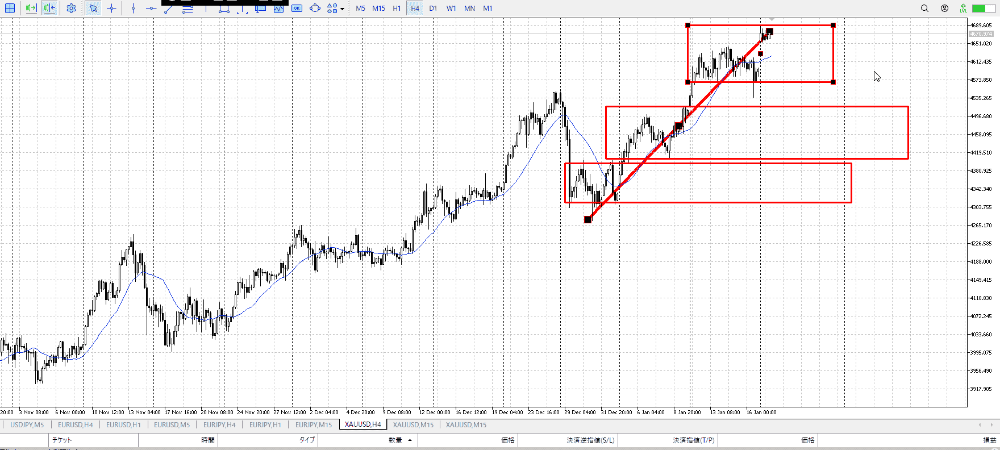
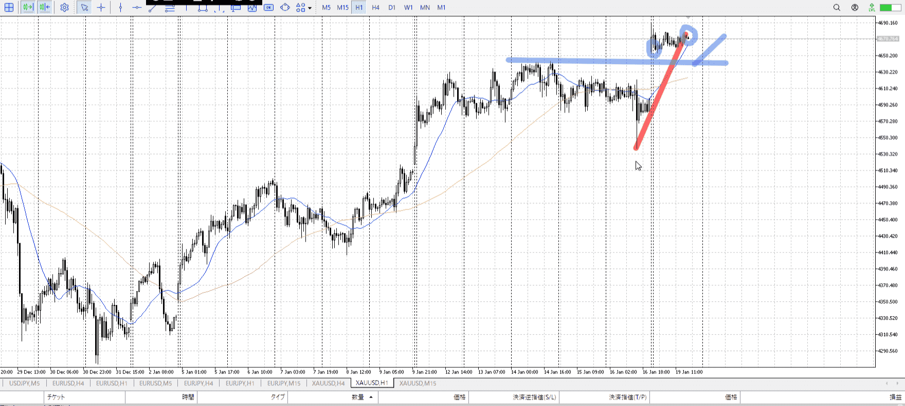
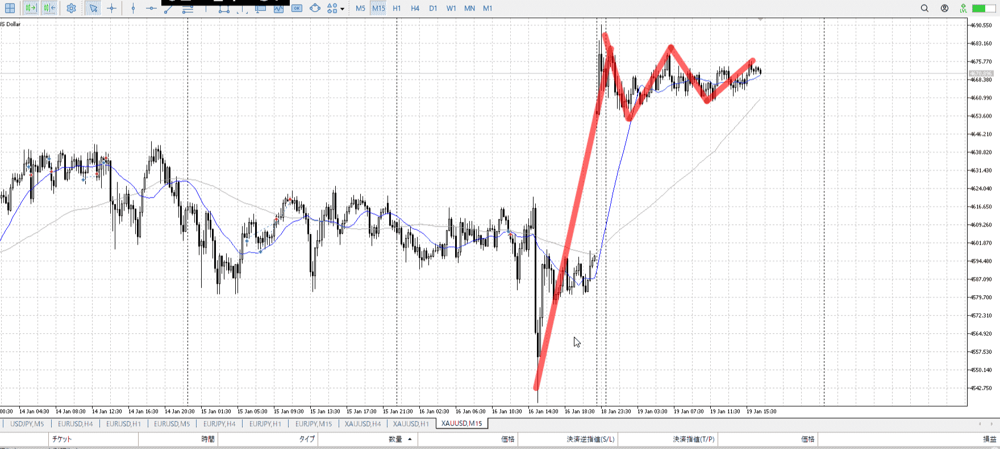
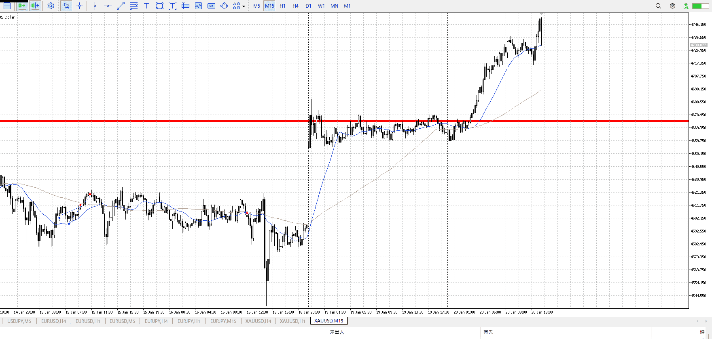
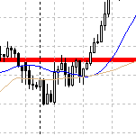

> [!note]
>- +1万 事前認識 **開始5分**

- [x] [my](obsidian://open?vault=Teino&file=FX/my)(見ないと増える)
- [x] 指標
    - 差し込まれる可能性有り、毎日

4h

＜ここに目線画像＞

- [x] トレーディングレンジ
    - u

方向：u

1h

＜ここに目線画像＞

方向：u

15m

＜ここに目線画像＞

方向：u

全方向：uuu

- [x] 使用足全ての目線確認


＜ここにシナリオ画像＞

b:1hレンジ上
s:？

ほぼ同値

- [x] 1hシナリオ
- [x] ぶつかり
- [x] 日出日入、週出週入


目線・シナリオ・強弱・調整
横幅・PA後・平均線方向・波
**ひきつけ**・軸時間
uuu
休場だったので
このためを元に買う、窓は閉まらず上に滞留

OK!
Exchage Start.

---





ずっとレンジだった中で、緩やかな降下から急上昇
買えた

前回が下から150000ほど、その七割で105000

レンジから伸びる最初がつかめない、弱点
大抵その後で押しを待ってる

それが出来れば十分ではあるが、伸びる最初を掴んでデータにできれば大きく取ることが出来るはず

すでに90000くらい動いてる、ここからさらには非現実
当初の予定通り降りて来てを狙うにしろ、浅押し狙いにしろ、もう明日。

10000x100x0.0001x158=15800

4750.213
4760.318
105
10.5


---

- 1
- 2
- 3
現状把握、利確予想まで落ち耐え

---

```meta-bind-button
style: default
label: 明日分
actions:
  - type: "insertIntoNote"
    line: selfEnd+1
    value: "Temp/defFXEnvAnalysis.md"
    templater: true
  - type: "replaceSelf"
    replacement: ""
```
