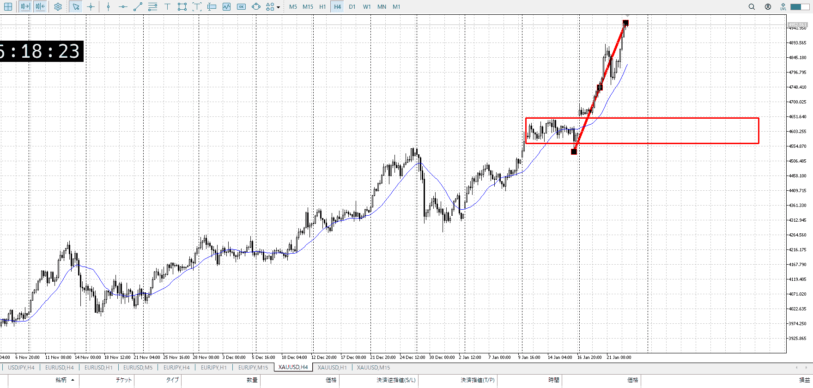
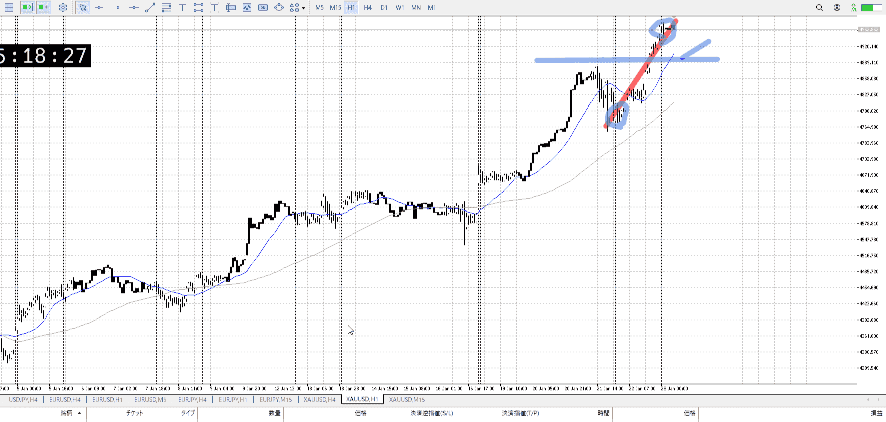
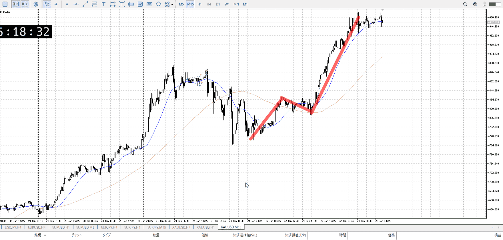
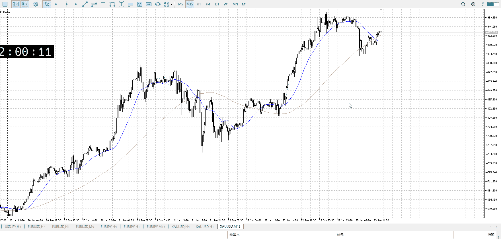
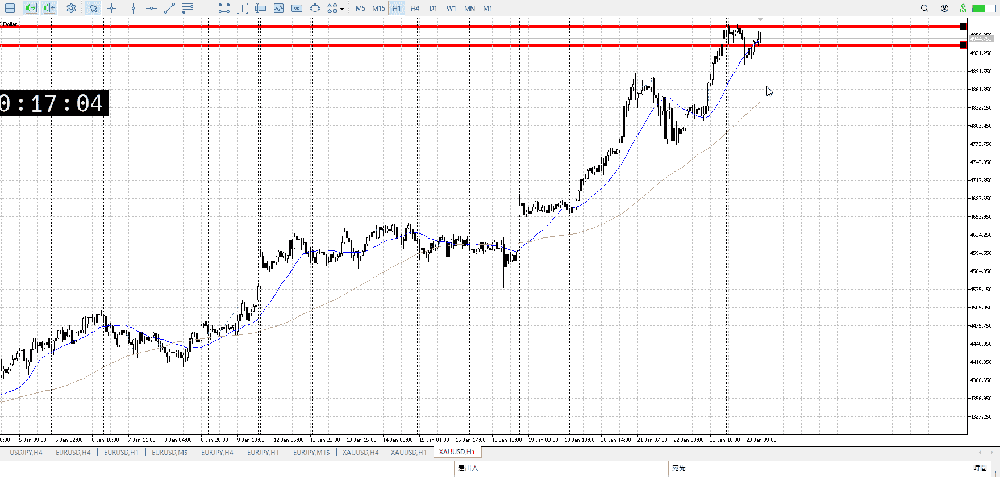
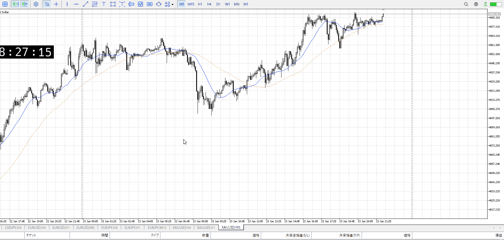

> [!note]
>- +1万 事前認識 **開始5分**

- [x] [my](obsidian://open?vault=Teino&file=FX/my)(見ないと増える)
- [x] 指標
    - 差し込まれる可能性有り、毎日

4h

＜ここに目線画像＞

- [x] トレーディングレンジ
    - u

方向：u

1h

＜ここに目線画像＞ ^29d2bf

- [x] 前移動値
    - 100000

方向：u

15m

＜ここに目線画像＞

方向：u

全方向：uuu

- [x] 使用足全ての目線確認


＜ここにシナリオ画像＞

b:1h安値
s:？

上昇の端と端

- [x] 1hシナリオ
- [x] ぶつかり
- [x] 日出日入、週出週入

- [x] 推進
- [ ] 調整
- [ ] 間

目線・シナリオ・強弱・調整
横幅・PA後・平均線方向・波
**ひきつけ**・軸時間
uuu
推進の中なので、調整と間を挟むまで待機
売り場を割って疑惑、まとめた売り場を割って確信を基本に

OK!
Exchage Start.

---



下落ちて調整を始めたのだが、売り場を作る前に上がっていってる
その結果前レンジの下という売り場へ、ここ割れば確かに疑惑、というかここに強い売り場があるはずなのでほぼ確信

ただし1hAが付いてこれてないので上昇サポは弱い
また損切も微妙に置きにくい



1hも上髭だし、見てる幅は非常に小さい
となるとやはり買わないのがベストだろ、止めて寝ろ



再度止められたなら一応買えたか。

---

- 1
- 2
- 3
現状把握、利確予想まで落ち耐え

---

```meta-bind-button
style: default
label: 明日分
actions:
  - type: "insertIntoNote"
    line: selfEnd+1
    value: "Temp/defFXEnvAnalysis.md"
    templater: true
  - type: "replaceSelf"
    replacement: ""
```
