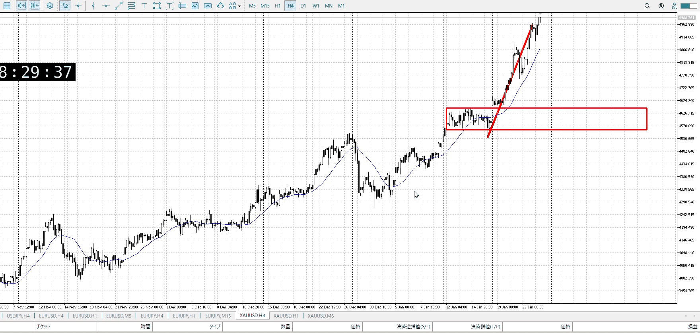
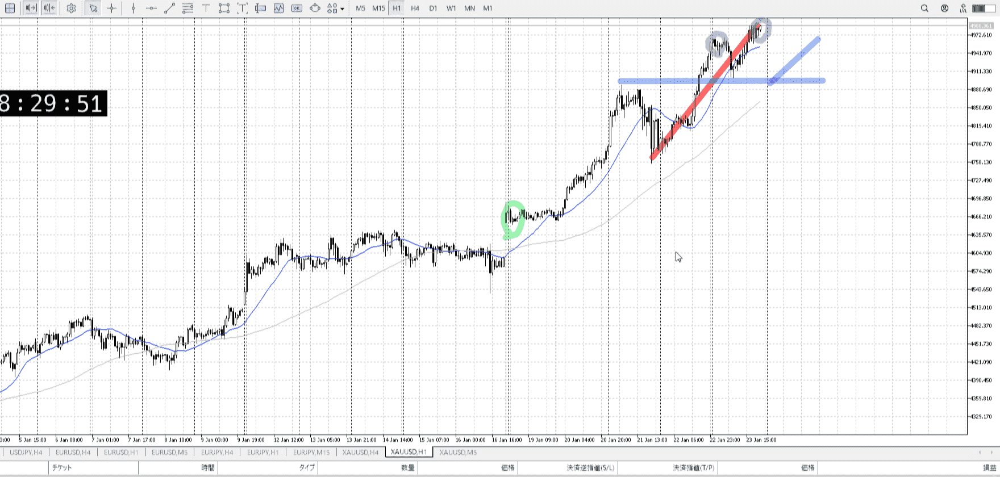
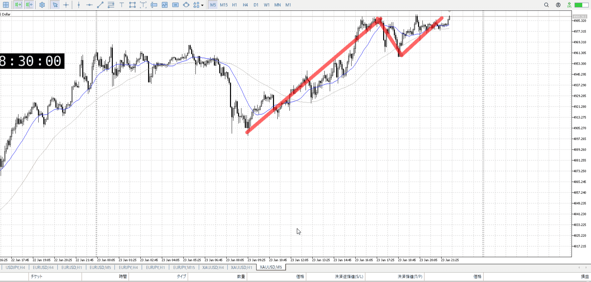

> [!note]
>- +1万 事前認識 **開始5分**

- [x] [my](obsidian://open?vault=Teino&file=FX/my)(見ないと増える)
- [x] 指標
    - 差し込まれる可能性有り、毎日

水曜28:00FOMC

4h

＜ここに目線画像＞

- [x] トレーディングレンジ
    - u

方向：u

1h

＜ここに目線画像＞ ^4bb92f

方向：u

15m

＜ここに目線画像＞

方向：u

全方向：uuu

- [x] 使用足全ての目線確認


＜ここにシナリオ画像＞

b:1h安値
s:？

下がって上がったが、止められてる

- [x] 1hシナリオ
- [x] ぶつかり
- [x] 日出日入、週出週入

- [ ] 推進
- [ ] 調整
- [x] 間

- [x] 前移動値
    - 90000


目線・シナリオ・強弱・調整
横幅・PA後・平均線方向・波
**ひきつけ**・軸時間
uuu
間にいるので、この後調整と間を挟んで推進狙い

ただ間になるのが早く、上昇がそろそろ頭打ちの疑惑
今は買いのみでいい、ネック割って下トレンドを形成するまでは買い


OK!
Exchage Start.

---

[my2026-01-24](../My_Test/my2026-01-24.md)

---

- 1
- 2
- 3
現状把握、利確予想まで落ち耐え

---

```meta-bind-button
style: default
label: 明日分
actions:
  - type: "insertIntoNote"
    line: selfEnd+1
    value: "Temp/defFXEnvAnalysis.md"
    templater: true
  - type: "replaceSelf"
    replacement: ""
```
