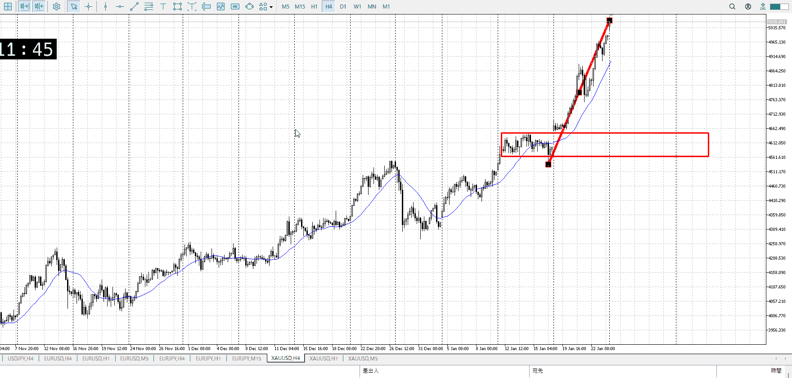
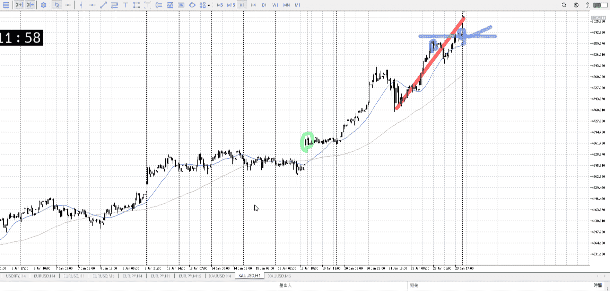
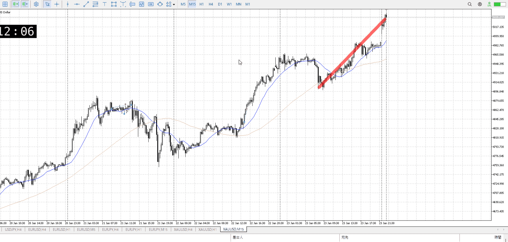

> [!note]
>- +1万 事前認識 **開始5分**

- [ ] [my](obsidian://open?vault=Teino&file=FX/my)(見ないと増える)
- [ ] 指標
    - 差し込まれる可能性有り、毎日

## 4h

＜ここに目線画像＞

- [x] トレーディングレンジ
    - u

方向：u

## 1h

＜ここに目線画像＞ ^4bb92f

方向：u

## 15m

＜ここに目線画像＞

方向：u

全方向：uuu

- [x] 使用足全ての目線確認

## シナリオ

＜ここにシナリオ画像＞

b:1h安値
s:？

上昇ゆるめが窓で抜かれる

- [x] 1hシナリオ
- [x] ぶつかり
- [x] 日出日入、週出週入

## 位置、値

- [x] 推進
- [ ] 調整
- [ ] 間

- [x] 前移動値
    - 80000、120000

## 方針
目線・シナリオ・強弱・調整
横幅・PA後・平均線方向・波
**ひきつけ**・軸時間
uuu
このまま窓が閉まらなければ普通に上
窓が閉まっても金曜を底にして上昇

実際に入るのは底から推進のはじめを取るか、また調整と間を待つか


OK!
Exchage Start.

---

## メモ


---

- 1
- 2
- 3
現状把握、利確予想まで落ち耐え

---

```meta-bind-button
style: default
label: 明日分
actions:
  - type: "insertIntoNote"
    line: selfEnd+1
    value: "Temp/defFXEnvAnalysis.md"
    templater: true
  - type: "replaceSelf"
    replacement: ""
```
