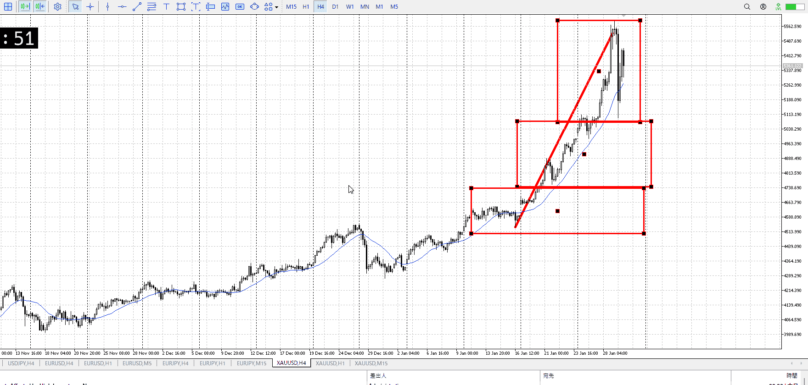
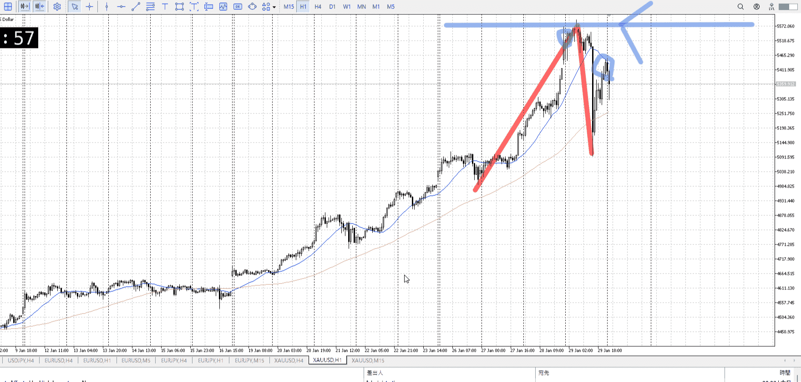
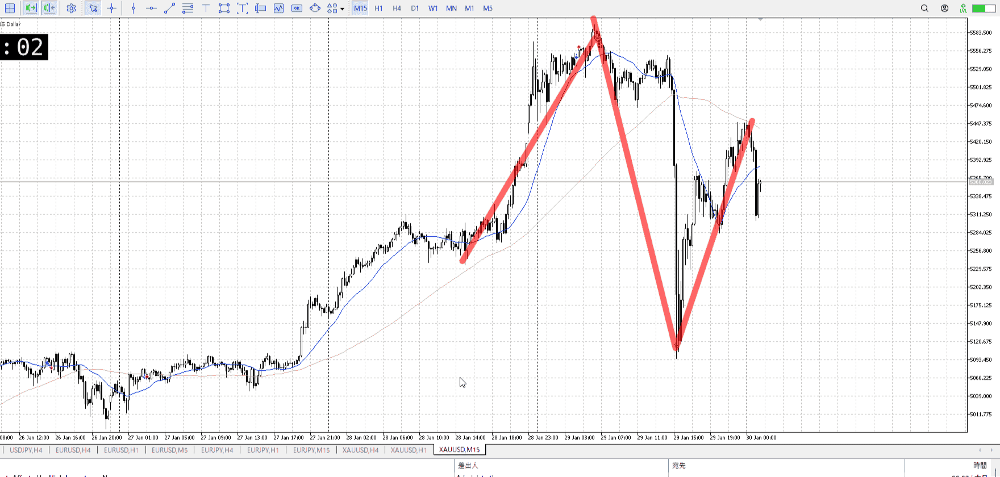
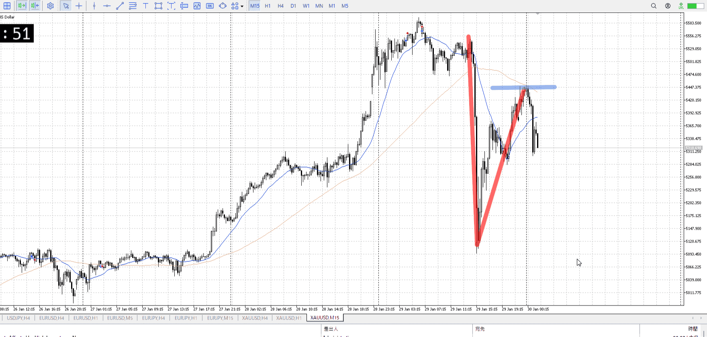
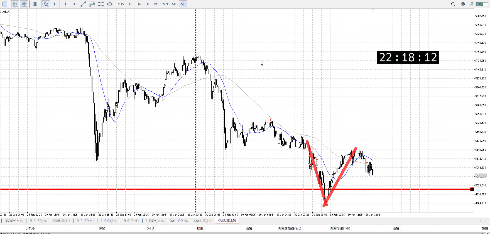

> [!note]
>- +1万 事前認識 **開始5分**

- [x] [my](obsidian://open?vault=Teino&file=FX/my)(見ないと増える)
- [x] 指標
    - 差し込まれる可能性有り、毎日
## 4h

＜ここに目線画像＞

- [ ] トレーディングレンジ
    - 

方向：

## 1h

＜ここに目線画像＞ ^4bb92f

方向：u

## 15m

＜ここに目線画像＞

方向：d

全方向：uud

- [x] 使用足全ての目線確認

## シナリオ

＜ここにシナリオ画像＞

b:1h前回高値
s:1h高値

下落したが1h目線は変わらず

- [x] 1hシナリオ
- [x] ぶつかり
- [x] 日出日入、週出週入
- [x] 前移動値
    - 490k
- [x] 前回上昇・下降値
    - 580k
## 位置

- [ ] 推進
- [x] 調整


## 方針
目線・シナリオ・強弱・調整
横幅・PA後・平均線方向・波
**ひきつけ**・軸時間
uud
ここで推進になる前の一つ下のレンジの抜けを狙う


OK!
Exchage Start.

---

## メモ

これで高値が出来たので抜けばいい


押し目の失敗
１ｈくずれ

15mみる
下

ダブルボトム崩れ
比率が売り寄り、縦横

改めて15mと1hぶつかり
売りが優勢

1hの買い目線は？
**それに反して買えないなとはなるけど、売るなという話ではない**
優勢なら売る
動き的な優先と、先導の話
[フラクタル](../フラクタル.md)
[目線](../目線.md)

1hシナリオ
売りと買いのぶつかりを見る

4h半値があるので抜けをずっとは持てない
それがあっても短期で上髭を出すなら売り
[利確損切](../利確損切.md)

これで入るなら15m
まだ1hの目線は有効なので
だから利確も相応に


比率で判定、レンジ待ち（待ち中で比率を元に売りも可能）、抜けと戻り、利確は上位時間足。


---

まず**小さい足の方が優勢ならそっち入る**
優勢の根拠は動きの比率と、ダブルボトム崩れ
[傾き比率](../傾き比率.md)
[ぶつかり](../ぶつかり.md)

で利確は小さい足、15m相応にしつつ4h半値を15mでケア
ケアが取れたらもっと取っていっていい
[フラクタル](../フラクタル.md)

1hシナリオ
平均上がってないのでまだ下からのものが必要
曖昧なら分かりやすくなってから再度作成
[シナリオ](../シナリオ.md)

どの時間足の物を使用しているかを再度確認、1hだけではない
ぶつかりに使う
[ぶつかり](../ぶつかり.md)


おまけ
伸びてVで戻ってくる[オーバーシュート](../オーバーシュート.md)に乗る


4hで半値、1hで目線の安値でV
これに短期の15mで乗り、近場の高値まで取る
これはちょっと早かったので耐えられず、上位権限で同値切り

その後の売り
本来はこの買いが失敗したあと、上髭を出したところで売っていければベスト
安全を考慮したいつもの戻りをやってるが、目が小さすぎる
また、1hが確定してなかったので危なかった


---

```meta-bind-button
style: default
label: 明日分
actions:
  - type: "insertIntoNote"
    line: selfEnd+1
    value: "Temp/defFXEnvAnalysis.md"
    templater: true
  - type: "replaceSelf"
    replacement: ""
```
