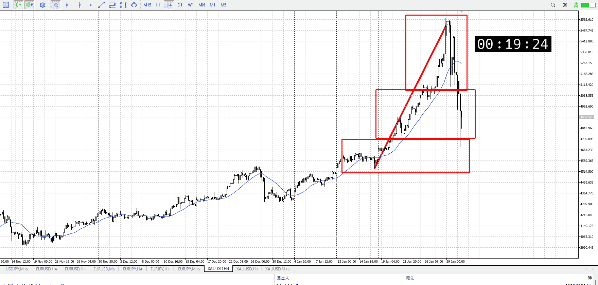
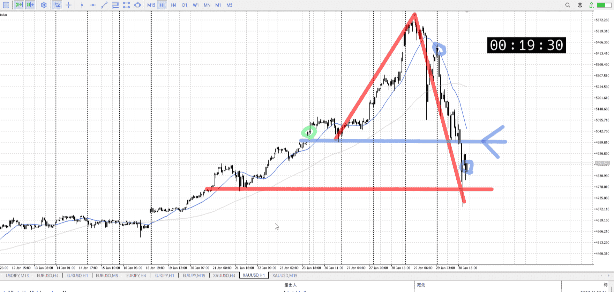
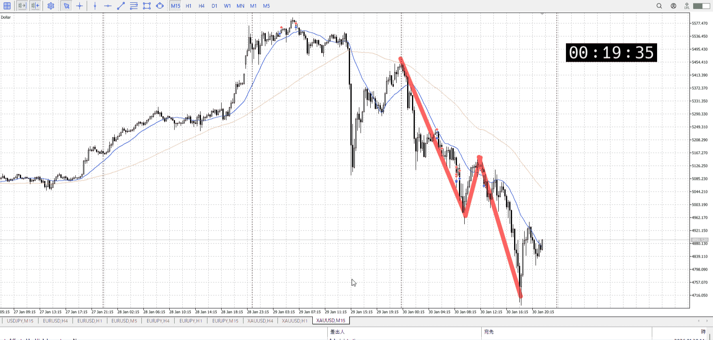
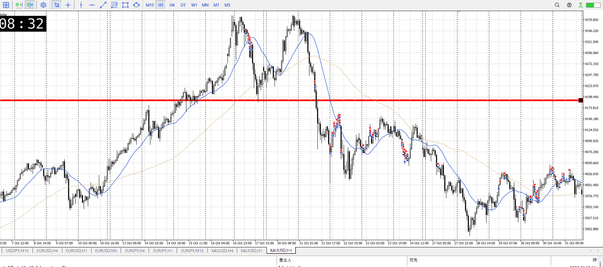
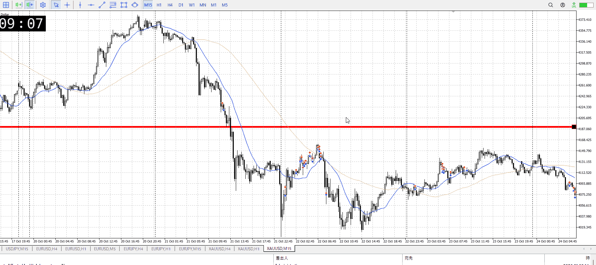

> [!note]
>- +1万 事前認識 **開始5分**

- [ ] [my](obsidian://open?vault=Teino&file=FX/my)(見ないと増える)
- [ ] 指標
    - 差し込まれる可能性有り、毎日

## 4h

＜ここに目線画像＞

- [x] トレーディングレンジ
    - m

方向：u

## 1h

＜ここに目線画像＞ ^4bb92f

方向：d

## 15m

＜ここに目線画像＞

方向：d

全方向：udd

- [x] 使用足全ての目線確認

## シナリオ

＜ここにシナリオ画像＞

b:?
s:?

まだどこから上がるも下がるも分からない状態、1hのさらに前の安値あたりで止まってるがここで本当に止まるかは分からない
その場合でも前回安値でどっち行くかの攻防があるだろうが、まだ上昇と言い切られてない物でぶつかってもな

なので下固めてからシナリオやり直し

一応一番ありそうな前回安値まで戻しなら、4hによる半値オバシュ上昇と1hによる売り場がぶつかることになる。
その場合だと前回安値近くで小さくレンジを作り、それがどっち行くかを見る必要がある。どのみちシナリオはそれからか、というとこ。描いてるシナリオもこれ。

降下安値抜き

- [x] 1hシナリオ
    - [x] 明確か ? 続行 : 確定後考え直し
- [x] 時間足ぶつかり
- [x] 日出日入、週出週入

- [x] 前移動値
    - 760k
- [x] 前回上昇・下降値
    - d910k

## 位置

- [x] 推進
- [ ] 調整


## 方針
目線・シナリオ・強弱・調整
横幅・PA後・平均線方向・波
**ひきつけ**・軸時間
udd
売りで見たいが、4hがまだ上昇なのに注意
シナリオを立て直してから考える


OK!
Exchage Start.

---

## メモ
参考、前回の落ち



抜けて伸びるべきところで15mで見えるほど落ちている
この前が落ちの否定上昇だったのでこの挙動は厳しい、厳しいがそんなすぐは天井決まっていない中だと売りにくいと思う
どっちかというと23日の方が売りはあり得るか

平均的には1hの押し目買いと1h売り場がぶつかる形、否定上昇にしてはやけに高値抜けに時間がかかったかなというとこ
1hの押し目以外にここから上がるというのは考えにくく、大きく下髭作って伸びてる
その後15mの買いを刈り取って下行った感じ

1h的には抜けすぐの売りに近い
天井から売れれば痛み少な目、15mで短期天井からの売りを狙えば一応行けるかというとこ
7:45で上髭出して1h確定させたのがでかい、ここで売れる

どっちみち外してはいけないのは23日のほう
天井レンジから下抜け予想売ったり、全体レンジの下から戻りを27日売ったり


---

- 1
- 2
- 3
現状把握、利確予想まで落ち耐え

---

```meta-bind-button
style: default
label: 明日分
actions:
  - type: "insertIntoNote"
    line: selfEnd+1
    value: "Temp/defFXEnvAnalysis.md"
    templater: true
  - type: "replaceSelf"
    replacement: ""
```
