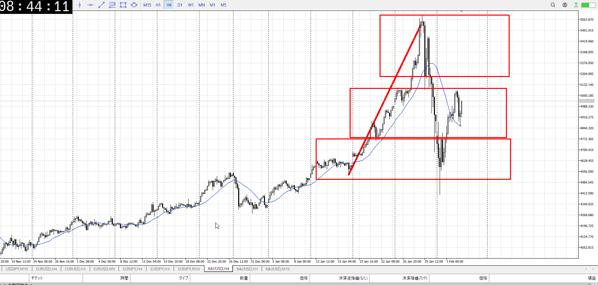
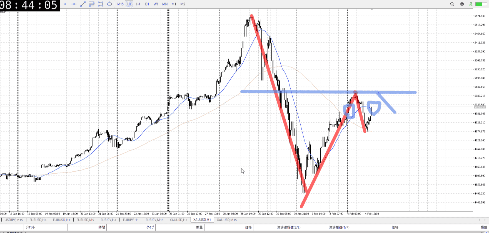
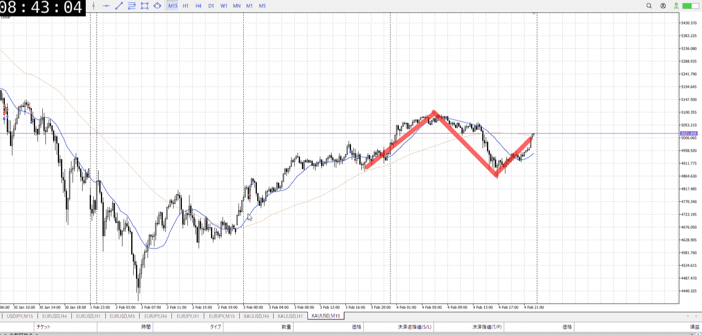
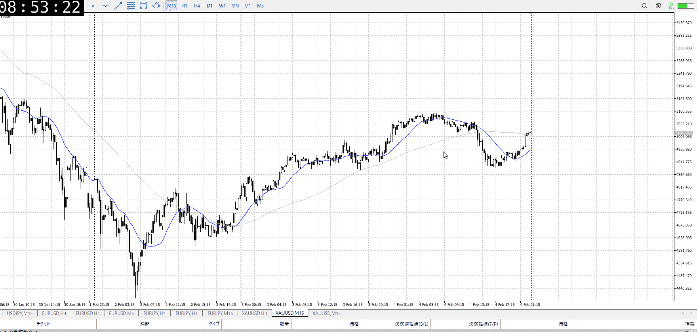

> [!note]
>- +1万 事前認識 **開始5分**

- [x] [my](../my.md)(見ないと増える)
- [x] 指標
    - 差し込まれる可能性有り、毎日

## 4h

＜ここに目線画像＞

- [x] トレーディングレンジ
    - m

方向：u

## 1h

＜ここに目線画像＞ ^4bb92f

方向：d

## 15m

＜ここに目線画像＞

方向：u

全方向：udu

- [x] 使用足全ての目線確認

## シナリオ


シナリオ:
1h半値から売りたい
また上がってるけどもう一回売ればいいはず
ネック抜くか高値抜いて決着ついてからでも遅くはない
高値抜きは一気に上がる可能性に注意

b:4h底
s:1h半値

同値

- [x] 1hシナリオ
    - [x] 明確か ? 続行 : 確定後考え直し
- [x] 時間足ぶつかり
- [x] 日出日入、週出週入

- [x] 前移動値
    - 240k
- [x] 前回上昇・下降値
    - 1.2m

## 位置

- [ ] 推進
- [x] 調整

## 方針
目線・シナリオ・強弱・調整
横幅・PA後・平均線方向・波
**ひきつけ**・軸時間・傾き比率
udu
大体同値で半分上昇という、売りっぽい比率
だからこそ直近の上昇が少し不可解だが、問題なく1h戻り売りで良いと思う

15mレベルでレンジ一回踏んで上がってってしてるだけなので、5mで下がり始めを掴めば行ける


OK!
Exchage Start.

---

## メモ


---

- 1
- 2
- 3
現状把握、利確予想まで落ち耐え

---

```meta-bind-button
style: default
label: 明日分
actions:
  - type: "insertIntoNote"
    line: selfEnd+1
    value: "Temp/defFXEnvAnalysis.md"
    templater: true
  - type: "replaceSelf"
    replacement: ""
```
