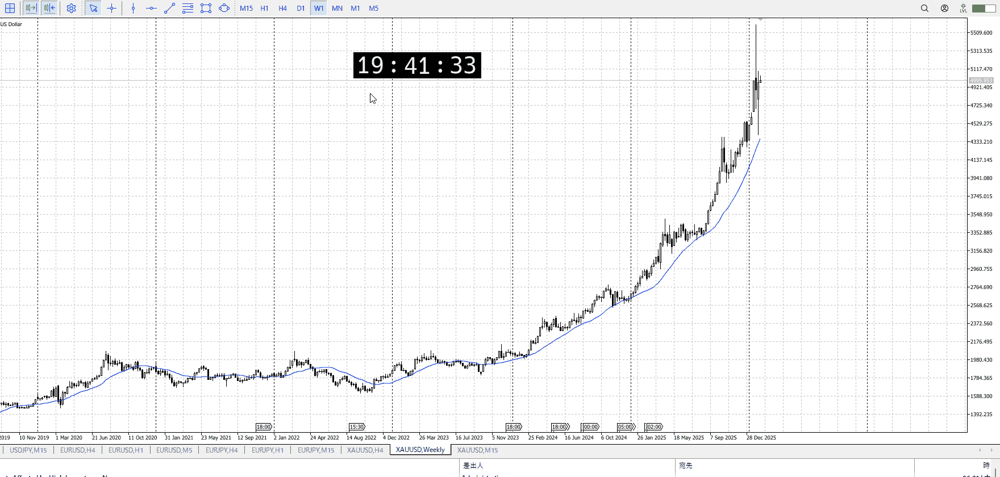
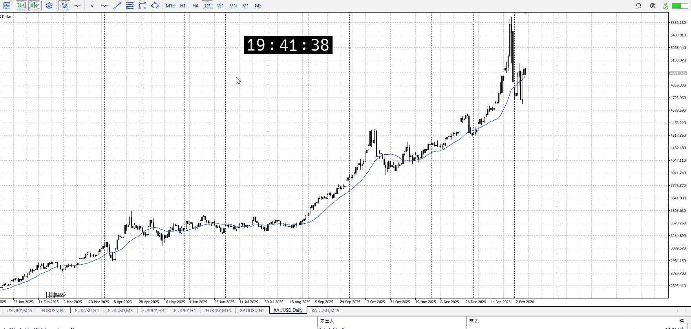
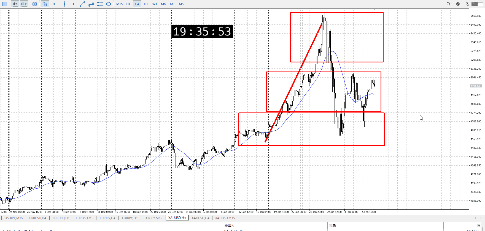
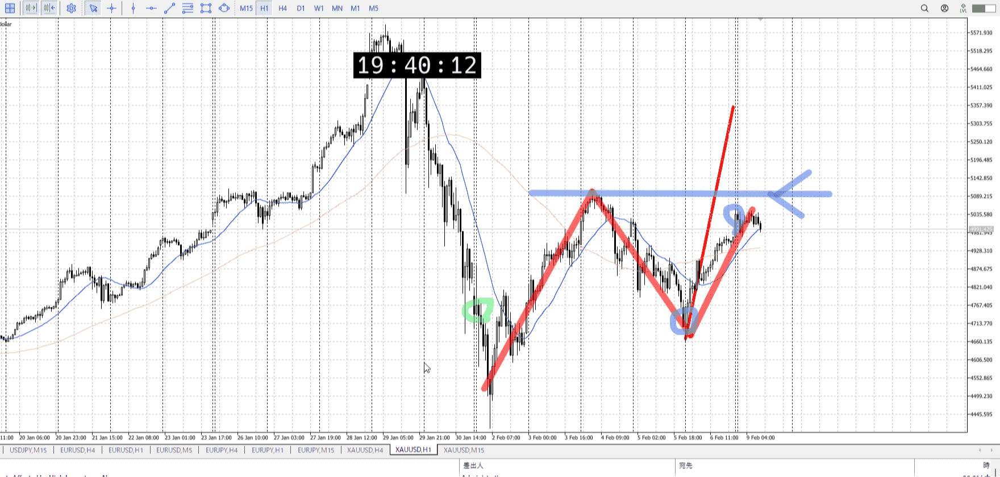
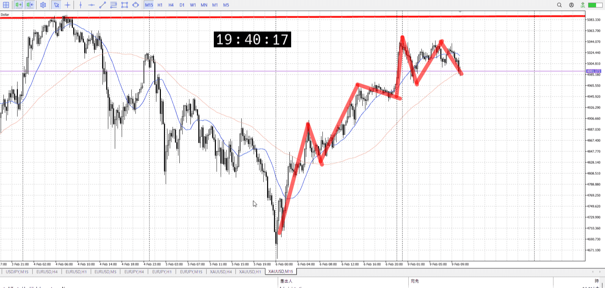

> [!note]
>- +1万 事前認識 **開始5分**

- [x] [my](../my.md)(見ないと増える)
- [x] 指標
    - 差し込まれる可能性有り、毎日
雇用統計、CPI
## 週、日

週は上髭後下髭
日は下髭
つまり上昇
## 4h

＜ここに目線画像＞

- [x] トレーディングレンジ
    - m

方向：u

## 1h

＜ここに目線画像＞ ^4bb92f

方向：d

## 15m

＜ここに目線画像＞

方向：u

全方向：udu
^1d4903

- [x] 使用足全ての目線確認

## シナリオ

b:4h底
s:1h高値
- [x] 時間足ぶつかり

前日同様、売りだが買い圧力があったため。
- [x] 1hシナリオ
    - [x] 明確か ? 続行 : 確定後考え直し

上昇
- [x] 日出日入、週出週入

ちょっとだけ買いが強め
- [x] 傾き比率

- [x] 前移動値
    - 333k
- [x] 前回上昇・下降値
    - 688k

## 位置

- [ ] 推進
- [x] 調整

## 方針
目線・シナリオ・強弱・調整
横幅・PA後・平均線方向・波
**ひきつけ**・軸時間・傾き比率

1hとして売りたいのは事実で、今が調整なのはそう
4h底と急激な上昇を足掛かりに調整でも買えるをやってきたが、1h天井が見え短期がレンジになり始めておりそろそろ売りかなというとこ
ここを15m目線変わり狙い売りが最低限、目線変わる前から怪しい動きを見て売れればOK。

もちろん買いのシナリオも
短期で買ってきたので、短期の買いになりそうな15m半値などから買い圧力があるかもしれない

売りはその買い圧力を警戒しつつ戦う形
実際に買うなら4h分入ったなと分かるレベルの高値抜きなど欲しいが。

- [x] 買いたいなら
    - 15m半値、1h高値割り
- [x] 売りたいなら
    - 1h高値から15m安値割

OK!
Exchage Start.

---

## メモ

---

再検証