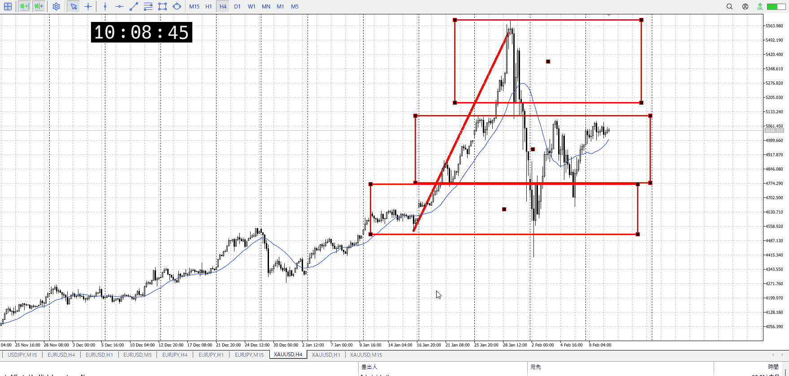
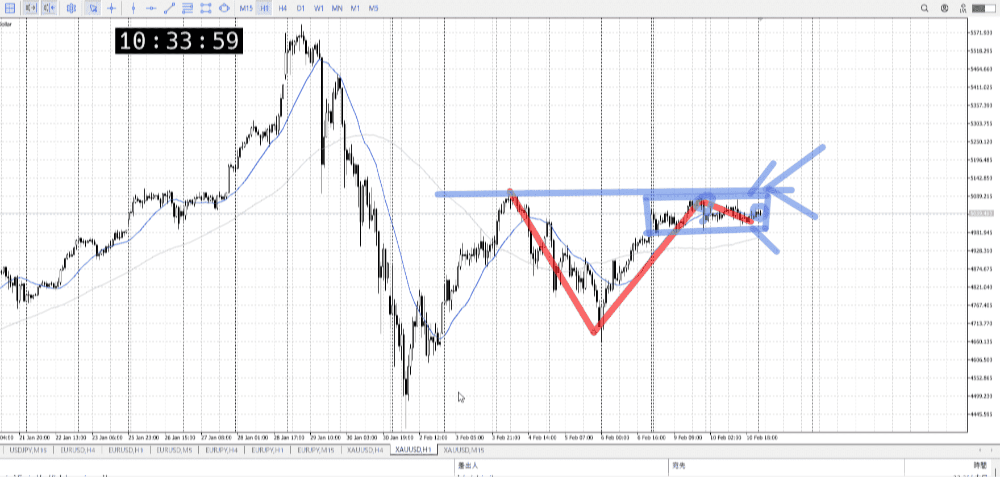
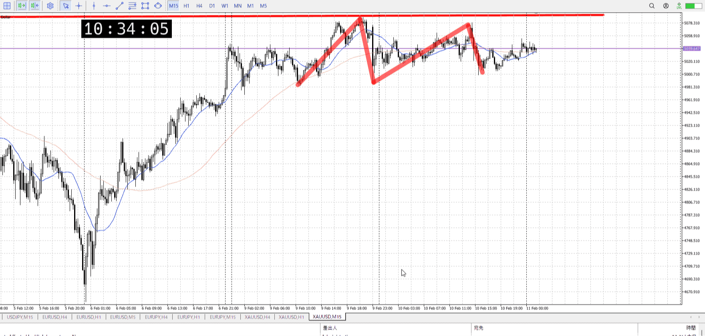

> [!note]
>- +1万 事前認識 **開始5分**

- [x] [my](../my.md)(見ないと増える)
- [x] 指標
    - 差し込まれる可能性有り、毎日
22:30雇用統計
## 4h

＜ここに目線画像＞

- [x] トレーディングレンジ
    - m

方向：u

## 1h

＜ここに目線画像＞ ^4bb92f

方向：d

## 15m

＜ここに目線画像＞

方向：u

全方向：udu
^1d4903

- [x] 使用足全ての目線確認

## シナリオ

b:4h底
s:1h高値
- [x] 時間足ぶつかり

上貼り付きで離れず
抜けるかもだし、反発するかも
- [x] 1hシナリオ
    - [x] 明確か ? 続行 : 確定後考え直し

同値
- [x] 日出日入、週出週入

上昇後上張り付き、下弱
- [x] 傾き比率

- [x] 前移動値
    - 80k
- [x] 前回上昇・下降値
    - 680k

## 位置

- [ ] 推進
- [x] 調整

## 方針
目線・シナリオ・強弱・調整
横幅・PA後・平均線方向・波
**ひきつけ**・軸時間・傾き比率

がっつりレンジ中
雇用統計が控えてるので、これがどっち行くか
これが出るまで分からないので今日は取引無し

- [x] 買いたいなら
    - 1h15m下髭そろい、上張り付き
- [x] 売りたいなら
    - 1h15m上髭揃い、下張り付き

OK!
Exchage Start.

---

## メモ

![[../After_Entry/Aen20260211T094741]]

![[../After_Entry/Aen20260211T104914]]

![[../After_Entry/Aen20260212T081612]]

---

再検証